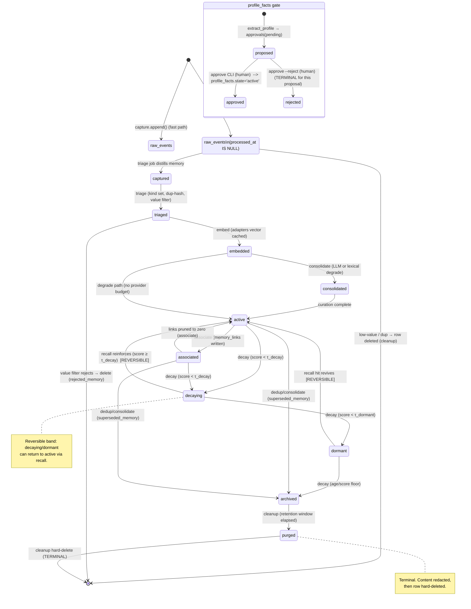

# memoryd — Clean-Room Rust Memory Daemon: Architecture & Milestone Plan

> Implementation-ready plan for a portable, helper-sized, SQLite-only, remote-providers-only-by-default, clean-room Rust memory daemon for AI coding agents and personal long-term memory. This began as a planning artifact and is now reconciled against the current implementation status below.

## Table of Contents

0. [Current Implementation Status](#0-current-implementation-status)
1. [Executive Recommendation](#1-executive-recommendation)
2. [Restated Goal](#2-restated-goal)
3. [Constraints And Assumptions](#3-constraints-and-assumptions)
4. [Three Architecture Options](#4-three-architecture-options)
5. [Recommended Architecture](#5-recommended-architecture)
6. [Core Modules](#6-core-modules)
7. [SQLite Data Model](#7-sqlite-data-model)
8. [Memory Lifecycle](#8-memory-lifecycle)
9. [Relevance, Decay, And Cleanup Model](#9-relevance-decay-and-cleanup-model)
10. [Dreaming Workflow](#10-dreaming-workflow)
11. [Historic Import Workflow](#11-historic-import-workflow)
12. [Remote Provider Strategy](#12-remote-provider-strategy)
13. [Plugin Architecture](#13-plugin-architecture)
14. [API And CLI Sketch](#14-api-and-cli-sketch)
15. [Benchmark Plan](#15-benchmark-plan)
16. [Packaging And npm Distribution](#16-packaging-and-npm-distribution)
17. [Security, CVE, And Supply-Chain Controls](#17-security-cve-and-supply-chain-controls)
18. [Maintainability Plan](#18-maintainability-plan)
19. [Small-VM Resource Profile](#19-small-vm-resource-profile)
20. [MVP Definition](#20-mvp-definition)
21. [Milestone Roadmap](#21-milestone-roadmap)
22. [Risks And Open Questions](#22-risks-and-open-questions)
23. [Final Recommendation](#23-final-recommendation)

---

## 0. Current Implementation Status

This document remains the target architecture and milestone plan. The current
code intentionally implements a narrow foreground slice first.

Implemented now:

- Rust workspace with a `memoryd` binary and `memoryd-core` library.
- SQLite schema migrations through v2, including the canonical tables,
  `memories_fts`, and `raw_events_fts`.
- Local-first config defaults: localhost bind, null provider mode, and zero paid
  provider spend.
- CLI commands: `doctor`, `stats`, `remember`, `recall`, and `serve`.
- REST endpoints: `POST /v1/capture` and `POST /v1/recall`.
- Fast capture writes a redacted raw event, upserts its session, inserts one
  pending `embed` job, and returns without provider calls.
- Recall is lexical-only over redacted captured raw events using SQLite FTS.
- Deterministic best-effort redaction runs before metadata, payload, provenance,
  and recall index persistence.
- CI/security gates cover formatting, build, clippy, tests, dependency policy,
  advisory audit, and SBOM generation.
- OpenSSF Best Practices evidence is complete and passing.

Still planned:

- Background worker execution, governor admission, provider adapters, vector
  reranking, graph expansion, dreaming/consolidation, MCP and hook facades,
  approval-gated profile facts, per-redaction `audit_log` entries, snapshots,
  benchmark harness, and npm binary distribution.

Implementation notes that differ from the target design for now:

- The current HTTP server uses a minimal standard-library listener rather than
  Axum/Hyper.
- The current crate layout is two crates rather than the planned multi-crate
  decomposition.
- The current REST surface is `/v1/capture` and `/v1/recall`; the broader route
  set in §14 remains target API design.

---

## 1. Executive Recommendation

**Architecture in one paragraph.** Build `memoryd` as **Governed Two-Plane Memory**: a single portable Rust binary that puts a *cheap, append-only foreground plane* (capture + recall over SQLite) in front of a *fully resource-governed background plane* (bounded job queue + a fixed worker pool + scheduled "dreaming") that performs all expensive, remote-provider work deferred, batched, capped, and scheduled. SQLite (WAL) is the only durable store — events, curated memories, the association graph, embeddings, jobs, audit, and the spend ledger all live in it; there is no Postgres, no Docker, no external vector DB. All LLM and embedding work goes through remote OpenAI-/Ollama-compatible provider adapters the owner already pays for or hosts; the daemon ships no model runtime, ever, and degrades to lexical-only recall when no provider is reachable. It is a *helper-sized daemon, not a second agent runtime*: adaptive over time because it dreams, but tiny at every instant because it dreams on a leash (bounded queue/workers/memory/CPU/dream-wall-clock and a default **$0.00** per-window spend cap).

**The 5 decisions that matter most.**
1. **Option B (adaptive two-plane) spine, with exactly two seams borrowed from Option C** — the `ProviderAdapter` trait (forced by remote-only/entitlement-first providers) and the `VectorIndex` trait (brute-force-over-shortlist now, in-process HNSW later, never an external DB). Reject every other extension point.
2. **The only extension surface is providers.** Workers are a fixed, audited enum; importers are a fixed audited enum; there is **no plugin registry, no dynamic code loading, no WASM in the default v1 build.** Any future opt-in sandboxed plugin track is explicitly out of scope for v1.
3. **Vectors are a raw `float32` BLOB in SQLite**, reranked over an FTS5/metadata-prefiltered shortlist (≤512 candidates) — never a full-table scan, never an alpha C extension. Default embedding is entitlement-first **Ollama `nomic-embed-text`, 768-dim**; OpenAI 1536-dim only when explicitly configured.
4. **No silent profile rewrites (H6).** Every `profile_facts` write is structurally gated: the schema forbids a fact row without a decided `approvals` id. Dreaming *proposes*; a human *decides*.
5. **Security is a release gate from the first artifact, not a final pass.** `cargo deny` + `cargo audit` + OSV + SBOM block the build on any unresolved critical/high CVE; npm ships **prebuilt** binaries via `optionalDependencies` with **zero network postinstall** (npm lockfile sha512 integrity is the trust root); binaries are checksummed + signed.

**The MVP (smallest slice that proves both planes, M0→M3).**
- Localhost-bound `gateway` (`127.0.0.1:7077`, bearer for remote) serving fast append-only `capture` and bounded `recall` over a real WAL SQLite store with all canonical tables migrated.
- One governed background batch: queue → governor (caps enforced) → `embed`/`consolidate`/`decay` workers → batched provider call (with a deterministic `null` adapter so CI is offline and free).
- A single end-to-end demo — capture a fragmented session → baseline recall → one `dream --once` consolidation → **measurably better** recall — gated by the internal `bench` harness, not asserted.
- Ships nothing that can mutate profile/identity (H6 risk = 0 by construction); MCP facade, graph recall, dedup, profile/approvals, scheduled dreaming, and HNSW are deferred behind seams already in place.

**Top 3 risks.**
1. **Privacy leakage to remote providers (Critical).** Coding sessions are dense with secrets; the background plane is the only thing that calls out. Mitigated by localhost-default bind, entitlement-first/local-preferred adapters, **on-by-default pre-send redaction**, and, in the target architecture, a full audit trail. Current implementation already redacts before persistence; per-redaction audit entries are still planned.
2. **Provider cost overrun (High).** Mitigated by a default **$0.00** per-window spend cap backed by the `provider_usage` ledger and enforced at governor admission; paid APIs are opt-in + budget-gated; on breach, LLM steps skip/re-queue while non-LLM maintenance completes.
3. **Memory + SQLite-vector bloat/perf cliff (High).** Mitigated by governed `purge`/decay on indexed due-rows only (no scans), retention windows, the bounded prefilter-then-rerank recall, and the HNSW seam ready to swap in past ~50k active memories.

**Bottom line.** Build the governed two-plane memory daemon: cheap on the hot path, everything expensive deferred and capped, one binary, SQLite-only, remote-providers-only, providers as the sole seam — continue from the shipped foreground slice toward the governed background plane.

---

## 2. Restated Goal

`memoryd` is a single-binary Rust daemon that gives AI coding agents (and one human owner) a **durable, adaptive memory substrate** — not a second agent. It sits beside the agent, listens cheaply, and does three jobs: it **captures** useful context from coding/chat sessions and **imports** historical data; it **curates** that raw stream into long-lived memories that decay, associate, consolidate, and self-clean on a schedule ("dreaming"); and it **serves** only high-value, ranked context back to future sessions on demand. All language-model and embedding work is done by **remote OpenAI-/Ollama-compatible providers** the user already pays for or hosts — `memoryd` itself ships no model runtime, ever.

The thing it is emphatically *not*: a database stack (no Postgres, no Docker, no vector-DB sidecar — SQLite is the only durable store), and not an autonomous worker (no always-on LLM loop, no action beyond memory maintenance, no silent rewrites of the user's identity/profile without an approval gate).

**The deepest tension.** Rich adaptive memory — embeddings, decay curves, association graphs, scheduled LLM consolidation, provenance, versioned profiles — naturally wants to grow into a heavyweight always-thinking service with a vector database and a model loop. The product mandate is the exact opposite: a *tiny helper daemon* that idles near-zero on a 1-vCPU / 512MB–1GB VM and never surprises the user with cost or CPU. Adaptiveness pushes toward "always working"; the helper mandate pushes toward "almost always asleep." These genuinely pull against each other on every design axis: CPU, memory, money, latency, and autonomy.

**The principle that holds it.** *Cheap on the hot path; everything expensive is deferred, batched, capped, scheduled, and resource-governed.* Capture is a fast append-only write (microseconds, no LLM, no embedding inline). Recall is a bounded read over pre-computed indexes (no full scans, no inline model calls when a cache suffices). Every costly operation — embedding, summarization, association-strengthening, decay sweeps, dreaming — is enqueued as a `job`, executed by a small bounded worker pool under a global resource governor, on a schedule or under explicit command, with hard caps on queue depth, concurrency, memory, CPU share, dream wall-clock, and per-window provider spend. The daemon is adaptive *because* it dreams, but it stays tiny *because* it dreams on a leash. Adaptiveness is bought with **deferral and governance**, never with an always-on loop — that single trade is the spine of the whole architecture.

---

## 3. Constraints And Assumptions

### 3.1 HARD constraints (non-negotiable; every downstream section inherits these)

| # | Constraint | Architectural consequence |
|---|------------|---------------------------|
| H1 | Clean-room Rust; conceptual inspiration only (no fork/source/API/doc copying) | Original module/table/API names; ideas reused, not surfaces. |
| H2 | Single portable binary is primary distribution; npm wrapper ships **prebuilt** binaries | Static-ish binary, minimal dynamic deps; npm package is a thin platform-selecting downloader, not a build. |
| H3 | No Docker requirement; no Postgres; **SQLite is the only required durable store** | All persistence — events, memories, vectors, jobs, audit — lives in SQLite. Vector search runs in-process. |
| H4 | LLM + embeddings are **remote-provider only, by default**; no *required or bundled* local model runtime now or ever (a future LocalEmbedder is opt-in, operator-supplied, never in the default build) | Provider adapters over HTTP. No bundled GGUF/ONNX/llama runtime. Graceful degradation when no provider configured. |
| H5 | Reuse existing entitlements (Ollama Pro, OpenCode models); **no new pay-per-token spend by default** | Default provider = already-paid/self-hosted. Paid APIs opt-in only. Per-window spend cap, default conservative. |
| H6 | Helper-sized daemon, not a second agent runtime; no always-on LLM loop; no autonomous action beyond memory maintenance; no silent identity/profile rewrites | Event-driven + scheduled only. Profile mutations route through an `approvals` gate. No goal-seeking. |
| H7 | All expensive work queued/batched/capped/scheduled/governed; bounded queues/workers/memory/CPU/dream-runtime; backpressure + graceful degradation; **no full-table scans in normal operation** | Central job queue + resource governor; indexed access paths only; degrade-don't-block on saturation. |
| H8 | Security & maintainability first-class; **no release with unresolved critical/high CVEs**; auditable deps; SBOM; simple enough to maintain long-term | Curated dep set, `cargo audit`/`cargo deny` in CI, SBOM artifact, small surface, no clever metaprogramming. |
| H9 | No unauthenticated remote access by default (**localhost-only bind**; bearer token for remote); no plugin design allowing arbitrary unsafe execution without explicit opt-in + sandbox boundary | Bind `127.0.0.1` by default; remote needs token; providers are the only "plugins" and they are network-only adapters, no arbitrary code. |
| H10 | Do not compromise planned features to stay light; stay light via batching/queueing/capping/scheduling | Feature richness preserved; cost controlled by *deferral*, not *deletion*. |

### 3.2 SOFT constraints (strong defaults; overridable with reason)

- **S1** — Default VM target ~1 vCPU / 512MB–1GB RAM / modest disk; idle RSS target small (single-digit→low-tens of MB), governor caps worker memory.
- **S2** — Platforms: Linux x64+arm64, macOS arm64+x64 first-class; Windows best-effort.
- **S3** — Provider endpoints assumed OpenAI-compatible and/or Ollama-compatible HTTP.
- **S4** — Async runtime kept minimal; prefer a small, well-audited stack over a sprawling one (maintainability > feature-by-dependency).
- **S5** — Single-user owner, multiple agents/sessions concurrently; not multi-tenant.
- **S6** — Capture path must never block the agent; if the daemon is down or saturated, the agent degrades silently (capture is best-effort, recall is best-effort).
- **S7** — Embeddings cached and reused; re-embedding is a deliberate, batched migration, not an inline cost.

### 3.3 ASSUMPTIONS (explicit; flag if violated)

- **A1** — At least one reachable provider is configured for full value, but the daemon must **boot, capture, and serve lexical recall with zero provider** (degraded mode).
- **A2** — SQLite in WAL mode on local disk gives adequate write throughput for a single-user capture stream; we are not building for thousands of writes/sec.
- **A3** — Total memory corpus is personal-scale (tens of thousands → low millions of rows over years), small enough that an **in-process ANN/brute-force-over-shortlist** vector search stays sub-100ms without an external vector DB.
- **A4** — Agents integrate via a documented local interface (HTTP/MCP/CLI hooks); we do not control agent internals.
- **A5** — The owner is occasionally online to run `approve`, configure providers, and trigger imports; the daemon never *needs* interactive presence to keep running.
- **A6** — "Dreaming" runs during idle/scheduled windows (e.g., nightly), not continuously.

### 3.4 UNRESOLVED QUESTIONS (decide before/within downstream sections)

- **U1** — Vector index strategy at scale: pure SQLite-row brute-force over a candidate shortlist vs. an in-process HNSW kept in a SQLite blob and rebuilt on load. (Leaning: shortlist-then-rerank early; pluggable ANN behind one trait — see C5.)
- **U2** — Wire protocol primary surface: native HTTP/JSON vs. MCP-first. (Leaning: HTTP/JSON core with an MCP facade adapter over stdio (no network bind); HTTP/JSON is the only network surface.)
- **U3** — Embedding dimensionality / model drift: how to handle a provider changing or retiring an embedding model. (Leaning: store `model_id`+`dim` per embedding; mixed dims coexist; re-embed as a batched `import`-like migration.)
- **U4** — Profile-fact extraction autonomy: how aggressive before the `approvals` gate. (Leaning: extraction proposes; nothing mutates `profile_facts` without approval; conservative by default.)
- **U5** — Multi-process safety: one daemon owning the DB vs. CLI commands opening it directly. (Resolution: the networked daemon is the **sole SQLite writer** via the `store::Writer` actor; per-agent `--mcp-stdio` facades are thin clients that never open or write the DB themselves — they forward capture/recall/enqueue to the single daemon over loopback IPC (Unix domain socket by default, or `127.0.0.1:7077` HTTP), and the daemon performs all writes. The single-writer-actor invariant holds and `SQLITE_BUSY` contention is avoided. If no daemon is running, a facade may auto-spawn/attach to one, but a facade never writes the database itself.)

### 3.5 Constraint conflicts and concrete resolutions

> Each is a genuine collision between two hard/soft constraints, not a strawman.

**C1 — Rich adaptive memory (H10) vs. tiny helper daemon (H6, S1).**
*Conflict:* decay sweeps, association strengthening, dreaming, and profile maintenance are continuous-sounding workloads that imply an always-busy service.
*Resolution:* **Two-plane design.** A *foreground plane* does only append-capture and indexed recall — provably cheap, always responsive. A *background plane* (bounded worker pool under a resource governor) performs all adaptive work, but only when (a) explicitly commanded (`dream`, `import`), (b) on a schedule, or (c) drained from a job queue under idle. The daemon is adaptive over *time*, not *at every instant*. No always-on LLM loop (H6) is satisfied because adaptiveness is event-/schedule-triggered batches, never a spin loop.

**C2 — SQLite-only (H3) vs. vector search at scale (rich recall).**
*Conflict:* "real" semantic search usually implies a vector DB; we forbid one.
*Resolution:* Vectors live in SQLite (`embeddings` table, blob + `model_id` + `dim`). Recall is **two-stage**: a cheap lexical/metadata prefilter (SQLite FTS5 + indexed columns) produces a bounded candidate set, then in-process cosine rerank over only those candidates — never the whole table (satisfies "no full-table scans," H7). For personal-scale corpora (A3) this is sub-100ms. The ANN method hides behind one `VectorIndex` trait so an in-process HNSW (persisted as a SQLite blob, loaded into RAM under a memory cap) can replace brute-force later **without** introducing an external store. SQLite stays the single durable store (H3); the index is a derived cache.

**C3 — No new paid spend (H5) vs. LLM-powered dreaming/consolidation (H10).**
*Conflict:* dreaming wants an LLM; LLM calls can cost money.
*Resolution:* Default provider is an **already-entitled / self-hosted** endpoint (Ollama Pro, OpenCode-reachable models). Every job records cost/usage in `provider_usage`; a **token/spend governor** enforces a per-window cap (default tuned to free/entitled tiers, effectively "no surprise spend"). When the cap is hit or no paid provider is authorized, dreaming **degrades gracefully**: non-LLM consolidation still runs (dedup, decay, link strengthening via embedding similarity), and LLM-only steps (summarization, profile-fact proposal) are skipped and re-queued. Paid APIs require explicit opt-in *and* a non-zero spend budget. So dreaming is real, but it never spends money the user didn't pre-authorize.

**C4 — Remote-provider-only (H4) vs. offline / air-gapped operability (deployment reality).**
*Conflict:* if the only intelligence is remote, an offline box appears useless.
*Resolution:* Separate the **durable substrate** (always local: capture, store, lexical recall, decay, dedup, graph maintenance — all run with zero network) from the **semantic enrichment** (embeddings + LLM, remote). Offline, `memoryd` is a fully functional lexical/temporal memory store with backpressure-safe queues; embedding/dream jobs simply **stay queued** until a provider is reachable, then drain. Air-gapped deployments point the provider adapter at an **on-LAN** OpenAI-/Ollama-compatible endpoint (allowed — "remote" means out-of-process over HTTP, not "public internet"; runtime artifact still makes no public-internet calls per build policy). No local model runtime is ever required (H4) and offline never means broken.

**C5 — Extensibility/benchmarks (platform value) vs. no-arbitrary-execution + maintainability (H8, H9).**
*Conflict:* a plugin ecosystem invites arbitrary code and CVE/maintenance sprawl.
*Resolution:* The **only** extension seam is the `ProviderAdapter` trait (LLM/embedding HTTP backends) — pure data in/out, no arbitrary host code, no dynamic loading. "Plugins" are compiled-in or config-selected adapters, never user-supplied binaries (satisfies H9's sandbox/opt-in mandate by *removing the unsafe seam entirely*). Benchmarking is a first-class **internal** `bench` command over fixed fixtures, not an open plugin API. Extensibility is bounded to the one place it adds product value (more providers) and nowhere it adds risk.

---

## 4. Three Architecture Options

Three genuinely different shapes for the same product. They differ in **where intelligence and complexity live**, not in cosmetics.

---

### Option A — Minimal Daemon ("the smallest thing that captures and recalls")

**Core idea.** A near-stateless append-and-serve daemon. SQLite is the brain; the daemon is plumbing. Adaptiveness is reduced to time-decay and lexical recall; LLM/embedding work is *optional sugar* invoked synchronously-but-rarely or via a single tiny background tick. No graph, no dream engine, no profile versioning beyond a flat key/value.

**Main modules.** `apid` (HTTP/MCP listener) → `store` (SQLite access) → `recall` (FTS5 + recency rank) → a thin `provider` adapter used only on explicit `remember`/`recall --semantic`. One optional `sweeper` cron that runs decay + TTL deletes. No job queue (or a trivial single-thread one).

**Data flow.** Capture: agent → `apid` → `store.append(raw_events)` → return. Recall: agent → `apid` → `recall` (FTS5 prefilter + recency) → optional one-shot embedding rerank → return. Maintenance: `sweeper` nightly updates decay scores and deletes expired rows.

**What complexity it hides.** Almost all of it — no queue scheduler, no worker governor, no association graph, no consolidation pipeline, no version history. Trivially small RSS; trivially auditable; fewest deps; strongest small-VM behavior by far.

**What it is bad at.** It barely "dreams." No association strengthening, no cross-session synthesis, no profile evolution, no noise consolidation beyond delete-on-TTL. Semantic recall is bolted on, not native. Returns *recent* context well, *insightful* context poorly.

**Why it might fail.** It under-delivers the product thesis — "adaptive memory substrate" collapses to "a tidy log with search." When the user wants the agent to remember a *synthesized* preference learned across ten sessions, A has nowhere to compute or store it. It satisfies H6/S1 spectacularly but violates the spirit of H10 (don't compromise features to stay light). Growth pressure would force bolting a queue and graph on later — re-deriving Option C the hard way.

---

### Option B — Adaptive Memory ("the dream engine is the point")

**Core idea.** A two-plane memory organism. Fast capture up front; a rich **background consolidation engine** behind a bounded job queue. The center of gravity is the *dream/decay/association* pipeline that turns raw events into versioned, linked, scored, self-cleaning memories and an evolving (but approval-gated) profile. Vector + lexical + graph recall fused into one ranked result.

**Main modules.** `gateway` (HTTP/MCP, auth) → `capture` (fast append) → `store` (SQLite, WAL) → `queue` (bounded jobs) → `governor` (CPU/mem/spend caps) → `workers` (embed, consolidate, decay, associate, dedup) → `dream` (scheduled orchestration of workers over a window) → `recall` (FTS5 prefilter + vector rerank + graph expansion + relevance scoring) → `profile` (fact extraction → `approvals` gate) → `provider` adapters → `audit`.

**Data flow.** *Fast path:* agent → `gateway` → `capture.append(raw_events/sessions)` → enqueue lightweight `embed` job → return immediately. *Recall path:* agent → `gateway` → `recall` (prefilter → vector rerank → graph hop → score over `scoring_variables`) → return top-K + provenance. *Dream path:* scheduler/`dream` → `queue` drains under `governor` → workers consolidate, strengthen `memory_links`, apply decay, dedup, propose `profile_facts` (→ `approvals`), write `memory_versions`, record `dream_runs` + `provider_usage`.

**What complexity it hides.** The hard, valuable stuff: relevance scoring fusing recency/frequency/semantic/graph signals; lifecycle transitions; consolidation that compresses noise into durable memory; association graph maintenance; provenance and version history; spend governance. This is the product thesis rendered directly in modules.

**What it is bad at.** Highest conceptual surface of the three; the scoring/decay/consolidation logic is where subtle bugs and "why did it forget X" issues live. Requires disciplined governance or it threatens S1/H6 (a sloppy dream loop becomes an always-busy service). More moving parts to keep CVE-clean and maintainable (H8).

**Why it might fail.** Over-engineering risk and tuning burden: decay curves and link-strengthening heuristics need iteration to feel good, and a poorly-capped governor could spike CPU/spend on the small VM — directly threatening the headline constraint. Mitigation is exactly the C1/C3 resolutions (governor + bounded queue + spend cap), so failure here is a *discipline* failure, not a *shape* failure.

---

### Option C — Extensible Platform ("substrate + clean seams for providers and benchmarks")

**Core idea.** Take Option B's two-plane engine and harden every boundary into a **stable internal contract**: a `ProviderAdapter` trait for any OpenAI-/Ollama-compatible backend, a `VectorIndex` trait so the ANN method is swappable, a `Job` trait so worker kinds are uniform, and a first-class `bench` harness. Same SQLite-only substrate; the bet is on *interchangeable internals*, not features.

**Main modules.** All of B, plus: a formalized `adapters` layer (multiple providers selectable/failover-able), a `VectorIndex` abstraction (brute-force-shortlist today, in-process HNSW later), a uniform `Job` registry, a `bench` module (fixtures + metrics), and a `doctor`/diagnostics surface. Recall, dream, and store stay as in B but program against traits.

**Data flow.** Identical to B at runtime; the difference is *seams*. Providers are chosen per-job and recorded in `provider_usage`; the vector index is constructed behind a trait at boot; `bench` replays fixtures through the real recall/dream paths to produce comparable numbers.

**What complexity it hides.** Provider heterogeneity and migration (model/dim drift, failover), index-method evolution without touching call sites, and reproducible performance measurement — all without an external vector DB (still H3-clean).

**What it is bad at.** Premature abstraction tax for a single-user tool: traits and registries add indirection and code that earns its keep only if multiple providers/indexes actually materialize. More surface to audit (H8) for benefit that may stay theoretical. Risk of building the framework before the product.

**Why it might fail.** Abstraction-first greenfield is the classic over-build: you pay the seam cost on day one and might never swap an implementation. For one user on a tiny VM, the platform ambitions can outrun the need — violating "simplest durable architecture" and the scope discipline that keeps it maintainable.

---

## 5. Recommended Architecture

**Decision: Option B (Adaptive Memory) as the spine, with two surgically-chosen seams borrowed from C.** Not a flavor of A (it under-delivers the thesis), not full C (it over-abstracts a single-user tool on day one). The named architecture is **"Governed Two-Plane Memory"**: a provably-cheap foreground plane (capture + recall) and a fully-governed background plane (queue + workers + dream), sharing one SQLite store.

### 5.1 Why this, against *these* constraints

- **H10 + H6 + S1 reconciled by C1's two-plane split.** B is the only option that delivers dreaming/decay/association/profile (the thesis) while keeping the hot path trivially cheap. A can't compute synthesized memory; C buys that ability and then taxes it with seams we don't yet need.
- **The two C seams we *do* adopt, because they pay for themselves immediately:**
  1. `ProviderAdapter` trait — forced by H4/H5 (OpenAI- *and* Ollama-compatible, entitlement-first, failover/degrade). This seam isn't speculative; it's required to satisfy provider constraints on day one.
  2. `VectorIndex` trait — forced by C2/U1: brute-force-over-shortlist now, room for in-process HNSW later, **without** ever reaching for an external vector DB (H3). One trait, no registry framework.
- **Seams we *reject* from C in the default build (scope discipline, H8 maintainability):** no general `Job`-plugin registry (workers are a fixed, audited enum), no open extension API (H9 — in the default build the only runtime seam is providers, data-in/data-out; the opt-in, sandboxed external-plugin track is specified in §13). `bench` is an internal command (vocab) over fixtures, not a plugin surface.
- **Governance is the load-bearing mitigation** for B's failure mode (C1/C3): a single `governor` enforces bounded queue depth, worker concurrency, per-worker memory, CPU share, dream wall-clock, and per-window provider spend — so adaptiveness never breaches S1/H6/H5.

### 5.2 Module topology (canonical crates/modules — reused verbatim downstream)

```
                          ┌─────────────────────────────────────────────┐
   agents / CLI  ───────► │  gateway  (HTTP/JSON core + MCP facade,      │
   (localhost, H9)        │           bearer auth, 127.0.0.1 default)    │
                          └───────┬───────────────────────┬─────────────┘
                                  │ FAST PATH             │ RECALL PATH
                                  ▼                       ▼
                          ┌──────────────┐        ┌──────────────────────┐
                          │   capture    │        │       recall         │
                          │ append-only  │        │ FTS5 prefilter →     │
                          │ raw_events,  │        │ VectorIndex rerank → │
                          │ sessions     │        │ graph hop → scoring  │
                          └──────┬───────┘        └──────────┬───────────┘
                                 │ enqueue lightweight        │ reads
                                 ▼ embed job                  ▼
                          ┌─────────────────────── store (SQLite, WAL) ───────────────────────┐
                          │ raw_events · sessions · memories · memory_versions · memory_links  │
                          │ embeddings · jobs · dream_runs · import_batches · profile_facts    │
                          │ approvals · audit_log · provider_usage      (single durable store) │
                          └───────▲───────────────────────────────────────────────▲───────────┘
                                  │                                                │
        BACKGROUND / DREAM PLANE  │                                                │
        ┌─────────┐   ┌───────────┴───────────┐   ┌──────────┐   ┌───────────┐    │
        │  queue  │──►│   governor (caps:     │──►│ workers  │──►│  dream    │────┘
        │ bounded │   │ queue/conc/mem/cpu/   │   │ embed,   │   │ scheduled │
        │  jobs   │   │ dream-wallclock/spend │   │ consolidate, decay,       │
        └─────────┘   └───────────┬───────────┘   │ associate, dedup,         │
                                  │               │ extract-profile           │
                                  ▼               └─────┬─────────────────────┘
                          ┌──────────────┐              │ profile proposals
                          │   adapters   │◄─────────────┘ → approvals gate
                          │ ProviderAdapter trait:       │
                          │ openai_compat · ollama ·     │ profile module ──► approvals (H6: no
                          │ opencode · null              │                    silent profile rewrite)
                          └──────┬───────┘               │
                                 │ records               ▼
                                 └──────────► provider_usage / audit_log
```

Canonical modules (15 top-level): **`gateway`, `capture`, `recall`, `store`, `queue`, `governor`, `workers`, `dream`, `profile`, `approvals`, `adapters`, `vectorindex`, `audit`, `config`, `cli`.** (`vectorindex` and `adapters` are the two trait-seams; everything else is concrete.) The units `relevance`, `import`, `snapshot`, `bench`, `redact`, `decay`, `cleanup` are sub-modules within `core` (mostly sub-components of `workers`/`recall`), not separate top-level modules.

### 5.3 End-to-end data flow — the three distinct paths

**(1) FAST capture path — microsecond-class, never blocks the agent (S6, H7).**
`agent → gateway (auth) → capture.append()` redacts metadata/payload/provenance, writes to `raw_events` (and upserts `sessions`) in one append-only SQLite transaction, writes the redacted recall index text, enqueues a lightweight `embed`/`triage` job into `jobs`, and returns immediately. No LLM, no embedding, no scan inline. If `store` is saturated, backpressure returns a fast "accepted-degraded" and the agent proceeds — capture is best-effort. This path touches only `gateway → capture → store(raw_events,sessions,jobs)`.

**(2) RECALL path — bounded read, no full-table scan (H7), no inline model call when cache suffices.**
Current implementation is lexical-only over `raw_events_fts`. Target design: `agent → gateway → recall`: (a) **prefilter** via FTS5 + indexed metadata (session, recency, tags) to a bounded candidate set; (b) **rerank** those candidates only, via `vectorindex` cosine over cached `embeddings` (compute a query embedding through `adapters` *only if* not cached and a provider is reachable; else lexical-only degrade per A1/C4); (c) optional one-hop **graph expansion** over `memory_links`; (d) **score** each candidate over the `scoring_variables` and return top-K `memories` with provenance (`memory_versions` lineage). Reads only; writes nothing except an optional access-stat bump queued as a job. Sub-100ms target at personal scale (A3).

**(3) BACKGROUND / dream / worker path — all expensive work, governed (C1, C3, H7).**
Triggered by schedule (e.g. nightly), explicit `dream`/`import`, or queue drain under idle. `queue` hands jobs to `governor`, which admits them only within caps (queue depth, worker concurrency, per-worker memory, CPU share, **dream wall-clock**, **per-window provider spend** via `provider_usage`). `workers` then: `embed` raw/changed rows; `consolidate` raw_events→durable `memories` (LLM summarization via `adapters` when budget allows, lexical/dedup-only when not — C3 degrade); apply **decay** (lifecycle transitions, no full scan — only rows due, by indexed `next_review`/score); `associate` to strengthen/prune `memory_links` by embedding+co-occurrence; `dedup`; and `extract-profile` which *proposes* `profile_facts` into `approvals` — **never** mutating profile silently (H6). Each run records a `dream_runs` row and `audit_log` entries; provider calls record `provider_usage`. On cap breach: graceful degradation — LLM steps skip and re-queue, non-LLM maintenance still completes. This path writes `memories`, `memory_versions`, `memory_links`, `embeddings`, `profile_facts`(via approval), `dream_runs`, `audit_log`, `provider_usage`; it is the *only* plane that calls providers or does heavy compute.

This recommendation — **Governed Two-Plane Memory**, Option B spine + Provider/Vector seams, fixed audited workers, providers as the sole extension point — governs every downstream section. The vocabulary below is canonical and must be reused verbatim.

---

## 6. Core Modules

The target workspace is a **single Cargo workspace** with one binary crate and a small set of library crates. The current implementation deliberately starts smaller with `memoryd` and `memoryd-core`; split out the planned seam crates only when their interfaces become real. The target split is conservative: crates exist only where they (a) define a stable seam (`adapters`, `vectorindex`), (b) form the durable substrate every plane depends on (`store`, `config`), or (c) need independent test surfaces and compile isolation. Everything else lives as **modules inside one `memoryd-core` library crate** to keep the build simple, the binary small, and link-time optimization effective (H8 maintainability, single-binary distribution).

### 6.1 Crate layout (workspace members)

```
memoryd/                         # target workspace root (Cargo.toml [workspace])
├── crates/
│   ├── memoryd            # [bin]  thin entrypoint → cli; the single portable binary
│   ├── memoryd-cli        # [lib]  cli            — arg parse, command dispatch, human/JSON output
│   ├── memoryd-core       # [lib]  gateway, capture, recall, queue, governor, workers,
│   │                       #        dream, profile, approvals, audit, redact, import, snapshot,
│   │                       #        relevance, decay, cleanup  (concrete modules; no plugin registry)
│   ├── memoryd-store      # [lib]  store          — SQLite/WAL, DDL, migrations, typed row I/O, FTS5
│   ├── memoryd-adapters   # [lib]  adapters       — ProviderAdapter trait + openai_compat/ollama/opencode/null
│   ├── memoryd-vectorindex# [lib]  vectorindex    — VectorIndex trait + BruteForceIndex (HNSW seam later)
│   └── memoryd-proto      # [lib]  shared types: ids, enums (LifecycleState, JobKind, LinkType),
│                           #        error type, DTOs, scoring structs — leaf crate, zero deps on siblings
└── Cargo.toml
```

#### Dependency direction (acyclic — enforced in CI by `cargo-deny` + a graph check)

```
memoryd (bin)
   └─► memoryd-cli
         └─► memoryd-core
               ├─► memoryd-store ─────┐
               ├─► memoryd-adapters   │
               ├─► memoryd-vectorindex│
               └─► memoryd-proto ◄────┴──(all crates depend only "downward" on proto)
memoryd-store, memoryd-adapters, memoryd-vectorindex ─► memoryd-proto   (leaf)
```

Rules enforced:
- **No crate depends upward.** `proto` is the leaf; nothing imports `core` except `cli`.
- `store`, `adapters`, `vectorindex` never depend on each other — they meet only inside `core`.
- The two trait-seams (`adapters`, `vectorindex`) are the **only** crates with feature flags; everything else compiles unconditionally.

#### Plane annotation legend

| Mark | Meaning |
|------|---------|
| **F** | FAST path — runs synchronously in the request, must stay sub-100ms, no LLM/embedding inline, no full-table scan |
| **W** | WORKER path — runs in the background plane under the `governor`; may call providers, may be slow, always capped |
| **C** | CONTROL/shared — config, store substrate, CLI; not latency-bound but on neither hot loop |

---

### 6.2 `cli` — command-line interface  *(crate: `memoryd-cli`)*  — **C**

**Responsibility.** Parse arguments, dispatch the 11 canonical commands, render human-readable or `--json` output, set process exit codes. Owns no business logic — every command is a thin call into `gateway` (in-process) or an HTTP call to a running `serve` instance.

```rust
pub enum Command {
    Serve(ServeArgs),    Setup(SetupArgs),   Import(ImportArgs),
    Dream(DreamArgs),    Recall(RecallArgs), Remember(RememberArgs),
    Approve(ApproveArgs),Export(ExportArgs), Bench(BenchArgs),
    Doctor,              Stats(StatsArgs),
}

pub fn run(argv: Vec<OsString>) -> ExitCode;            // entrypoint from bin
fn dispatch(cmd: Command, cfg: &Config) -> Result<Output, CliError>;
```

| Command | Path touched | Notes |
|---------|--------------|-------|
| `serve` | starts gateway + queue + governor + workers + scheduler | the daemon |
| `setup` | writes config, runs migrations, probes adapters | first-run wizard |
| `import` | enqueues `import_batches` + `import` jobs | **W** (async, resumable) |
| `dream` | enqueues an explicit `dream_run` | **W** |
| `recall` | calls `recall` | **F** |
| `remember` | calls `capture.append` | **F** |
| `approve` | decides an `approvals` row | gated write |
| `export` | streams a snapshot | read-only |
| `bench` | internal fixture harness | not a plugin surface |
| `doctor` | health probes | read-only |
| `stats` | aggregates ledgers | read-only |

- **Inputs:** `argv`, env, config file path. **Outputs:** stdout (text/JSON), exit code.
- **Depends on:** `core` (for in-process commands), `proto`, `config`.

---

### 6.3 `config` — configuration  *(module in `memoryd-core`, re-exported)*  — **C**

**Responsibility.** Load and validate layered config (defaults → file `~/.config/memoryd/config.toml` → env `MEMORYD_*` → flags), resolve adapter wiring, expose typed caps to the `governor`. **Localhost-only bind by default; remote requires an explicit bearer token (H9).**

```rust
pub struct Config {
    pub bind: SocketAddr,                 // default 127.0.0.1:7077
    pub bearer_token: Option<Secret<String>>, // None ⇒ remote bind refused at startup
    pub db_path: PathBuf,                  // default ~/.local/share/memoryd/memoryd.db
    pub adapters: AdapterConfig,           // embed + llm endpoints, priority/failover order
    pub caps: Caps,                        // governor limits (see §6.10)
    pub schedule: Schedule,                // dream cron, idle-drain window
    pub redaction: RedactionConfig,        // patterns + on/off
}
pub fn load(path: Option<&Path>) -> Result<Config, ConfigError>;
fn validate(&self) -> Result<(), ConfigError>;   // refuses 0.0.0.0 bind w/o token
```

- **Inputs:** file, env, flags. **Outputs:** validated `Config`. **Depends on:** `proto`.

---

### 6.4 `store` — memory store  *(crate: `memoryd-store`)*  — **C** (touched by both planes)

**Responsibility.** Sole durable substrate. Owns the 13 canonical durable tables (plus the memories_fts virtual table and schema_migrations), WAL-mode SQLite, schema migrations, FTS5 virtual table for lexical prefilter, and **all** typed row I/O. No module touches SQLite except through `store`. Connection pooling: one writer connection (SQLite single-writer) + a small read pool. Embeddings stored as `BLOB` (little-endian f32). No external vector DB (H3).

```rust
pub struct Store { /* writer conn + read pool */ }

impl Store {
    pub fn open(db: &Path) -> Result<Self, StoreError>;     // opens, sets PRAGMA, migrates
    pub fn migrate(&self) -> Result<u32, StoreError>;       // returns schema version

    // FAST-path writes (append-only, single txn)
    pub fn append_raw_event(&self, e: &NewRawEvent) -> Result<RawEventId, StoreError>;
    pub fn upsert_session(&self, s: &SessionPatch) -> Result<(), StoreError>;
    pub fn enqueue_job(&self, j: &NewJob) -> Result<JobId, StoreError>;

    // RECALL-path reads (bounded; FTS5 + indexed metadata only)
    pub fn fts_prefilter(&self, q: &str, lim: usize, filt: &RecallFilter)
        -> Result<Vec<MemoryId>, StoreError>;
    pub fn load_embeddings(&self, ids: &[MemoryId]) -> Result<Vec<EmbeddingRow>, StoreError>;
    pub fn neighbors(&self, id: MemoryId, k: usize) -> Result<Vec<LinkRow>, StoreError>;

    // WORKER-path (transactional consolidation, versioning, decay)
    pub fn due_for_decay(&self, now: Ts, lim: usize) -> Result<Vec<MemoryId>, StoreError>;
    pub fn write_version(&self, v: &NewMemoryVersion) -> Result<VersionId, StoreError>;
    pub fn claim_jobs(&self, kinds: &[JobKind], n: usize) -> Result<Vec<JobRow>, StoreError>;
}
```

**Key DDL invariants (abbreviated; full DDL in §7):**

```sql
PRAGMA journal_mode=WAL; PRAGMA synchronous=NORMAL; PRAGMA foreign_keys=ON;

CREATE TABLE raw_events ( id INTEGER PRIMARY KEY, session_id TEXT NOT NULL REFERENCES sessions(id),
  ts INTEGER NOT NULL, source TEXT NOT NULL, kind TEXT NOT NULL, payload TEXT NOT NULL,
  provenance TEXT NOT NULL, processed_at INTEGER );
CREATE INDEX ix_raw_unprocessed ON raw_events(processed_at) WHERE processed_at IS NULL;

CREATE TABLE memories ( id TEXT PRIMARY KEY, current_version_id TEXT REFERENCES memory_versions(id),
  kind TEXT NOT NULL, content TEXT NOT NULL, lifecycle_state TEXT NOT NULL,
  relevance_score REAL NOT NULL DEFAULT 0, last_accessed_at INTEGER,
  access_count INTEGER NOT NULL DEFAULT 0, decay_at INTEGER, created_at INTEGER NOT NULL );
CREATE INDEX ix_memories_decay_due ON memories(decay_at) WHERE lifecycle_state
  IN ('active','associated','decaying','dormant');         -- decay scans only due rows (H7)

CREATE VIRTUAL TABLE memories_fts USING fts5(content, content='memories', content_rowid='id');

CREATE TABLE jobs ( id INTEGER PRIMARY KEY, kind TEXT NOT NULL, priority INTEGER NOT NULL,
  state TEXT NOT NULL, payload TEXT NOT NULL, attempts INTEGER NOT NULL DEFAULT 0,
  scheduled_at INTEGER, started_at INTEGER, finished_at INTEGER, last_error TEXT );
CREATE INDEX ix_jobs_ready ON jobs(priority, scheduled_at, id) WHERE state IN ('pending','deferred');
```

- **Inputs:** typed structs from any module. **Outputs:** typed rows / ids. **Depends on:** `proto`, `rusqlite` (bundled SQLite — no system dep, offline-buildable).

---

### 6.5 `gateway` — server, REST API, MCP facade, hook receiver  *(module in `memoryd-core`)*  — **F**

**Responsibility.** The single network surface. Target design: one Axum/Hyper server that exposes three co-located facades over the same handlers: **REST/JSON core**, an **MCP facade**, and a **hook receiver**. Enforces bearer auth, 127.0.0.1 default bind, request size caps, and per-route rate limits. Dispatches to `capture` (fast) or `recall` (read); never calls a provider inline. Current implementation uses a minimal standard-library HTTP listener with `POST /v1/capture` and `POST /v1/recall` only.

```rust
pub struct Gateway { capture: Capture, recall: Recall, store: Store, cfg: Arc<Config> }

impl Gateway {
    pub async fn serve(self, bind: SocketAddr) -> Result<(), GatewayError>;
}

// auth middleware: constant-time bearer compare; localhost bypass only if no token set
async fn auth(req: Request, next: Next) -> Result<Response, StatusCode>;
```

#### Sub-facade: REST API — **F**

| Method & route | Handler | Plane |
|----------------|---------|-------|
| `POST /v1/events` | `capture.append` | F |
| `POST /v1/recall` | `recall.query` | F |
| `POST /v1/remember` | `capture.append` (explicit) | F |
| `GET  /v1/memories/{id}` | `store` read | F |
| `POST /v1/approvals/{id}` | `approvals.decide` | gated |
| `GET  /v1/stats` | aggregates | read |
| `GET  /healthz` | liveness | F |

#### Sub-facade: MCP adapter — **F**

Speaks MCP over the same process. Exposes tools `memory.remember`, `memory.recall`, `memory.stats` and resources `memory://session/{id}`. **Server-side only — it does not let agents register code or call providers (H9).** Each MCP tool maps 1:1 onto a REST handler; no separate logic path.

```rust
pub trait McpTool { fn name(&self) -> &str;
    async fn call(&self, args: Value, ctx: &ReqCtx) -> Result<Value, McpError>; }
```

#### Sub-facade: hook receiver — **F**

Accepts coding-agent lifecycle webhooks (session-start, tool-use, session-end, handoff) at `POST /v1/hooks/{event}`. Normalizes the payload into a `NewRawEvent { source, kind, payload, provenance }` and calls `capture.append` — **same fast path, no special casing.** A saturated store yields `202 Accepted (degraded)` so the agent never blocks (S6/H7).

- **Inputs:** HTTP requests. **Outputs:** HTTP responses; side effect = `raw_events`/`jobs` rows. **Depends on:** `capture`, `recall`, `store`, `config`, `audit`.

---

### 6.6 `capture` — event capture + redaction  *(module in `memoryd-core`)*  — **F**

**Responsibility.** The microsecond-class write. Runs the **redaction/privacy filter** synchronously (cheap, regex/entropy-based — no LLM), appends to `raw_events`, upserts `sessions`, and enqueues exactly one lightweight `triage`/`embed` job. Returns immediately. Best-effort under backpressure.

```rust
pub struct Capture { store: Store, redact: Redactor, queue: QueueHandle }

impl Capture {
    pub fn append(&self, e: NewRawEvent) -> Result<CaptureAck, CaptureError>;
    // CaptureAck::Stored | CaptureAck::Degraded  (degraded = enqueue skipped, event still appended)
}
```

#### Redaction/privacy filter (sub-component) — **F**

Synchronous, deterministic, **no network**. Applied before persistence so matched secrets do not hit disk unredacted.

```rust
pub struct Redactor { patterns: Vec<Pattern>, entropy_min: f32 }
impl Redactor {
    pub fn scrub(&self, payload: &str) -> (String, RedactionReport);  // masks tokens, keys, emails, PII
}
```

Current implementation: dependency-free best-effort masking for sensitive JSON keys, bearer-style credentials, common API-key prefixes, private-key markers, emails, and high-entropy token-like spans (>4.0 bits/char over ≥20 chars). It redacts metadata fields, payloads, provenance, and recall index text before the SQLite transaction. Planned next hardening: record per-redaction summaries in `audit_log` without storing the original secret. Cost budget: <1ms per event at 4KB payload.

- **Inputs:** `NewRawEvent`. **Outputs:** `CaptureAck`; rows in `raw_events`, `sessions`, `jobs`. **Depends on:** `store`, `queue`, `audit`.

---

### 6.7 `recall` — recall engine  *(module in `memoryd-core`)*  — **F**

**Responsibility.** Bounded read pipeline: **FTS5 prefilter → vector rerank → one-hop graph expansion → score → top-K.** Computes a query embedding via `adapters` **only if** uncached *and* a provider is reachable within a tight deadline; otherwise lexical-only degrade (A1/C4). Writes nothing except an optional queued access-stat bump.

```rust
pub struct Recall { store: Store, vindex: Box<dyn VectorIndex>,
                    embed: Arc<dyn EmbeddingAdapter>, scorer: Relevance, queue: QueueHandle }

impl Recall {
    pub async fn query(&self, q: RecallQuery) -> Result<RecallResult, RecallError>;
}
pub struct RecallQuery { pub text: String, pub k: usize, pub filter: RecallFilter,
                         pub deadline_ms: u32 /* default 80 */ }
pub struct RecallResult { pub hits: Vec<ScoredMemory>, pub degraded: bool /* lexical-only */ }
```

Pipeline caps: prefilter ≤ 500 candidates, rerank over that shortlist only, graph expansion 1 hop ≤ 50 neighbors. **No full-table scan.** Sub-100ms target at personal scale (A3).

- **Inputs:** `RecallQuery`. **Outputs:** `RecallResult` + provenance (`memory_versions` lineage). **Depends on:** `store`, `vectorindex`, `adapters` (embed only), `relevance`, `queue`.

---

### 6.8 `relevance` — relevance engine  *(module in `memoryd-core`)*  — **F (scoring) / W (centrality precompute)**

**Responsibility.** Combine the canonical `scoring_variables` into a single ranking score. Pure, deterministic, allocation-light — runs inside `recall` on the hot path. Graph-derived inputs (`graph_centrality`) are **precomputed by a worker** and read from a column, never computed inline.

```rust
pub struct Relevance { weights: ScoringWeights }
impl Relevance {
    pub fn score(&self, c: &Candidate, ctx: &QueryCtx) -> f32;
}
pub struct Candidate {                  // all canonical scoring_variables
    pub semantic_similarity: f32, pub lexical_match: f32, pub recency: f32,
    pub access_frequency: f32,    pub decay_factor: f32,  pub graph_centrality: f32,
    pub link_strength: f32,       pub source_trust: f32,  pub provenance_weight: f32,
    pub lifecycle_bonus: f32,
}
```

Default model: weighted sum with a learned-later seam (weights live in `config`, not code). No LLM. **Depends on:** `proto`, `config`.

---

### 6.9 `queue` — job queue  *(module in `memoryd-core`)*  — **W**

**Responsibility.** Bounded, durable, resumable work queue backed by the `jobs` table. Enqueue is fast (FAST path callers use it); dequeue is governed. Provides backpressure (bounded depth) and at-least-once delivery with attempt/`last_error` tracking and dead-lettering after `max_attempts`.

```rust
pub struct QueueHandle { store: Store, cap_depth: usize }
impl QueueHandle {
    pub fn enqueue(&self, kind: JobKind, payload: Value, prio: u8) -> Result<JobId, QueueError>;
    // returns QueueError::Full when depth ≥ cap_depth ⇒ caller degrades gracefully
}
pub struct Dequeuer { store: Store }
impl Dequeuer {
    pub fn claim(&self, kinds: &[JobKind], n: usize) -> Result<Vec<JobRow>, QueueError>; // atomic UPDATE...RETURNING
    pub fn complete(&self, id: JobId, outcome: JobOutcome) -> Result<(), QueueError>;
}
```

`JobKind` is a **fixed enum** (no plugin registry, H8/H9): `Triage, Embed, Consolidate, Decay, Associate, Dedup, ExtractProfile, Import, AccessBump, Cleanup`.

- **Depends on:** `store`, `proto`.

---

### 6.10 `governor` — resource governor  *(module in `memoryd-core`)*  — **W**

**Responsibility.** The load-bearing mitigation. The **sole** admission gate to all expensive work. Enforces every cap before a worker runs and before any provider call. On breach: skip the LLM step, re-queue, let non-LLM maintenance continue (graceful degradation).

```rust
pub struct Governor { caps: Caps, usage: Store /* provider_usage ledger */, sem: Semaphore }
impl Governor {
    pub async fn admit(&self, job: &JobRow) -> Admission;       // Admit | Defer { retry_after } | Drop
    pub fn check_spend(&self, est: TokenEstimate) -> SpendVerdict; // per-window cap from provider_usage
    pub fn dream_budget(&self) -> Duration;                     // remaining wall-clock for this run
}
```

#### Default caps (`Caps`, all configurable; small-VM defaults per §19.8)

| Cap | Default | Enforced where |
|-----|---------|----------------|
| `queue_depth_max` | 10 000 | `queue.enqueue` |
| `worker_concurrency` | 1 | semaphore |
| `worker_mem_mb` | 128 / worker | RSS check + payload cap |
| `cpu_share` | 50% (nice + throttle) | scheduler |
| `dream_wallclock` | 180 s / run | `dream` loop |
| `provider_spend_window` | $0.00 default (entitlement-only) | `check_spend` vs `provider_usage` |
| `recall_deadline_ms` | 80 | `recall` |

These are the small-VM defaults; the 'standard' profile values live in the §19.8 two-column table. Default spend window is **$0.00** — the daemon runs on entitlements (Ollama Pro / OpenCode-accessible models) only; any pay-per-token spend requires explicit opt-in in `config` (H5/C3).

- **Depends on:** `store` (reads `provider_usage`), `config`, `proto`.

---

### 6.11 `workers` — worker pool  *(module in `memoryd-core`)*  — **W**

**Responsibility.** A fixed, audited set of worker functions — one per `JobKind`. No dynamic registration. Each claims jobs via `queue`, passes through `governor.admit`, does its work, records `audit_log` + (if it called a provider) `provider_usage`, and advances memory `lifecycle_state`.

```rust
pub trait Worker { fn kind(&self) -> JobKind;
    async fn run(&self, job: JobRow, g: &Governor) -> Result<JobOutcome, WorkerError>; }

// fixed roster (enum-dispatched, not a registry):
//  TriageWorker   captured  -> triaged
//  EmbedWorker    triaged   -> embedded     (adapters: embed)
//  ConsolidateWorker embedded -> consolidated/active  (adapters: llm, budget-gated; lexical/dedup fallback)
//  AssociateWorker  active  -> associated    (memory_links strengthen/prune)
//  DecayWorker      active/associated -> decaying/dormant   (due rows only, no scan)
//  DedupWorker      merge near-duplicates -> memory_versions
//  ExtractProfileWorker  proposes profile_facts -> approvals (never writes profile)
//  ImportWorker     drains import_batches
//  AccessBumpWorker recall stat bump
//  CleanupWorker    dormant -> archived -> purged   (JobKind::Cleanup; within dream budget)
```

Maps directly onto the `lifecycle_states` chain `captured → triaged → embedded → consolidated → active → associated → decaying → dormant → archived → purged`. **Depends on:** `store`, `queue`, `governor`, `adapters`, `vectorindex`, `audit`, `relevance`.

#### Decay engine & Cleanup engine (sub-components of `workers`)

- **`DecayWorker` (decay engine).** Reads only `memories.due_for_decay(now, lim)` via the partial index `ix_memories_decay_due` — **no full scan**. Recomputes `decay_factor` from recency/access, lowers `relevance_score`, transitions `active/associated → decaying → dormant`. Idempotent and resumable.
- **`CleanupWorker` (cleanup engine).** Maps to the `cleanup` JobKind. Final-stage self-cleanup: `dormant → archived` (content compacted, embeddings dropped to reclaim space) and, past a retention horizon with no access, `archived → purged` (hard delete with a tombstone in `audit_log`). Runs only within the dream budget. Never deletes anything referenced by an un-decided `approval`.

---

### 6.12 `dream` — dream engine  *(module in `memoryd-core`)*  — **W**

**Responsibility.** The scheduled/explicit consolidation orchestrator. Opens a `dream_runs` row, computes a budget from `governor`, drains a prioritized slice of `Consolidate/Associate/Decay/Dedup/ExtractProfile` jobs until the dream wall-clock or spend cap is hit, then closes the run with outcomes and cost. **Not an autonomous agent — no open-ended LLM loop; it only drains the fixed worker roster within caps (S1/H6).**

```rust
pub struct Dream { queue: QueueHandle, gov: Governor, store: Store }
impl Dream {
    pub async fn run(&self, trigger: DreamTrigger) -> Result<DreamReport, DreamError>;
    // trigger: Scheduled | Explicit{scope} | IdleDrain
}
pub struct DreamReport { pub jobs_run: u32, pub memories_touched: u32,
                         pub tokens_used: u64, pub status: DreamStatus }
```

Triggered by cron (`config.schedule`), `cli dream`, or idle-drain. **Depends on:** `queue`, `governor`, `store`, `workers`, `audit`.

---

### 6.13 `adapters` — embedding + LLM provider adapters  *(crate: `memoryd-adapters`)*  — **W** (and embed-only on **F**)

**Responsibility.** The single extension seam (H4/H5/H9). One trait family over **remote, OpenAI-/Ollama-compatible HTTP** providers — no local model runtime, ever. Entitlement-first ordering with failover/degrade. Every call records `provider_usage`; every call respects `governor.check_spend`.

```rust
pub trait LlmAdapter: Send + Sync {
    fn id(&self) -> &str;                                    // "openai_compat" | "ollama" | "opencode" | "null"
    async fn complete(&self, req: LlmReq, deadline: Duration) -> Result<LlmResp, AdapterError>;
}
pub trait EmbeddingAdapter: Send + Sync {
    fn model_id(&self) -> &str; fn dim(&self) -> usize;
    async fn embed(&self, texts: &[String], deadline: Duration) -> Result<Vec<Vec<f32>>, AdapterError>;
}

pub struct AdapterChain { ordered: Vec<Box<dyn LlmAdapter>> }   // failover order from config
impl AdapterChain { async fn complete(&self, req: LlmReq) -> Result<LlmResp, AdapterError>; }
```

| Adapter id | Transport | Use |
|-----------|-----------|-----|
| `openai_compat` | OpenAI-compatible `/v1/chat/completions`, `/v1/embeddings` | generic remote |
| `ollama` | Ollama `/api/chat`, `/api/embeddings` | Ollama Pro entitlement |
| `opencode` | OpenCode-accessible models | entitlement |
| `null` | no-op / deterministic stub | offline, tests, degrade |

Degrade path: chain failover → on total failure, return `AdapterError::Unavailable`, and callers (`recall`, `ConsolidateWorker`) fall back to lexical/dedup-only. **Depends on:** `proto`, `store` (writes `provider_usage` via callback), an HTTP client (`reqwest`, rustls — no OpenSSL system dep).

---

### 6.14 `vectorindex` — vector index  *(crate: `memoryd-vectorindex`)*  — **F (search) / W (build)**

**Responsibility.** The second trait seam (C2/U1). Brute-force cosine over the recall shortlist now; an in-process HNSW behind the same trait later — **never** an external vector DB (H3).

```rust
pub trait VectorIndex: Send + Sync {
    fn search(&self, query: &[f32], shortlist: &[(MemoryId, &[f32])], k: usize)
        -> Vec<(MemoryId, f32)>;                              // cosine, top-k over candidates only
}
pub struct BruteForceIndex;                                   // default; SIMD cosine over f32
// feature "hnsw" ⇒ pub struct HnswIndex { /* in-process, mmap-backed */ }
```

Vectors live in `store.embeddings` (sole vector store). The index operates over the bounded shortlist `recall` provides — it never scans all embeddings on the hot path. **Depends on:** `proto`.

---

### 6.15 `profile` — profile model  *(module in `memoryd-core`)*  — **W**

**Responsibility.** Owner long-term profile/preference model over `profile_facts`. **Read-only on the fast path; every mutation is a proposal routed through `approvals` — no silent identity/profile rewrites (H6).** `ExtractProfileWorker` produces `ProposedFact`s; nothing writes `profile_facts` directly.

```rust
pub struct Profile { store: Store }
impl Profile {
    pub fn get(&self, key: &str) -> Result<Option<ProfileFact>, ProfileError>;     // read (F-safe)
    pub fn propose(&self, p: ProposedFact) -> Result<ApprovalId, ProfileError>;    // → approvals, never direct
}
pub struct ProposedFact { pub fact_key: String, pub fact_value: String,
                          pub confidence: f32, pub source_memory_id: MemoryId }
```

**Depends on:** `store`, `approvals`, `audit`.

---

### 6.16 `approvals` — approval/review workflow  *(module in `memoryd-core`)*  — **C (gate)**

**Responsibility.** The human-in-the-loop gate for sensitive mutations (profile facts and other proposed changes). Persists pending proposals to `approvals`; `cli approve` / `POST /v1/approvals/{id}` decides them. **Only a decided-`approved` row may apply its `proposed_change`** (e.g., write `profile_facts`). Every decision is audited.

```rust
pub struct Approvals { store: Store, audit: Audit }
impl Approvals {
    pub fn request(&self, target: TargetRef, change: ProposedChange) -> Result<ApprovalId, _>;
    pub fn pending(&self) -> Result<Vec<ApprovalRow>, _>;
    pub fn decide(&self, id: ApprovalId, d: Decision, actor: Actor) -> Result<Applied, _>;
}
pub enum Decision { Approve, Reject }
```

**Depends on:** `store`, `audit`. Applies approved profile changes by calling back into `profile`/`store` within one transaction.

---

### 6.17 `audit` — audit/provenance log  *(module in `memoryd-core`)*  — **C**

**Responsibility.** Target append-only accountability trail for every mutating/security-relevant action (H8/H9): captures, redactions, consolidations, decay/cleanup, profile decisions, provider calls, config changes. Provenance for `memories` is carried via `memory_versions` (`created_by_job`, `reason`); `audit_log` is the cross-cutting action ledger. Current implementation has the table but does not yet emit per-action audit rows.

```rust
pub struct Audit { store: Store }
impl Audit {
    pub fn record(&self, e: AuditEntry) -> Result<(), AuditError>;  // ts, actor, action, target, detail
}
```

Append-only; never updated or deleted by application code. **Depends on:** `store`, `proto`.

---

### 6.18 `import` — historic import engine  *(module in `memoryd-core`)*  — **W**

**Responsibility.** Idempotent, resumable ingestion of historic data (chat logs, prior session exports, claude-mem-style archives — conceptual inspiration only, no format copying). Tracked per-source in `import_batches` for progress/idempotency; rows flow into `raw_events` and through the normal worker pipeline. No full-table scan; chunked and capped under the governor.

```rust
pub struct Import { store: Store, queue: QueueHandle }
impl Import {
    pub fn begin(&self, src: ImportSource, uri: &str) -> Result<BatchId, ImportError>;  // import_batches row
    pub fn step(&self, batch: BatchId, n: usize) -> Result<Progress, ImportError>;      // resumable
}
```

Driven by `cli import` → `ImportWorker`. **Depends on:** `store`, `queue`, `audit`.

---

### 6.19 `snapshot` — export/import snapshots  *(module in `memoryd-core`)*  — **C**

**Responsibility.** Whole-store, portable backup/restore (distinct from historic `import`, which ingests foreign data). Streams a deterministic, versioned snapshot (NDJSON + manifest, or a copied SQLite file via the backup API) for `cli export`; restore validates schema version and provenance.

```rust
pub struct Snapshot { store: Store }
impl Snapshot {
    pub fn export(&self, w: impl Write, scope: ExportScope) -> Result<Manifest, SnapshotError>;
    pub fn restore(&self, r: impl Read) -> Result<RestoreReport, SnapshotError>;
}
```

Read-only for export; restore is gated and audited. **Depends on:** `store`, `audit`.

---

### 6.20 `bench` — benchmark harness  *(module in `memoryd-core`, exposed via `cli bench`)*  — **C (internal)**

**Responsibility.** Internal performance/quality harness over **fixtures** — recall latency, precision@k against a labeled set, dream throughput, decay correctness. **It is a command, not a plugin surface (H9):** it loads fixtures and exercises the real modules; it cannot register code.

```rust
pub struct Bench { store: Store }
impl Bench {
    pub fn run(&self, suite: BenchSuite) -> Result<BenchReport, BenchError>;  // latency p50/p95, precision@k
}
pub enum BenchSuite { RecallLatency, RecallPrecision, DreamThroughput, DecayCorrectness }
```

**Depends on:** `recall`, `dream`, `store`, `relevance`.

---

### 6.21 Plugin system — **deliberately constrained (H9)**

In **the default build** there is **no general plugin registry and no arbitrary-code extension API.** The only extension seam is `adapters` (`ProviderAdapter` trait family), and it is strictly **data-in / data-out over remote HTTP** — a provider adapter cannot execute host code, read the store directly, or bypass the `governor`/`provider_usage` ledger. `JobKind` and the worker roster are a **fixed audited enum**; adding a worker is a source change reviewed in-tree, never a runtime plugin. The opt-in, sandboxed external-plugin track (off by default, behind the `plugins-external` cargo feature) is specified in §13 and ships only on explicit opt-in.

```rust
// the ENTIRE extension surface of the default build — nothing else is pluggable:
pub trait ProviderAdapter: LlmAdapter + EmbeddingAdapter {}
```

---

### 6.22 Module → plane → table matrix (summary)

| Module | Crate | Plane | Primary tables touched | Calls providers? |
|--------|-------|-------|------------------------|------------------|
| `cli` | memoryd-cli | C | — (delegates) | no |
| `config` | core | C | — | no |
| `store` | memoryd-store | C | all 13 | no |
| `gateway` | core | **F** | raw_events, jobs (via capture) | no |
| `capture` (+redact) | core | **F** | current: raw_events, sessions, jobs, raw_events_fts; target adds audit_log | no |
| `recall` | core | **F** | current: raw_events_fts/raw_events; target: memories, embeddings, memory_links | current: no; target: embed-only, cache-first |
| `relevance` | core | **F**/W | memories (read) | no |
| `queue` | core | W | jobs | no |
| `governor` | core | W | provider_usage, jobs | no (gates) |
| `workers` (+decay/cleanup) | core | **W** | memories, memory_versions, memory_links, embeddings, audit_log | yes (gated) |
| `dream` | core | **W** | dream_runs, jobs, audit_log | yes (gated) |
| `adapters` | memoryd-adapters | W (F embed) | provider_usage | **yes** |
| `vectorindex` | memoryd-vectorindex | **F**/W | embeddings (via store) | no |
| `profile` | core | W | profile_facts (via approvals) | no |
| `approvals` | core | C gate | approvals, profile_facts, audit_log | no |
| `audit` | core | C | audit_log | no |
| `import` | core | **W** | import_batches, raw_events | no |
| `snapshot` | core | C | all (read/restore) | no |
| `bench` | core | C | fixtures | no |

This breakdown is canonical: module names, crate boundaries, plane assignments, and the no-plugin constraint govern every downstream section.

---

## 7. SQLite Data Model

This section specifies the complete durable schema for the single SQLite store shared by both planes (§5.2). It is implementation-grade: every `CREATE TABLE` / `CREATE INDEX` below is the canonical DDL, applied by the `store` module's embedded, versioned migrations (`store::migrate(conn, target)`), idempotent and forward-only. All 13 canonical durable tables (plus the `memories_fts` virtual table and `schema_migrations`) are defined. The governing constraint is **H7: no full-table scan in normal operation** — every hot query (§7.6) is pinned to a covering or seek index, and embeddings live in plain SQLite (H3) with vector search bounded by a prefilter, never a scan.

### 7.1 Connection setup — pragmas for a helper daemon

The daemon opens **one writer connection** (all `capture` + worker writes funnel through a single `store::Writer` actor, serializing writes — SQLite has one writer anyway, and this eliminates `SQLITE_BUSY` storms between `capture` and `workers`) plus a **small read pool** (4 read-only connections for `recall` and `cli`). WAL lets readers run concurrently with the single writer without blocking.

```sql
-- Applied on EVERY connection at open (store::apply_pragmas):
PRAGMA journal_mode   = WAL;          -- readers never block the writer; required for two-plane concurrency
PRAGMA synchronous    = NORMAL;       -- WAL-safe durability (fsync at checkpoint, not per-commit);
                                      --   correct trade for a helper daemon — a crash loses at most the
                                      --   last few capture appends, all of which are best-effort (S6).
PRAGMA busy_timeout   = 5000;         -- 5s: absorb checkpoint/contention without surfacing SQLITE_BUSY
PRAGMA foreign_keys   = ON;           -- enforce the FK graph below (off by default in SQLite)
PRAGMA temp_store     = MEMORY;       -- sort/temp btrees in RAM, not on disk
PRAGMA cache_size     = -16384;       -- 16 MiB page cache per connection (negative = KiB).
                                      --   writer + 4 readers ≈ 80 MiB worst case — fits the 512MB-1GB VM.
PRAGMA mmap_size      = 268435456;    -- 256 MiB memory-mapped I/O cap; bounded so we never map a
                                      --   multi-GB db into a 512MB VM. Reads from mmap avoid syscalls.

-- Writer connection ONLY (additional):
PRAGMA wal_autocheckpoint = 1000;     -- checkpoint every ~4 MiB of WAL (1000 pages × 4 KiB)
-- The governor additionally runs `PRAGMA wal_checkpoint(TRUNCATE)` at the end of every dream_run
-- to cap WAL growth during idle batch work; analysis stats refreshed via `PRAGMA optimize` on close.
```

Rationale for `synchronous=NORMAL` over `FULL`: capture is explicitly best-effort with an "accepted-degraded" backpressure path (§5.3-1), and curated `memories` are reconstructable by re-running `consolidate` over the append-only `raw_events`. We trade per-commit fsync for throughput on the µs-class hot path; durability of the *source of truth* (`raw_events`) is preserved across any crash that doesn't corrupt the WAL, and WAL + `NORMAL` is the documented-safe combination.

### 7.2 Identifiers, types, and conventions

- **PKs**: `id TEXT PRIMARY KEY` holding a **UUIDv7** (time-ordered → index locality on insert, monotonic for range scans by creation time, globally unique for export/merge). `raw_events`, `jobs`, `audit_log`, `provider_usage` use `INTEGER PRIMARY KEY` (rowid alias) instead — these are high-volume append-only logs where a 16-byte UUID per row is wasteful and monotonic rowid gives free time-ordering. IDs surfaced over the API/CLI for those tables are the rowid.
- **Timestamps**: `INTEGER` Unix epoch **milliseconds** (UTC). Integer math for decay/recency, no string parsing in the hot path, sortable. Column suffix `_at` / `_ts`.
- **Enums** (`lifecycle_state`, `jobs.state`, `jobs.kind`, `link_type`, adapter names, etc.) are `TEXT` with a `CHECK` constraint — readable in `sqlite3` REPL, no separate lookup table, and the constraint is the schema-level guard against typos in the canonical vocabulary.
- **Vectors**: stored as raw little-endian `float32` packed into a `BLOB` (see §7.4). `dim` is stored alongside so a row is self-describing.
- **JSON**: free-form structured columns (`payload`, `provenance`, `detail`, `proposed_change`) are `TEXT` validated by `CHECK(json_valid(col))`; queried with SQLite's built-in JSON1 functions only where indexed via generated columns, never scanned.

### 7.3 Table DDL

#### 7.3.1 `raw_events` and `sessions` (fast-path capture)

```sql
CREATE TABLE sessions (
  id           TEXT PRIMARY KEY,                 -- UUIDv7
  agent        TEXT NOT NULL,                    -- logical agent/tool identity
  started_at   INTEGER NOT NULL,
  ended_at     INTEGER,                          -- NULL while open
  summary      TEXT,                             -- filled by consolidate; NULL until then
  event_count  INTEGER NOT NULL DEFAULT 0,       -- maintained by capture upsert
  status       TEXT NOT NULL DEFAULT 'open'
                 CHECK (status IN ('open','closed','consolidated'))
) STRICT;

CREATE INDEX sessions_agent_started ON sessions(agent, started_at DESC);
CREATE INDEX sessions_open          ON sessions(status) WHERE status = 'open';

CREATE TABLE raw_events (
  id           INTEGER PRIMARY KEY,              -- rowid; monotonic, time-ordered
  session_id   TEXT NOT NULL REFERENCES sessions(id) ON DELETE CASCADE,
  ts           INTEGER NOT NULL,                 -- event time (ms)
  source       TEXT NOT NULL,                    -- e.g. 'mcp','cli','hook'
  kind         TEXT NOT NULL,                    -- e.g. 'message','tool_call','file_edit','note'
  payload      TEXT NOT NULL CHECK (json_valid(payload)),
  provenance   TEXT          CHECK (provenance IS NULL OR json_valid(provenance)),
  processed_at INTEGER                           -- NULL = not yet consolidated into memories
) STRICT;

-- HOT: incremental "what's new to consolidate/embed" window, never a full scan.
CREATE INDEX raw_events_unprocessed ON raw_events(id) WHERE processed_at IS NULL;
-- Per-session replay / handoff reconstruction:
CREATE INDEX raw_events_session_ts  ON raw_events(session_id, ts);
```

The partial index `raw_events_unprocessed` is the linchpin of the dream-input window (§7.6): it contains **only** unprocessed rows, so the consolidation worker's "give me the next N raw events" query is an index range read whose size is the backlog, not the table.

#### 7.3.2 `memories`, `memory_versions`, `memory_links` (curated graph)

```sql
CREATE TABLE memories (
  id                 TEXT PRIMARY KEY,           -- UUIDv7
  current_version_id TEXT,                       -- FK -> memory_versions.id (deferred; see below)
  kind               TEXT NOT NULL,              -- 'fact','event','preference','procedure','summary'
  content            TEXT NOT NULL,              -- denormalized current content (= current version)
  lifecycle_state    TEXT NOT NULL DEFAULT 'captured'
                       CHECK (lifecycle_state IN
                         ('captured','triaged','embedded','consolidated','active',
                          'associated','decaying','dormant','archived','purged')),
  relevance_score    REAL NOT NULL DEFAULT 0.0,  -- cached composite (§ scoring), refreshed by workers
  last_accessed_at   INTEGER,
  access_count       INTEGER NOT NULL DEFAULT 0,
  decay_at           INTEGER,                    -- next scheduled decay/review time (ms); drives cleanup
  created_at         INTEGER NOT NULL,
  FOREIGN KEY (current_version_id) REFERENCES memory_versions(id) DEFERRABLE INITIALLY DEFERRED
) STRICT;

-- HOT: recall metadata prefilter (recency/active set) and cleanup pass selection.
CREATE INDEX memories_state_decay   ON memories(lifecycle_state, decay_at);
-- HOT: decay/cleanup picks only rows whose review is DUE — partial index, no scan of archived/purged (terminal) rows.
CREATE INDEX ix_memories_decay_due  ON memories(decay_at)
  WHERE lifecycle_state IN ('active','associated','decaying','dormant');
-- Recall recency tie-break / "recent active memories" prefilter:
CREATE INDEX memories_active_recent ON memories(last_accessed_at DESC)
  WHERE lifecycle_state IN ('active','associated');

CREATE TABLE memory_versions (
  id            TEXT PRIMARY KEY,                -- UUIDv7
  memory_id     TEXT NOT NULL REFERENCES memories(id) ON DELETE CASCADE,
  version_no    INTEGER NOT NULL,               -- 1-based, monotonic per memory
  content       TEXT NOT NULL,                  -- immutable snapshot
  reason        TEXT NOT NULL,                  -- 'initial','consolidate','dedup-merge','manual-edit'
  created_by_job INTEGER REFERENCES jobs(id) ON DELETE SET NULL,
  created_at    INTEGER NOT NULL,
  UNIQUE (memory_id, version_no)
) STRICT;
-- lineage walk (provenance display, rollback) is by the UNIQUE index above; no extra index needed.

CREATE TABLE memory_links (
  id                 TEXT PRIMARY KEY,           -- UUIDv7
  src_memory_id      TEXT NOT NULL REFERENCES memories(id) ON DELETE CASCADE,
  dst_memory_id      TEXT NOT NULL REFERENCES memories(id) ON DELETE CASCADE,
  link_type          TEXT NOT NULL
                       CHECK (link_type IN ('semantic','causal','temporal','co_occurrence','dedup')),
  weight             REAL NOT NULL DEFAULT 0.0,
  last_reinforced_at INTEGER NOT NULL,
  CHECK (src_memory_id <> dst_memory_id),
  UNIQUE (src_memory_id, dst_memory_id, link_type)
) STRICT;

-- HOT: one-hop graph expansion during recall (forward edges, strongest first).
CREATE INDEX memory_links_src ON memory_links(src_memory_id, weight DESC);
-- associate/prune worker needs reverse adjacency + stale-edge selection:
CREATE INDEX memory_links_dst ON memory_links(dst_memory_id);
CREATE INDEX memory_links_weak ON memory_links(last_reinforced_at) WHERE weight < 0.1;
```

The `current_version_id` FK is `DEFERRABLE INITIALLY DEFERRED` to break the circular dependency with `memory_versions` (a memory and its first version are inserted in one transaction). `content` is intentionally denormalized onto `memories` so the recall hot path returns content without a join to `memory_versions`; versions are read only for provenance display.

#### 7.3.3 `embeddings` (sole vector store)

```sql
CREATE TABLE embeddings (
  id          TEXT PRIMARY KEY,                  -- UUIDv7
  owner_type  TEXT NOT NULL CHECK (owner_type IN ('memory','query','raw_event')),
  owner_id    TEXT NOT NULL,                     -- memories.id / sessions-query cache key / raw_events.id
  model_id    TEXT NOT NULL,                     -- e.g. 'text-embedding-3-small','nomic-embed-text'
  dim         INTEGER NOT NULL,                  -- vector length; row is self-describing
  vector      BLOB NOT NULL,                     -- dim × float32, little-endian, packed (see §7.4)
  created_at  INTEGER NOT NULL,
  UNIQUE (owner_type, owner_id, model_id)        -- one embedding per (owner, model); idempotent upsert
) STRICT;

-- HOT: pull all candidate-memory vectors for a given model to rerank a recall shortlist.
CREATE INDEX embeddings_owner_model ON embeddings(owner_type, model_id, owner_id);
```

#### 7.3.4 `jobs` (bounded durable queue)

```sql
CREATE TABLE jobs (
  id            INTEGER PRIMARY KEY,             -- rowid; monotonic enqueue order
  kind          TEXT NOT NULL CHECK (kind IN
                   ('embed','triage','consolidate','decay','associate','dedup',
                    'extract_profile','import','access_bump','cleanup')),  -- fixed, audited worker set (H8)
  priority      INTEGER NOT NULL DEFAULT 100,    -- lower = sooner
  state         TEXT NOT NULL DEFAULT 'pending'
                  CHECK (state IN ('pending','running','done','failed','dead','deferred')),
  payload       TEXT NOT NULL CHECK (json_valid(payload)),
  attempts      INTEGER NOT NULL DEFAULT 0,
  scheduled_at  INTEGER NOT NULL,                -- earliest eligible time (ms); backoff/defer sets future
  started_at    INTEGER,
  finished_at   INTEGER,
  last_error    TEXT
) STRICT;

-- HOT: governor's dequeue — eligible pending jobs by priority then FIFO. Partial index = only the
-- live frontier is indexed; 'done' rows (the bulk over time) are excluded entirely → no scan.
CREATE INDEX ix_jobs_ready ON jobs(priority, scheduled_at, id)
  WHERE state IN ('pending','deferred');
-- bounded-depth backpressure check & per-kind caps are COUNT(*) over this same partial index.
CREATE INDEX jobs_state_kind ON jobs(state, kind);
```

Bounded queue depth (governor) is enforced as `SELECT count(*) FROM jobs WHERE state IN ('pending','deferred')` against `ix_jobs_ready` (an index-only count), rejecting/​degrading capture-triggered enqueues past the cap (default `queue.max_depth = 10_000`).

#### 7.3.5 `dream_runs`, `import_batches`

```sql
CREATE TABLE dream_runs (
  id              TEXT PRIMARY KEY,
  trigger         TEXT NOT NULL CHECK (trigger IN ('schedule','explicit','idle_drain')),
  started_at      INTEGER NOT NULL,
  finished_at     INTEGER,
  jobs_run        INTEGER NOT NULL DEFAULT 0,
  memories_touched INTEGER NOT NULL DEFAULT 0,
  tokens_used     INTEGER NOT NULL DEFAULT 0,    -- sum of provider_usage for this run
  status          TEXT NOT NULL DEFAULT 'running'
                    CHECK (status IN ('running','completed','capped','failed'))
) STRICT;
CREATE INDEX dream_runs_started ON dream_runs(started_at DESC);

CREATE TABLE import_batches (
  id          TEXT PRIMARY KEY,
  source      TEXT NOT NULL,                     -- 'claude-mem','jsonl','markdown', ...
  path_or_uri TEXT NOT NULL,
  total       INTEGER NOT NULL DEFAULT 0,
  processed   INTEGER NOT NULL DEFAULT 0,
  state       TEXT NOT NULL DEFAULT 'pending'
                CHECK (state IN ('pending','running','completed','failed')),
  started_at  INTEGER,
  finished_at INTEGER,
  UNIQUE (source, path_or_uri)                   -- idempotency: re-importing the same source resumes
) STRICT;
```

#### 7.3.6 `profile_facts`, `approvals` (H6 — no silent rewrites)

```sql
CREATE TABLE approvals (
  id              TEXT PRIMARY KEY,
  target_type     TEXT NOT NULL CHECK (target_type IN ('profile_fact','memory_purge','other')),
  target_ref      TEXT,                          -- e.g. profile_facts.fact_key, or memories.id
  proposed_change TEXT NOT NULL CHECK (json_valid(proposed_change)),
  state           TEXT NOT NULL DEFAULT 'pending'
                    CHECK (state IN ('pending','approved','rejected','expired')),
  requested_at    INTEGER NOT NULL,
  decided_at      INTEGER
) STRICT;
CREATE INDEX approvals_pending ON approvals(requested_at) WHERE state = 'pending';

CREATE TABLE profile_facts (
  id               TEXT PRIMARY KEY,
  fact_key         TEXT NOT NULL,                -- e.g. 'preferred_language'
  fact_value       TEXT NOT NULL,
  confidence       REAL NOT NULL DEFAULT 0.0,
  source_memory_id TEXT REFERENCES memories(id) ON DELETE SET NULL,
  approval_id      TEXT NOT NULL REFERENCES approvals(id),  -- EVERY write traces to an approval (H6)
  state            TEXT NOT NULL DEFAULT 'active'
                     CHECK (state IN ('active','superseded','retracted')),
  created_at       INTEGER NOT NULL
) STRICT;
-- current value lookup; only one active row per key:
CREATE UNIQUE INDEX profile_facts_active_key ON profile_facts(fact_key) WHERE state = 'active';
```

The `NOT NULL` `approval_id` FK is the schema-level enforcement of H6: there is no code path that writes a `profile_facts` row without a decided `approvals` row — the database itself rejects a silent profile write.

#### 7.3.7 `audit_log`, `provider_usage` (accountability + spend governor)

```sql
CREATE TABLE audit_log (
  id          INTEGER PRIMARY KEY,               -- rowid; append-only, time-ordered
  ts          INTEGER NOT NULL,
  actor       TEXT NOT NULL,                     -- 'capture','worker:consolidate','cli:approve', ...
  action      TEXT NOT NULL,                     -- 'memory.create','profile.apply','approval.decide'
  target_type TEXT NOT NULL,
  target_ref  TEXT,
  detail      TEXT CHECK (detail IS NULL OR json_valid(detail))
) STRICT;
CREATE INDEX audit_log_ts          ON audit_log(ts);
CREATE INDEX audit_log_target      ON audit_log(target_type, target_ref, ts);

CREATE TABLE provider_usage (
  id               INTEGER PRIMARY KEY,
  ts               INTEGER NOT NULL,
  adapter          TEXT NOT NULL CHECK (adapter IN ('openai_compat','ollama','opencode','null')),
  model_id         TEXT NOT NULL,
  op               TEXT NOT NULL CHECK (op IN ('embed','complete')),
  prompt_tokens    INTEGER NOT NULL DEFAULT 0,
  completion_tokens INTEGER NOT NULL DEFAULT 0,
  est_cost         REAL NOT NULL DEFAULT 0.0,    -- estimate in USD; 0 for entitlement/null adapters
  job_id           INTEGER REFERENCES jobs(id) ON DELETE SET NULL
) STRICT;
-- HOT: per-window spend governor — sum tokens/cost since a cutoff, by adapter. Range seek on ts.
CREATE INDEX provider_usage_ts_adapter ON provider_usage(ts, adapter);
```

The per-window spend cap (H5/C3) is `SELECT coalesce(sum(est_cost),0), coalesce(sum(prompt_tokens+completion_tokens),0) FROM provider_usage WHERE ts >= :window_start AND adapter = :a`, an index range seek over `provider_usage_ts_adapter` — the governor evaluates it before admitting any provider-calling job, and re-queues (`state='deferred'`, `scheduled_at = window_end`) on breach.

### 7.4 Vector storage decision: raw `float32` BLOB, **not** sqlite-vec

**Decision: store vectors as a packed little-endian `float32` `BLOB` in the plain `embeddings` table (no virtual table, no extension).**

| Option | Pros | Cons | Verdict |
|---|---|---|---|
| **Raw `float32` BLOB** (chosen) | Zero extra runtime deps; pure-SQLite (H3); trivially portable in the single binary; no loadable-extension signing/loading concerns; full control of degrade path; SBOM stays minimal (security.md) | Must implement cosine in Rust over candidates; ANN is our responsibility | **Chosen** |
| **`sqlite-vec` `vec0` virtual table (ANN)** | In-DB KNN, DiskANN/IVF | Still **pre-v1 alpha (0.1.x)**, "minor releases may introduce breaking changes" per upstream; bundling a C loadable extension widens the CVE/SBOM surface and the cross-platform build matrix (Linux x64/arm64, macOS arm64/x64, Windows best-effort) for the prebuilt binaries; alpha pin conflicts with "no release with unresolved critical/high CVEs / auditable deps" | Rejected for v1 |

At single-user personal scale the corpus is realistically **10²–10⁵ active memories**, so brute-force cosine over a *prefiltered shortlist* is sub-millisecond and never needs ANN (§7.5). Adopting an alpha C extension to avoid a 30-line dot-product loop is a poor trade against H3/maintainability/CVE constraints. The `vectorindex` trait seam (§5.1) deliberately preserves the option to add an in-process HNSW or sqlite-vec backend later **without schema change** — the `embeddings` BLOB is the canonical store either way.

**BLOB layout** (`vectorindex::pack`/`unpack`): `dim` contiguous IEEE-754 `f32` LE, length `4 × dim` bytes; `dim` and `model_id` stored per row so a backend reads vectors self-describingly. f32 (not f64) halves storage/bandwidth and matches provider output precision; a 768-dim embedding (the default `nomic-embed-text`) is ~3 KiB (~3 KB/vector; ~1M vectors ≈ 3 GB), and a 1536-dim embedding is 6 KiB if `openai_compat` (`text-embedding-3-small`) is configured.

### 7.5 How vector search avoids a full scan (SQLite-only)

**Chosen: brute-force cosine over a lexically/metadata-prefiltered shortlist** — recall path step (a)→(b) of §5.3:

1. **Prefilter (index-only, bounded).** An **FTS5** external-content virtual table over `memories.content` plus the metadata indexes (`memories_active_recent`, `memories_state_decay`) reduce the corpus to a bounded candidate set `K_pre` (default `recall.shortlist = 200`). FTS5 is a built-in SQLite module — no third-party extension, consistent with H3.

   ```sql
   CREATE VIRTUAL TABLE memories_fts USING fts5(
     content,
     content='memories', content_rowid='rowid',
     tokenize='unicode61 remove_diacritics 2'
   );
   -- kept in sync by AFTER INSERT/UPDATE/DELETE triggers on memories (external-content pattern).
   ```

2. **Rerank (bounded compute).** `vectorindex::Backend::topk` loads only the ≤`K_pre` candidate vectors via `embeddings_owner_model` and computes cosine in Rust, returning top‑`K` (default 10). Cost is `K_pre × dim` multiply-adds — ~300 K flops for defaults, well under the sub-100 ms / sub-1 ms target — and is **independent of corpus size** because the prefilter bounded the input. There is no `SELECT … ORDER BY cosine(...)` over all rows anywhere.

```rust
pub trait VectorIndex {
    /// Rerank a *prefiltered* candidate set; never scans the full corpus.
    fn topk(&self, query: &[f32], candidates: &[(MemoryId, &[f32])], k: usize)
        -> Vec<(MemoryId, f32)>;   // (id, cosine) desc
}
```

Rejected alternatives: **(a) full-table brute force** — violates H7 at scale; **(b) in-memory HNSW rebuilt from `embeddings` at startup** — adds an `hnsw_rs`-class dep, rebuild cost on every daemon start, and memory pressure on the 512MB VM, for a corpus where the prefilter already makes it unnecessary. HNSW stays a *future* `vectorindex` backend (built lazily, capped), not a v1 requirement; the prefilter strategy keeps v1 dependency-free and within the small-VM budget.

### 7.6 Hot-query → index map (H7 enforcement)

Every query on a latency- or frequency-sensitive path, and the index that keeps it off a full-table scan:

| Hot path | Query shape | Index used | Access |
|---|---|---|---|
| **Capture append** | `INSERT raw_events`; `UPDATE sessions SET event_count=event_count+1`; `INSERT jobs` | PK rowid append; `sessions` PK | O(log n) writes, no read scan |
| **Recall prefilter** | FTS5 MATCH + recency/active filter | `memories_fts`, `memories_active_recent`, `memories_state_decay` | FTS posting-list + index range |
| **Recall rerank** | load candidate vectors | `embeddings_owner_model` | ≤`K_pre` index seeks |
| **Recall graph hop** | `… FROM memory_links WHERE src_memory_id=? ORDER BY weight DESC LIMIT n` | `memory_links_src` | index range, top-n |
| **Queue dequeue** | next eligible job by priority/FIFO | `ix_jobs_ready` (partial) | index range over live frontier only |
| **Backpressure / per-kind cap** | `count(*)` of pending | `ix_jobs_ready`, `jobs_state_kind` | index-only count |
| **Dream input window** | next N unprocessed events | `raw_events_unprocessed` (partial) | index range = backlog size |
| **Incremental cleanup/decay** | memories due for review | `ix_memories_decay_due` (partial) | index range = due rows only |
| **Spend governor** | sum tokens/cost in window | `provider_usage_ts_adapter` | index range seek |
| **Approval gate** | pending approvals | `approvals_pending` (partial) | index range = pending only |

The decay/cleanup pass is the canonical example of "no full-table scan in normal operation": it reads `ix_memories_decay_due` (a partial index containing only `active`/`associated`/`decaying` rows whose `decay_at <= now`), so its cost scales with the number of memories *actually due*, never the corpus. `dormant`/`archived`/`purged` rows are not in the index and are never touched by the routine pass.

### 7.7 Retention & compaction of `raw_events`

`raw_events` is the highest-volume table and the append-only source of truth, but once a session is `consolidated` its raw rows are largely redundant with the curated `memories` + `memory_versions` lineage. Retention is governed, deferred, and capped — never an inline `DELETE` on the hot path:

- **Policy (config, defaults):** retain raw events `config.retention.raw_events_days = 90` after `processed_at`, and cap total at `config.retention.raw_events_max = 2_000_000` rows. Unprocessed rows are **never** purged regardless of age.
- **Mechanism:** a low-priority `decay`-class compaction step inside scheduled `dream` runs deletes in **bounded batches** (`DELETE FROM raw_events WHERE processed_at IS NOT NULL AND processed_at < :cutoff ORDER BY id LIMIT 5000`), looping until under cap or the dream wall-clock cap trips. The `raw_events_unprocessed` partial index guarantees this never scans retained/active rows. Each batch records a `dream_runs` row delta and an `audit_log` entry (`action='raw_events.compact'`).
- **Provenance preservation:** before deletion, the originating `session.summary` and the `memory_versions(reason='consolidate')` snapshot already capture the durable distillation, so purging raw rows loses no curated knowledge — only the verbatim source signal beyond the retention window. Sessions themselves are retained (cheap, one row each) so handoff/provenance anchors survive.
- **Space reclaim:** WAL is truncated at end of each dream run (§7.1); a full `VACUUM` is **not** run automatically (it rewrites the whole DB and would breach the dream wall-clock / small-VM I/O budget). `PRAGMA auto_vacuum = INCREMENTAL` is set at DB creation and `PRAGMA incremental_vacuum(N)` reclaims a bounded number of freed pages per dream run. `cli doctor` reports DB size, free-page count, and offers an explicit, user-initiated full `VACUUM`.

Sources: [asg017/sqlite-vec (GitHub)](https://github.com/asg017/sqlite-vec), [sqlite-vec releases](https://github.com/asg017/sqlite-vec/releases)

---

## 8. Memory Lifecycle

The lifecycle is an explicit state machine layered over the canonical `lifecycle_state` column on `memories` and the curation states tracked on `raw_events`, `profile_facts`, and `approvals`. It governs every row's journey from a microsecond-class fast-path append (`captured`) to terminal removal (`purged`), and it is the contract the background plane's `workers` and `dream` modules implement. Every transition is driven by exactly one of six triggers — **capture, dream, decay, cleanup, approval, contradiction/supersession** — each of which maps to a concrete job `kind` in the `jobs` table and (where mutating) an `audit_log` entry.

This section names eight lifecycle *roles* the planning brief asks us to define — `raw_event`, `candidate_memory`, `active_memory`, `reinforced_memory`, `stale_memory`, `superseded_memory`, `archived_memory`, `rejected_memory` — and maps each onto the canonical `lifecycle_state` enum (`captured → triaged → embedded → consolidated → active → associated → decaying → dormant → archived → purged`). The roles are the *coarse* narrative; the canonical states are the *fine-grained* persisted values. The mapping is fixed and reused verbatim downstream.

### 8.1 Role ↔ canonical-state mapping

| Lifecycle role | Backing canonical `lifecycle_state`(s) | Backing table.column | Plane that owns transitions |
|---|---|---|---|
| `raw_event` | *(none — pre-memory)* | `raw_events.processed_at IS NULL` | foreground `capture` → enqueues |
| `candidate_memory` | `captured`, `triaged`, `embedded` | `memories.lifecycle_state` | background `workers` (`triage`, `embed`) |
| `active_memory` | `consolidated`, `active` | `memories.lifecycle_state` | background `workers` (`consolidate`) |
| `reinforced_memory` | `associated` | `memories.lifecycle_state` + `memory_links` | background `dream` (`associate`) |
| `stale_memory` | `decaying`, `dormant` | `memories.lifecycle_state` + `memories.decay_at` | background `workers` (`decay`) |
| `superseded_memory` | `archived` *(reason = superseded)* | `memories.lifecycle_state` + `memory_links.link_type='supersedes'` | background `dream` (`dedup`/`consolidate`) |
| `archived_memory` | `archived` | `memories.lifecycle_state` | background `workers` (`decay`/`cleanup`) |
| `rejected_memory` | *(row deleted or `purged`)* | `raw_events`/`memories`/`approvals.state='rejected'` | `cleanup` / `approval` |

> The role split between `superseded_memory` and `archived_memory` is *reason*, not *state*: both land in canonical `archived`. They are distinguished by the `memory_versions.reason` of the final version and by the presence/absence of an inbound `memory_links` edge of `link_type='supersedes'`. This avoids inventing a new `lifecycle_state` value (scope discipline) while preserving the provenance the brief asks for.

### 8.2 Canonical state definitions

The persisted state machine runs over the ten canonical `lifecycle_state` values. Each is a TEXT enum value with a `CHECK` constraint:

```sql
-- store/migrations/0001_init.sql  (excerpt — memories DDL)
CREATE TABLE memories (
  id               TEXT PRIMARY KEY,              -- UUIDv7 string
  current_version_id TEXT REFERENCES memory_versions(id),
  kind             TEXT NOT NULL,
  content          TEXT NOT NULL,
  lifecycle_state  TEXT NOT NULL DEFAULT 'captured'
      CHECK (lifecycle_state IN (
        'captured','triaged','embedded','consolidated','active',
        'associated','decaying','dormant','archived','purged')),
  relevance_score  REAL NOT NULL DEFAULT 0.0,   -- 0.0..1.0, recomputed by decay/recall
  last_accessed_at INTEGER,                      -- unix epoch ms; bumped by recall job
  access_count     INTEGER NOT NULL DEFAULT 0,
  decay_at         INTEGER,                      -- unix epoch ms; next scheduled decay review
  created_at       INTEGER NOT NULL
) STRICT;

-- The decay scheduler NEVER scans the whole table; it pages by this index.
CREATE INDEX ix_memories_decay_due  ON memories(decay_at)
    WHERE lifecycle_state IN ('active','associated','decaying','dormant');
CREATE INDEX ix_memories_state       ON memories(lifecycle_state);
CREATE INDEX ix_memories_relevance   ON memories(relevance_score);
```

| Canonical state | Meaning | Entry criteria | Owning job `kind` |
|---|---|---|---|
| `captured` | A durable `memories` row was distilled from one or more `raw_events`, but nothing expensive has run. Content may be raw payload text. | `consolidate`/`triage` created the row, OR `remember` CLI wrote it directly. | `triage` |
| `triaged` | Lightweight, no-LLM classification done: `kind` set, dup-hash computed, low-value rows already filtered out (→ deleted). | `triage` worker finished; row survived the value filter. | `triage` |
| `embedded` | A vector embedding exists in `embeddings` for `owner_type='memory', owner_id=this`. | `embed` worker stored a vector via an `adapters` call (or cache hit). | `embed` |
| `consolidated` | LLM (or lexical-degrade) summarization merged/cleaned content; a new `memory_versions` row exists with `reason='consolidate'`. | `consolidate` worker produced version N. | `consolidate` |
| `active` | Fully curated, recall-eligible, accruing access stats. The steady state. | Reached from `consolidated` (or `embedded` under degrade) once curated. | *(none — resting)* |
| `associated` | At least one outbound/inbound `memory_links` edge was created/reinforced during dreaming. Recall-eligible; eligible for one-hop graph expansion. | `associate` worker wrote/reinforced a `memory_links` row. | `associate` |
| `decaying` | `decay_score` fell below the decay threshold; flagged for downgrade but still recall-eligible at a penalty. | `decay` worker found `decay_score < τ_decay` (0.50) at a due `decay_at`. | `decay` |
| `dormant` | Below the dormancy threshold; excluded from default recall (prefilter skips it) but retained and reversible. | `decay` worker found `decay_score < τ_dormant`. | `decay` |
| `archived` | Retired from recall and graph expansion. Content preserved for provenance/audit/export. Covers both `archived_memory` and `superseded_memory` roles. | `decay` (age/score floor) or `dedup`/`consolidate` (superseded). | `decay`, `dedup` |
| `purged` | Terminal tombstone. Content nulled/redacted; row retained briefly only to satisfy audit/idempotency, then hard-deleted by `cleanup`. | `cleanup` worker past retention window, or `export --purge`. | `cleanup` |

### 8.3 Triggers → job kinds

The fixed, audited `workers` enum (no plugin registry — H8/H9) drives all transitions. Every lifecycle edge is caused by exactly one trigger:

| Trigger | Originates from | `jobs.kind` value(s) | Records into |
|---|---|---|---|
| **capture** | foreground `capture.append()` | `triage` (and a chained `embed`) | `raw_events`, `sessions`, `jobs` |
| **dream** | scheduler / `dream` CLI / idle drain | `consolidate`, `associate`, `dedup`, `extract_profile` | `dream_runs`, `memory_versions`, `memory_links`, `provider_usage`, `audit_log` |
| **decay** | scheduler (paged by `ix_memories_decay_due`) | `decay` | `memories`, `audit_log` |
| **cleanup** | scheduler / retention policy | `cleanup` | `memories` (→`purged`/delete), `raw_events`, `audit_log` |
| **approval** | human via `approve` CLI / gateway | *(no worker job; gateway-side)* | `approvals`, `profile_facts`, `audit_log` |
| **contradiction / supersession** | `dedup`/`consolidate` workers | `dedup`, `consolidate` | `memory_links` (`link_type='supersedes'`), `memory_versions`, `audit_log` |

Worker enum (closed set — concrete, not a plugin surface):

```rust
// workers/mod.rs
#[derive(Clone, Copy, Debug, PartialEq, Eq)]
pub enum JobKind {
    Triage,          // capture-driven, no LLM
    Embed,           // adapters embedding call (or cache)
    Consolidate,     // dream: summarize/merge (LLM or lexical-degrade)
    Decay,           // recompute decay_score/relevance_score, transition state, set next decay_at
    Associate,       // dream: build/reinforce/prune memory_links
    Dedup,           // dream: near-dup + supersession detection
    ExtractProfile,  // dream: PROPOSE profile_facts into approvals (never mutate)
    Import,          // ingest external corpus into raw_events/memories
    Cleanup,         // retention: archived→purged→hard-delete
    AccessBump,      // recall-driven stat bump (cheapest; coalesced)
}

/// Single transition primitive. All state changes go through here so every
/// edge is audited and the `CHECK` constraint is the last line of defense.
pub fn transition(
    tx: &rusqlite::Transaction,
    memory_id: &str,       // memories.id is a UUIDv7 TEXT key (§7)
    from: LifecycleState,
    to: LifecycleState,
    reason: &str,          // -> memory_versions.reason when a version is cut
    job_id: Option<i64>,   // -> memory_versions.created_by_job, audit_log.detail
) -> Result<(), StoreError>;
```

`transition()` enforces the legal-edge table (below) in code, writes the `audit_log` row, and — for transitions that change content — cuts a `memory_versions` row and repoints `memories.current_version_id`. Illegal edges return `StoreError::IllegalTransition` rather than silently writing.

### 8.4 State diagram



### 8.5 Legal transition table (enforced by `transition()`)

| From | To | Trigger | Job `kind` | Reversible? | Columns / tables touched |
|---|---|---|---|---|---|
| *(raw_events)* | `captured` | capture→dream | `triage` | n/a (new row) | `memories` insert; `raw_events.processed_at` set |
| `captured` | `triaged` | capture | `triage` | — | `memories.kind`, dup-hash; `lifecycle_state` |
| `triaged` | *(delete)* | cleanup | `triage` filter | terminal | `memories` row deleted; `audit_log` |
| `triaged` | `embedded` | capture | `embed` | — | `embeddings` insert; `lifecycle_state` |
| `embedded` | `consolidated` | dream | `consolidate` | — | `memory_versions`(+`current_version_id`), `provider_usage` |
| `embedded` | `active` | dream (degrade) | `consolidate` | — | `lifecycle_state` only (no provider) |
| `consolidated` | `active` | dream | `consolidate` | — | `lifecycle_state` |
| `active` | `associated` | dream | `associate` | yes | `memory_links` insert/reinforce; `last_reinforced_at` |
| `associated` | `active` | dream | `associate` | yes | `memory_links` pruned to zero |
| `active`/`associated` | `decaying` | decay | `decay` | **yes** | `relevance_score`, `decay_at`, `lifecycle_state` |
| `decaying` | `active` | decay/recall | `decay`/`AccessBump` | **yes** | `relevance_score` (reinforced), `last_accessed_at` |
| `decaying` | `dormant` | decay | `decay` | **yes** | `relevance_score`, `decay_at` |
| `dormant` | `active` | recall | `AccessBump`+`decay` | **yes** | `relevance_score`, `access_count`, `last_accessed_at` |
| `dormant` | `archived` | decay | `decay` | mostly terminal | `lifecycle_state`; `memory_versions.reason='archive_age'` |
| `active`/`associated` | `archived` | supersession | `dedup`/`consolidate` | terminal* | `memory_links('supersedes')`, `memory_versions.reason='superseded_by:<id>'` |
| `archived` | `purged` | cleanup | `cleanup` | terminal | content redacted; `lifecycle_state='purged'` |
| `purged` | *(hard delete)* | cleanup | `cleanup` | terminal | row + `embeddings` + dangling `memory_links` deleted |

\* An `archived` (superseded) row can be *manually* restored via `recall --restore <id>` (operator action, audited) before `cleanup` purges it; after `purged` it is irreversible.

### 8.6 Decay & reinforcement mechanics

Decay is the only trigger that runs on a wall-clock schedule, and it is the load-bearing guarantee against full-table scans (H7). It pages **only** rows whose `decay_at <= now()` via `ix_memories_decay_due`, in bounded batches:

```sql
-- decay worker: bounded, indexed, never a full scan
SELECT id, kind, lifecycle_state, decay_score, relevance_score, last_accessed_at, access_count
FROM memories
WHERE decay_at <= :now
  AND lifecycle_state IN ('active','associated','decaying','dormant')
ORDER BY decay_at
LIMIT :batch;          -- governor-capped, default 256
```

`decay_score` is recomputed per-kind with the §9.6 half-life table — `decay_score = base * 0.5^(age / half_life_for_kind)`, where `half_life_for_kind` comes from §9.6 (preference 180 d, fact 120 d, decision 90 d, session_summary 45 d, task 21 d, observation 14 d, ephemeral 3 d, identity = no decay); 30 d is only the fallback for kinds absent from that table. `relevance_score` is recomputed separately from the canonical `scoring_variables` and an exponential time term:

```
relevance' = clamp01(
      w_recency        * exp(-λ * Δt_days)
    + w_access         * log1p(access_count) / log1p(ACCESS_NORM)
    + w_link           * link_strength_norm        -- from memory_links.weight
    + w_centrality     * graph_centrality_norm
    + w_source_trust   * source_trust
    + w_provenance     * provenance_weight
    + w_lifecycle      * lifecycle_bonus )          -- small bonus for 'active'/'associated'
```

Thresholds and the half-life are config (`config` module), with these defaults:

| Constant | Default | Effect |
|---|---|---|
| `decay.half_life_days` (per-kind) | see §9.6 (30 d fallback) | per-kind half-life feeds `decay_score = base * 0.5^(age / half_life_for_kind)` |
| `τ_decay` (on `decay_score`) | 0.50 | `active/associated → decaying` |
| `τ_dormant` (on `decay_score`) | 0.15 | `decaying → dormant` |
| `τ_revive` (on `decay_score`) | 0.40 | `decaying/dormant → active` on recall |
| `archive_age_days` | 180 d | `dormant → archived` floor |
| `decay.review_interval_days` | 7 d | sets next `decay_at` |
| `decay.batch` | 256 rows | governor cap per run |

**Reinforcement is the reverse edge and is recall-driven, not schedule-driven.** A recall hit enqueues a cheap `AccessBump` job (coalesced per memory to avoid write amplification — H7) that bumps `access_count` and `last_accessed_at`; if the recomputed `decay_score ≥ τ_revive`, the same job transitions `decaying`/`dormant → active`. This makes the `decaying/dormant` band **fully reversible** by use — the core adaptive-relevance behavior.

### 8.7 Supersession & contradiction

The `dedup` and `consolidate` workers detect two distinct conditions; both are governed by provider budget and degrade to lexical-only when spend caps (`provider_usage`, H5) are hit:

1. **Near-duplicate** (per the §9.7 tiers over cached `embeddings`: AUTO-merge at `auto_dedup_sim` ≥ 0.97 with identical normalized content; QUEUE for human review when 0.90 ≤ cosine < 0.97 (`queue_dup_sim`); lexical fallback `lex_merge` = 0.92): on auto-merge the lower-`relevance_score` row is `archived` and an edge `memory_links(src=loser, dst=winner, link_type='supersedes', weight=1.0)` is written. Winner gains a `memory_versions` row noting the merge.
2. **Contradiction / supersession** (newer memory asserts something incompatible with an older one — detected by `consolidate`'s LLM step, or by an explicit `remember --supersedes <id>`): the older row → `archived` with `memory_versions.reason='superseded_by:<new_id>'`, and the `supersedes` edge records lineage. **Profile/identity facts are never resolved here** — see §8.8.

Both are **terminal** for the loser (modulo operator `--restore` before purge). This is how the system stays self-cleaning without ever silently destroying provenance: the archived row and its version history persist until `cleanup` purges them past the retention window.

### 8.8 Approval gates (profile / identity — H6, no silent rewrites)

The single hard gate in the lifecycle sits between *memory* and *profile*. The `extract_profile` worker may **only propose**; it can never write `profile_facts` directly.

```
dream → extract_profile worker
      → derives candidate fact (fact_key, fact_value, confidence, source_memory_id)
      → INSERT approvals(target_type='profile_fact', proposed_change=<json>, state='pending')
      → audit_log(action='profile.proposed')
      ── STOP. No profile mutation. ──

human → `memoryd approve <approval_id>`  (or  `approve --reject <id>`)
      → on accept:  INSERT profile_facts(..., approval_id=<id>, state='active')
                    approvals.state='approved', decided_at=now
                    audit_log(action='profile.approved')
      → on reject:  approvals.state='rejected', decided_at=now
                    audit_log(action='profile.rejected')   (TERMINAL for proposal)
```

Gate properties:

- **No `profile_facts` row is ever written without a non-null `approval_id`.** Enforced by FK + a `CHECK (approval_id IS NOT NULL)` and by routing all writes through the `approvals` module.
- **Default-deny:** a pending proposal has zero effect on recall or profile reads until approved.
- **Auditable & reversible pre-decision:** pending proposals can be re-reviewed; rejection is terminal *for that proposal* but the source memory is untouched and may re-propose later with higher confidence.
- The same gate guards any other `target_type` sensitive change (e.g. bulk archive via `export --purge` proposals), keeping the extension surface to "data-in / data-out" only.

### 8.9 Reversible vs terminal — summary

| Band | States | Reversible by | Terminal at |
|---|---|---|---|
| Maturation | `captured → triaged → embedded → consolidated → active` | re-run of dream (idempotent versions) | — |
| Association | `active ↔ associated` | `associate` (links added/pruned) | — |
| **Decay (adaptive core)** | `active ↔ decaying ↔ dormant` | **recall** (`AccessBump`/`τ_revive`) | — |
| Retirement | `dormant/active → archived` | operator `recall --restore` (pre-purge, audited) | `archived → purged` |
| Removal | `purged` → hard delete | — | **yes** |
| Profile proposal | `approvals.pending` | re-review | `rejected` / `approved` |
| Capture reject | `raw_events`/`triaged` → delete | re-capture (new row) | row deletion |

Two edges are irreversible and therefore the only ones requiring explicit operator intent or an elapsed retention window: **`purged` hard-delete** (`cleanup`, past `retention_days`) and **`approvals` rejection** (human `approve --reject`). Everything in the decay band is reversible by ordinary use, which is precisely what makes the memory adaptive rather than merely a TTL cache.

---

## 9. Relevance, Decay, And Cleanup Model

This section makes the `scoring_variables`, `lifecycle_states`, and the maintenance plane (Section 5.3 path 3) **computable**: exact formulas, default weights, DDL columns, decay half-lives, and scan-free cleanup tiers. Everything here runs in two places only — `recall` (read-time ranking, no writes, no provider call unless query embedding is cold) and `workers`/`dream` (maintenance-time recompute, governed). Both consume the same scalar inputs so a memory's recall rank and its decay trajectory never disagree.

Scope assumptions relied on (stated per the brief): single-user, multi-agent; default VM ~1 vCPU / 512MB–1GB RAM; SQLite-only; remote-provider embeddings cached in `embeddings`, lexical-only degrade when no provider is reachable.

### 9.1 The ten scoring variables — definition, source, normalization

Every variable is normalized to `[0,1]` (or a documented signed range) **before** weighting, so weights are directly comparable and the combined score is bounded. Each is computed from indexed columns on `memories` / `memory_links` / `embeddings` / `profile_facts` — never a scan.

| `scoring_variable` | Range | Source column(s) | Normalization |
|---|---|---|---|
| `semantic_similarity` | `[0,1]` | cosine(`embeddings.vector` query vs candidate) | `(cos + 1) / 2`, then clamp ≥0 |
| `lexical_match` | `[0,1]` | FTS5 `bm25()` rank over `memories.content` | `1 / (1 + bm25)` (bm25≥0, smaller=better) |
| `recency` | `[0,1]` | `now - memories.last_accessed_at` | `exp(-Δt / τ_recency)`, `τ_recency = 14 days` |
| `access_frequency` | `[0,1]` | `memories.access_count` | `log1p(count) / log1p(ACCESS_SAT)`, `ACCESS_SAT=50`, clamp 1 |
| `decay_factor` | `[0,1]` | `memories.relevance_score` floor (see 9.3) | `exp(-Δt_decay / half_life(kind))` |
| `graph_centrality` | `[0,1]` | precomputed `memories.centrality` (9.4) | min-max over the candidate set at recall |
| `link_strength` | `[0,1]` | max/seed-weighted `memory_links.weight` on expansion hop | `weight` is stored already in `[0,1]` |
| `source_trust` | `[0,1]` | `memories.source_trust` (from `raw_events.source`, 9.5) | lookup table, fixed per source kind |
| `provenance_weight` | `[0,1]` | `+0.25` if a clean `memory_versions` lineage + cited `raw_events`, else `0` | additive flag, capped 1 |
| `lifecycle_bonus` | `[-0.30, +0.20]` | `memories.lifecycle_state` (signed map, 9.2) | signed lookup table |

New columns added to the canonical `memories` table (others already exist):

```sql
ALTER TABLE memories ADD COLUMN source_trust   REAL    NOT NULL DEFAULT 0.5;  -- 9.5 table
ALTER TABLE memories ADD COLUMN centrality      REAL    NOT NULL DEFAULT 0.0;  -- recomputed in dream
ALTER TABLE memories ADD COLUMN confirmed        INTEGER NOT NULL DEFAULT 0;   -- user-confirmed importance (0/1)
ALTER TABLE memories ADD COLUMN superseded_by   TEXT    NULL REFERENCES memories(id); -- contradiction/supersession (UUIDv7 FK to memories.id)
ALTER TABLE memories ADD COLUMN decay_score      REAL    NOT NULL DEFAULT 1.0;  -- materialized decay_factor (9.3)
ALTER TABLE memories ADD COLUMN decay_recomputed_at INTEGER NOT NULL DEFAULT 0; -- epoch ms; cursor for 9.6
-- indexes that keep maintenance scan-free (9.6)
CREATE INDEX IF NOT EXISTS ix_mem_maint   ON memories(lifecycle_state, decay_recomputed_at);
CREATE INDEX IF NOT EXISTS ix_memories_decay_due ON memories(decay_at) WHERE lifecycle_state IN ('active','associated','decaying','dormant');
CREATE INDEX IF NOT EXISTS ix_mem_super    ON memories(superseded_by) WHERE superseded_by IS NOT NULL;
```

### 9.2 `lifecycle_bonus` — signed map over `lifecycle_states`

The canonical lifecycle `captured → triaged → embedded → consolidated → active → associated → decaying → dormant → archived → purged` maps to a signed recall bonus. Pre-curation states are slightly penalized (raw, unverified); curated states are boosted; declining states are penalized; terminal states are excluded from recall entirely.

| `lifecycle_state` | `lifecycle_bonus` | Recall eligible? |
|---|---|---|
| `captured` | −0.15 | no (not yet embedded) |
| `triaged` | −0.10 | no |
| `embedded` | 0.00 | yes |
| `consolidated` | +0.10 | yes |
| `active` | +0.20 | yes |
| `associated` | +0.15 | yes |
| `decaying` | −0.15 | yes (demoted) |
| `dormant` | −0.30 | only if explicitly requested (`recall --include-dormant`) |
| `archived` | n/a | no |
| `purged` | n/a | no (row gone / tombstone) |

### 9.3 Combined relevance score — the formula

Two consumers, one core. Define the **base relevance** `R_base` (maintenance-time, query-independent) and the **recall relevance** `R_recall` (adds query-dependent terms).

#### Maintenance-time base relevance (stored in `memories.relevance_score`)

Query-independent; recomputed in `dream` (9.6). Drives decay/cleanup, **not** ranking.

```
R_base =  w_decay   * decay_factor
        + w_access  * access_frequency
        + w_central * graph_centrality
        + w_trust   * source_trust
        + w_life    * lifecycle_bonus_pos          # clamp lifecycle_bonus to [0,1] here
        + provenance_weight                         # additive 0 or 0.25
        + confirm_floor                             # see below
R_base = clamp(R_base, 0, 1)
```

`confirm_floor`: if `memories.confirmed = 1`, **floor** `R_base` at `0.60` (user-confirmed memories never decay into auto-cleanup tiers — H6 spirit applied to memory, not just profile).

#### Recall-time relevance (computed in `recall`, never stored)

```
R_recall =  w_sem    * semantic_similarity
          + w_lex    * lexical_match
          + w_rec    * recency
          + w_acc    * access_frequency
          + w_link   * link_strength            # 0 unless reached via graph hop
          + w_cent   * graph_centrality
          + w_trust2 * source_trust
          + lifecycle_bonus                      # signed, full [-0.30,+0.20]
          + provenance_weight
          - supersession_penalty                 # see 9.5
R_recall = clamp(R_recall, 0, 1.45)              # cap before sort; bonuses can exceed 1
```

Final ranking key is `R_recall`. Ties broken by `last_accessed_at DESC, id DESC` (deterministic).

#### Default weights (config-overridable under `[scoring]` in `config`)

```toml
[scoring.recall]
w_sem   = 0.34   # semantic similarity dominates when embeddings present
w_lex   = 0.18   # lexical floor; rises to 1.0-relative when provider down (degrade)
w_rec   = 0.12
w_acc   = 0.08
w_link  = 0.10
w_cent  = 0.06
w_trust2= 0.07
# lifecycle_bonus, provenance_weight, supersession_penalty are additive, unweighted

[scoring.base]
w_decay   = 0.40
w_access  = 0.20
w_central = 0.12
w_trust   = 0.13
w_life    = 0.15
```

**Degrade rule (no provider / cold query embedding, per Section 5.3 path 2):** when `semantic_similarity` is unavailable, do **not** zero it — renormalize the remaining recall weights so `w_lex` absorbs the freed mass: `w_lex' = w_lex + w_sem`, others unchanged. Recall stays lexical-but-ranked rather than collapsing to FTS order.

```rust
// recall scoring — pure function over already-fetched candidate rows
pub struct Cand<'a> { pub mem: &'a MemoryRow, pub cos: Option<f32>, pub bm25: f32, pub link_w: f32 }
pub fn score_recall(c: &Cand, w: &RecallWeights, now: i64) -> f32 { /* formula above */ }
// maintenance — query-independent
pub fn score_base(m: &MemoryRow, w: &BaseWeights, now: i64) -> f32 { /* R_base */ }
```

### 9.4 `graph_centrality` — cheap, bounded, precomputed

Full eigenvector centrality is overkill and unbounded. Use **degree-weighted strength**, capped, recomputed in `dream` only for memories whose links changed since last run (tracked via `memory_links.last_reinforced_at > dream_runs.started_at`):

```
centrality(m) = clamp( Σ_over_links(weight) / CENTRALITY_SAT , 0, 1 ),  CENTRALITY_SAT = 8.0
```

Stored in `memories.centrality`. No global graph traversal; each memory needs only its own incident `memory_links` rows (indexed by `src_memory_id`/`dst_memory_id`). At recall, `graph_centrality` is min-max normalized **within the candidate set** so a small shortlist isn't dominated by globally-hubby nodes.

### 9.5 `source_trust` and supersession/contradiction

**`source_trust`** — fixed lookup keyed on `raw_events.source` / `kind`, written onto `memories.source_trust` at consolidation time:

| Source kind | `source_trust` |
|---|---|
| user-confirmed / explicit `remember` | 1.00 |
| approved `profile_fact` derived | 0.95 |
| agent tool-result / verified provenance | 0.75 |
| agent free-text assertion | 0.55 |
| inferred / consolidated-without-citation | 0.40 |
| imported | per-source, see §11.8 (0.45–0.70) |

**Supersession / contradiction.** Detected by the `consolidate`/`dedup` workers (embedding near-duplicate + LLM contradiction check when budget allows; lexical+heuristic when not). When memory B supersedes A:
- set `A.superseded_by = B.id`, transition `A` toward `decaying` (never silent purge),
- write a `memory_versions` row on B (`reason='supersedes:<A.id>'`, `created_by_job`),
- emit `audit_log` (`action='supersede'`).

At recall, `supersession_penalty = 0.35 if superseded_by IS NOT NULL else 0`. Superseded memories are demoted, not hidden — provenance and rollback (`memory_versions`) remain intact (H8/H9).

### 9.6 Decay model — half-lives per memory kind

Decay is a continuous exponential applied to `decay_factor`, parameterized by `memories.kind` (the canonical `kind` column). `Δt_decay = now - last_accessed_at`; **access resets the clock** (recall bumps `last_accessed_at` via the queued access-stat job from Section 5.3 path 2).

```
decay_factor = exp( -ln(2) * Δt_decay / half_life(kind) )
decay_at     = last_accessed_at + ceil( half_life(kind) * DORMANT_HALVINGS )   -- materialized, indexed
```

| `kind` | Half-life | Rationale |
|---|---|---|
| `identity` / profile-derived | ∞ (no decay) | never auto-decays; profile path only (H6) |
| `preference` | 180 d | stable but revisable |
| `fact` | 120 d | durable knowledge |
| `decision` | 90 d | ages with project context |
| `task` / `todo` | 21 d | sharply time-bound |
| `session-summary` | 45 d | useful for handoff window, then fades |
| `observation` / ambient | 14 d | cheapest, fastest to fade |
| `ephemeral` / scratch | 3 d | near-disposable |

`DORMANT_HALVINGS = 4` (≈6.25% of original) → `decay_at` is the precomputed epoch when a memory becomes a `dormant`/cleanup candidate; this is the **indexed cursor column** that makes cleanup scan-free (9.7).

#### When is decay recomputed? — **batched in `dream` (recommended), not lazy-at-access**

| Strategy | Verdict |
|---|---|
| Lazy-at-access | Rejected as the **driver**: only touches hot rows, so cold rows never transition to `dormant`/`archived` and cleanup starves exactly where it's needed. |
| Batched-in-dream | **Recommended.** A `decay` worker run sweeps a bounded slice by cursor, recomputes `decay_score`/`relevance_score`/`lifecycle_state`/`decay_at`, governed by caps. |
| Cheap lazy nudge | Kept as an **adjunct**: recall does *not* recompute decay, it only bumps `last_accessed_at`/`access_count` (which lazily improves the next dream pass). No write amplification on the read path (Section 5.3 path 2). |

Decay worker, governed by `governor` (bounded batch, no full scan):

```sql
-- bounded slice: oldest-recomputed first, only non-terminal rows. Uses ix_mem_maint.
SELECT id, kind, last_accessed_at, access_count, confirmed
FROM memories
WHERE lifecycle_state NOT IN ('archived','purged')
  AND decay_recomputed_at < :cutoff           -- watermark: now - DECAY_RECOMPUTE_INTERVAL
ORDER BY decay_recomputed_at ASC
LIMIT :batch;                                  -- governor-set, e.g. 500
-- per row: recompute decay_factor, R_base, lifecycle transition, decay_at; then:
UPDATE memories SET decay_score=?, relevance_score=?, lifecycle_state=?,
       decay_at=?, decay_recomputed_at=:now WHERE id=?;
```

`DECAY_RECOMPUTE_INTERVAL` default 24h. The `ORDER BY decay_recomputed_at ASC LIMIT :batch` over `ix_mem_maint` is a **cursor walk** — each dream advances the watermark, so over a few runs every live row is refreshed without any single full-table scan.

#### Lifecycle transitions driven by decay

```
active/associated → decaying   when decay_score < 0.50  (and not confirmed-floored)
decaying          → dormant    when decay_score < 0.15  OR now >= decay_at
decaying/dormant  → active     when access lifts decay_score >= 0.40 (revive)
dormant           → archived   when dormant ≥ ARCHIVE_GRACE (default 30 d) AND access_count unchanged
```

Transitions are monotonic toward decline but **reversible by access**: any recall on a `decaying`/`dormant` memory bumps `last_accessed_at`, which on the next dream recomputes a higher `decay_score` and promotes it back toward `active`. Nothing is one-way until `archived`.

### 9.7 Cleanup tiers — auto / queued / never, with exact thresholds

Cleanup is a separate `dream` step (`cleanup` action) that reads the same cursor. Three tiers, evaluated per candidate row pulled by the cursor walk:

#### Tier AUTO — silently archived/purged (no human gate)

Only the genuinely safe-to-drop. AUTO means **`archived` (recoverable tombstone)**, then **`purged`** after a long grace. AUTO never touches confirmed/profile/approved rows (guarded by the `WHERE` clause, not by trust alone).

| Condition (all must hold) | Action |
|---|---|
| `kind IN ('ephemeral','observation')` AND `decay_score < 0.05` AND `access_count = 0` AND `now >= decay_at` AND `confirmed = 0` AND `superseded_by IS NULL` | → `archived` |
| `lifecycle_state='archived'` AND `now - archived_at ≥ PURGE_GRACE (90 d)` AND `confirmed=0` AND not referenced by any `memory_links`/`profile_facts` | → `purged` (row removed, `audit_log` retains the tombstone id) |
| Exact `dedup` duplicate (`semantic_similarity ≥ 0.97` AND identical normalized content) | merge into survivor, loser → `archived`, link survivor in `memory_versions` |

#### Tier QUEUED — proposed for review, never auto-removed

Written as an `approvals` row (`target_type='memory_cleanup'`) and surfaced via `cli approve`. Maintenance proposes; the human disposes.

| Condition | Why queued not auto |
|---|---|
| `kind IN ('fact','decision','preference')` AND `decay_score < 0.10` | durable knowledge — fading ≠ wrong |
| `superseded_by IS NOT NULL` AND superseding memory is `active` for ≥ 14 d | likely obsolete, but contradiction calls can be wrong |
| Near-duplicate `0.90 ≤ similarity < 0.97` (not exact) | merge could lose nuance |
| `source_trust ≤ 0.70` (imported/unverified) AND `decay_score < 0.20` | low-trust + fading, but imported history may matter |

#### Tier NEVER — never silently removed (hard guard)

These are excluded from AUTO **in the SQL `WHERE` itself**, so a logic bug in tier evaluation cannot delete them:

- `confirmed = 1` (user-confirmed importance — `R_base` is floored at 0.60, can't reach AUTO thresholds).
- `kind = 'identity'` / any profile-derived memory, and anything linked from `profile_facts` (`source_memory_id`).
- Any memory with a decided `approvals` row marking it keep/approved.
- Any memory currently cited by an `active`/`consolidated` memory via `memory_links` (drop would orphan provenance — H8).

```sql
-- AUTO candidate pull — NEVER-tier rows are structurally excluded here.
SELECT m.id, m.kind, m.decay_score, m.access_count, m.decay_at, m.lifecycle_state
FROM memories m
WHERE m.lifecycle_state IN ('dormant','archived')
  AND m.confirmed = 0
  AND m.kind NOT IN ('identity')
  AND m.superseded_by IS NULL
  AND NOT EXISTS (SELECT 1 FROM profile_facts pf WHERE pf.source_memory_id = m.id)
  AND NOT EXISTS (SELECT 1 FROM approvals a
                  WHERE a.target_type='memory_cleanup' AND a.target_ref=m.id
                    AND a.state IN ('keep','approved'))
  AND m.decay_recomputed_at < :cutoff
ORDER BY m.decay_at ASC                 -- cursor over ix_memories_decay_due
LIMIT :batch;                            -- governor cap
```

### 9.8 Scan-free guarantee — cursors, watermarks, caps

Every maintenance read in this section is a **bounded cursor walk over an indexed column**, never a full-table scan (H7):

| Step | Cursor column / index | Watermark advanced |
|---|---|---|
| Decay recompute (9.6) | `decay_recomputed_at` / `ix_mem_maint` | per-row to `now` |
| AUTO cleanup (9.7) | `decay_at` / `ix_memories_decay_due` | implicit via decay recompute |
| Centrality refresh (9.4) | `memory_links.last_reinforced_at` vs `dream_runs.started_at` | only changed links |
| Supersession sweep (9.5) | `superseded_by` / `ix_mem_super` (partial index, only set rows) | n/a (event-driven) |

Each `dream_run` records `memories_touched` and the cursor high-water mark; the next run resumes from there. The `governor` caps `:batch`, worker concurrency, and dream wall-clock, so a backlog of millions of rows drains over many bounded runs rather than one unbounded sweep — adaptiveness without ever breaching the resource envelope (C1/C3/S1). Config knobs (`config`, `[decay]`/`[cleanup]`):

```toml
[decay]
recompute_interval_h = 24
batch                = 500
dormant_halvings     = 4

[cleanup]
archive_grace_d = 30
purge_grace_d   = 90
auto_dedup_sim  = 0.97
queue_dup_sim   = 0.90

---

## 10. Dreaming Workflow

Dreaming is the memoryd term for **scheduled / idle CONSOLIDATION**: the only plane that calls remote providers and does heavy compute (per §5.3 path 3). It is explicitly **not autonomous agency** — there is no always-on LLM loop, no goal-seeking, no action outside memory maintenance, and **no silent profile/identity mutation** (H6). A dream run is a bounded, checkpointed, resumable batch job that takes the backlog in `jobs`, applies fixed audited `workers` under `governor` caps, writes a `dream_runs` journal + `audit_log` trail, and proposes (never commits) any profile change through the `approvals` gate. Every mutation is versioned (`memory_versions`) and reversible.

### 10.1 Triggers

`dream` orchestration is started by exactly four trigger sources, each producing a `dream_runs` row with a distinct `trigger` value. No other path may start a run.

| `trigger` | Source | Default fire condition | Caps profile |
|-----------|--------|------------------------|--------------|
| `scheduled` | cron-like internal scheduler in `dream` module | nightly at `dream.schedule` (default `0 3 * * *`, local TZ) | `full` |
| `idle` | `governor` idle detector | no `capture.append()` and no `recall` query for `dream.idle_quiet_secs` (default 900s) **and** `jobs` has ≥1 `pending` heavy job | `idle` (shorter wall-clock) |
| `queue_depth` | `queue` watermark | `count(jobs WHERE state='pending' AND kind IN heavy_kinds) ≥ dream.queue_high_watermark` (default 256) | `drain` (LLM steps may skip first) |
| `manual` | `cli dream` | operator invocation | `full` unless `--quick` |

```text
$ memoryd dream                 # manual full run, honors all caps
$ memoryd dream --quick         # idle-profile caps, skip LLM consolidation, decay+dedup+associate only
$ memoryd dream --until-drain   # run repeated checkpointed slices until heavy backlog empty or daily spend cap hit
$ memoryd dream --dry-run       # plan only: print batch composition + cap budget, mutate nothing
$ memoryd dream --scope session:<id>   # restrict input window to one session
```

Trigger guards (enforced before any worker admits a job):
- **Singleton:** at most one `dream_runs` row in `state='running'`. A second trigger while running is coalesced (logged to `audit_log`, no-op) unless `--force`.
- **Min-interval:** consecutive `scheduled`/`idle` runs must be ≥ `dream.min_interval_secs` (default 1800s) apart, to avoid thrash.
- **Spend ceiling first:** if the per-window `provider_usage` spend governor (§9 governor, H5/C3) already shows the window exhausted, the run still starts but is forced into **NON-LLM fallback mode** (§10.6) — it does not block.

### 10.2 Input windows — what enters a batch, and how it is bounded

A run partitions work into **input windows**, each feeding one or more `jobs`. Windows are bounded by row count and by indexed predicates only — **never a full-table scan** (H7). All selections use covering indexes (`raw_events(processed_at)`, `memories(lifecycle_state, decay_at)`, `memory_links(last_reinforced_at)`).

| Window | Selection predicate (indexed) | Feeds workers | Per-run row cap (default) |
|--------|-------------------------------|---------------|---------------------------|
| `unembedded` | `embeddings` missing for `raw_events`/`memories` with `processed_at IS NULL` | `embed` | `dream.cap.embed_rows` = 2000 |
| `unconsolidated` | `raw_events.processed_at IS NULL`, grouped by `session_id` | `consolidate` | `dream.cap.consolidate_events` = 1000 |
| `decay_due` | `memories.decay_at <= now() AND lifecycle_state IN (active,associated,decaying,dormant)` | `decay` | `dream.cap.decay_rows` = 5000 |
| `assoc_candidates` | `memories.last_accessed_at >= now()-assoc_lookback` (default 7d) | `associate` | `dream.cap.assoc_pairs` = 4000 pairs |
| `dedup_candidates` | new/changed `memories` since last run's `finished_at` | `dedup` | `dream.cap.dedup_rows` = 1500 |
| `profile_candidates` | `consolidated`→`active` memories flagged `profile_hint` this run | `extract-profile` | `dream.cap.profile_props` = 50 |
| `contradiction_scan` | memory pairs within a cluster sharing high similarity but conflicting polarity | `consolidate`(detect) | `dream.cap.contradiction_pairs` = 800 |

Windowing rules:
- **Watermark, not scan:** each window starts from a stored watermark (`dream_runs.finished_at` of the prior same-kind run, plus per-table cursor in `config`/`jobs.payload`). Rows above caps are left for the next run — backlog is normal, not failure.
- **Cluster bounding:** clustering (for `consolidate`, `dedup`, `associate`, `contradiction_scan`) operates on the **shortlist** produced by `recall`'s FTS5-prefilter + `vectorindex` cosine, not the whole table. Max cluster size `dream.cap.cluster_size` = 64; oversized clusters are split deterministically by embedding centroid.
- **Session locality:** `consolidate` batches are grouped by `session_id` so summaries respect session/provenance boundaries (anchors `memory_versions.created_by_job` lineage).

### 10.3 Batch limits + hard wall-clock with checkpoint/resume

Every run carries an inline cap budget (mirrored from `governor` config, §9). The **hard wall-clock** is the master kill-switch.

| Cap | `full` | `idle` | `drain` | Enforced by |
|-----|--------|--------|---------|-------------|
| `dream.cap.wallclock_secs` (HARD) | 180 | 120 | 180 | `governor` deadline timer |
| `dream.cap.max_jobs_per_run` | 500 | 120 | unbounded (sliced) | `queue` admission |
| `dream.cap.worker_concurrency` | 1 | 1 | 1 | `governor` |
| `dream.cap.per_worker_mem_mb` | 128 | 96 | 128 | `governor` (RSS sampling) |
| `dream.cap.cpu_share` | 0.5 | 0.25 | 0.5 | `governor` (cgroup/nice + sleep throttle) |
| `dream.cap.llm_calls` | 60 | 0 | 30 | `adapters` + `provider_usage` |
| `dream.cap.window_spend_units` | per §9 spend governor | 0 | remaining-only | `provider_usage` ledger |

**Checkpoint/resume contract:**
- Work is sliced into **idempotent jobs** in `jobs`; a job is the unit of checkpoint. Each completed job advances its window cursor and is marked `state='done'` in the same SQLite transaction as its output writes — so a crash mid-run never double-applies (exactly-once per job via `attempts` + idempotency key in `payload`).
- On `wallclock_secs` expiry the `governor` raises a **soft deadline** (stop admitting new jobs, let in-flight jobs finish) at `0.9 * wallclock`, then a **hard deadline** at `1.0 * wallclock` that cancels in-flight LLM calls and re-queues their jobs (`attempts++`, `last_error='deadline'`). The current `dream_runs` row is closed `status='partial'`.
- Resume is automatic: the next run (or `--until-drain` next slice) picks pending jobs from the same windows; cursors guarantee forward progress. No job is lost; none is reprocessed.
- A job exceeding `dream.cap.job_max_attempts` (default 5) is parked `state='dead'`, logged to `audit_log`, and excluded from windows until manually re-queued via `cli doctor --requeue`.

### 10.4 Concrete LLM use cases

LLM calls go **only** through `adapters` (`openai_compat` | `ollama` | `opencode`; `null` in fallback), each call metered to `provider_usage` and counted against `llm_calls`/`window_spend_units`. All are batch, prompt-capped, and skippable.

| Worker step | LLM use case | Input (bounded) | Output → store |
|-------------|--------------|-----------------|----------------|
| `consolidate` (summarize) | Summarize a cluster of `raw_events`/related memories into one durable `memories.content` | ≤`cluster_size` items, prompt ≤ `dream.cap.prompt_tokens`=6000 | new/updated `memories` + `memory_versions` (`reason='consolidate'`) |
| `dedup` (semantic merge) | Decide if N near-duplicate memories are the same fact; produce canonical merged text — auto-merge at cosine ≥ `auto_dedup_sim` (0.97) with identical normalized content, else queue for review at `queue_dup_sim` (0.90) ≤ cosine < 0.97 (§9.7) | shortlist pair/cluster | merged `memories`, losers → `archived`, `memory_links(link_type='duplicate_of')` |
| `extract-profile` | Propose owner profile/preference **candidates** from `active` memories | profile_hint memories | `approvals` rows (proposed_change), **never** `profile_facts` directly (H6) |
| `consolidate` (contradiction) | Detect that two high-similarity memories assert conflicting facts; classify which is newer/trusted | contradiction_pairs | `memory_links(link_type='contradicts')`; if profile-relevant → `approvals` |
| `associate` (label) | Optional: name/justify a strong new association (link_type rationale) | top assoc pairs only | `memory_links.weight` bump + rationale in `audit_log` |

Hard rules:
- **Profile/identity is approval-gated:** `extract-profile` and contradiction resolution that touches identity emit `approvals` rows only. Nothing in profile mutates without an `approve` decision (§10.7).
- **Provenance preserved:** every LLM-authored memory records `created_by_job` and source `raw_events`/`memories` ids in `memory_versions`, so any synthesized memory is traceable to its inputs.
- **Prompt budget cap:** per-call prompt tokens capped at `dream.cap.prompt_tokens`; oversize clusters are split, not truncated silently.

### 10.5 Embedding use cases

`embed` is the cheapest provider op and runs first (it unblocks recall + clustering for all later steps in the same run):
- Embed new/changed `raw_events` and `memories` lacking a current `embeddings` row for the active `model_id` (cache-first: never re-embed an unchanged owner).
- Embed **query-side** nothing here — query embeddings are a `recall`-path concern; dreaming only fills the corpus side.
- Re-embed on `model_id` change is a **separate explicit migration job** (`cli doctor --reembed`), never silent inside a normal dream run (avoids surprise spend).
- Output: `embeddings(owner_type, owner_id, model_id, dim, vector)`; these feed `vectorindex` for `associate`/`dedup`/`consolidate` clustering within the **same** run after the embed step completes.

### 10.6 NON-LLM fallback — dreaming at zero paid spend / provider down

Dreaming must still make useful progress when (a) spend window is exhausted (H5), (b) all configured adapters are unreachable (C4), or (c) operator chose `--quick`/`null` adapter. Fallback is **not** a failure mode; it is the default-cheap mode.

| Step | LLM path | NON-LLM fallback (zero spend) |
|------|----------|-------------------------------|
| cluster formation | embedding cosine | **lexical/heuristic clustering**: FTS5 token overlap + Jaccard on shingles + co-occurrence in same `session_id` |
| `consolidate` | LLM summary | **extractive** consolidation: keep highest-`source_trust`/most-recent raw text as canonical, attach others as supporting; no synthesis |
| `dedup` | semantic merge | **lexical dedup**: normalized-text hash + trigram similarity ≥ `dream.dedup.lexthresh` (`lex_merge` = 0.92, §9.7) → mark `duplicate_of`, keep canonical |
| `associate` | LLM-labeled links | **co-occurrence + cached-cosine** link strengthening only; weight via PMI of session co-occurrence; no new labels |
| `extract-profile` | LLM proposal | **skipped** (no heuristic profile inference — too risky for H6); deferred to a future LLM-capable run |
| `decay` | n/a (never LLM) | **runs unchanged** — pure indexed lifecycle maintenance, always available |

Fallback selection is automatic and per-step: `governor` checks adapter reachability + remaining spend before each step and routes to fallback if either fails; a partially-degraded run is normal. The minimum guaranteed work in **any** dream run, even fully offline, is **decay maintenance + lexical dedup + co-occurrence association** — all zero-spend, no-scan, indexed-only.

```rust
// adapters availability gate consulted per step
fn step_mode(step: WorkerKind, gov: &Governor) -> StepMode {
    if !gov.adapter_reachable() || gov.window_spend_remaining() == 0 {
        StepMode::NonLlm           // fallback table above
    } else {
        StepMode::Llm
    }
}
```

### 10.7 Approval gates — no silent profile/identity mutation (H6)

The dream plane may **propose** but never **commit** profile/identity changes:
- `extract-profile` and identity-touching contradiction resolution write `approvals(target_type='profile_fact', target_ref, proposed_change, state='pending', requested_at)` and an `audit_log` entry. They do **not** write `profile_facts`.
- `profile_facts` rows are written **only** by the `approvals` apply step after an explicit `cli approve <approval_id>` (or `--reject`), which fills `profile_facts.approval_id` and flips `approvals.state='applied'`.
- Non-profile dream outputs (`memories`, `memory_links`, `embeddings`, `dream_runs`) are auto-applied — they are versioned and reversible, so they don't need a gate. Only profile/identity is gated. This keeps the gate narrow (H8) while honoring H6 absolutely.

```text
extract-profile ──► approvals(pending) ──► [operator] cli approve <id> ──► profile_facts (approval_id set)
                                       └─► cli approve <id> --reject  ──► approvals(state='rejected'), audit_log
```

### 10.8 Dream-journal output — `dream_runs` + `audit_log`

Every run is fully accountable. On start/finish the `dream` module writes one `dream_runs` row; every mutating action additionally appends to `audit_log`.

`dream_runs` row (canonical columns) populated as:

| Column | Written | Meaning |
|--------|---------|---------|
| `trigger` | start | `scheduled`/`idle`/`queue_depth`/`manual` (§10.1) |
| `started_at` / `finished_at` | start / end | run span (bounds wall-clock) |
| `jobs_run` | end | count of `jobs` moved to `done` this run |
| `memories_touched` | end | distinct `memories` created/updated/transitioned |
| `tokens_used` | end | sum of `provider_usage.prompt_tokens+completion_tokens` for this run's `job_id`s |
| `status` | end | `completed` \| `partial` (deadline/cap hit) \| `degraded` (ran NON-LLM) \| `aborted` (singleton/guard) |

`audit_log` entries (one per mutating/security action, `actor='dream'` or `'worker:<kind>'`):

| `action` | `target_type` / `target_ref` | `detail` |
|----------|------------------------------|----------|
| `dream.start` / `dream.finish` | `dream_run` / `<id>` | trigger, caps profile, status, tokens_used |
| `memory.consolidate` | `memory` / `<id>` | source ids, job id, llm-vs-fallback |
| `memory.transition` | `memory` / `<id>` | `from`→`to` lifecycle state |
| `link.reinforce` / `link.prune` | `memory_link` / `<id>` | old→new weight |
| `dedup.merge` | `memory` / `<canonical_id>` | losers, method (semantic/lexical) |
| `profile.propose` | `approval` / `<id>` | proposed fact (never applied here) |
| `provider.call` | `provider_usage` / `<id>` | adapter, model_id, op, est_cost |
| `cap.breach` | `dream_run` / `<id>` | which cap, action taken (skip/requeue) |

`cli stats` surfaces last N `dream_runs`; `cli doctor` flags repeated `partial`/`degraded` runs (chronic under-provisioning signal).

### 10.9 Rollback / audit — every change versioned and reversible

- **Memories:** every content change writes an immutable `memory_versions` row (`version_no` monotonic, `reason`, `created_by_job`); `memories.current_version_id` points at the active version. Rollback = repoint `current_version_id` to a prior version (recorded as a new `audit_log` `memory.rollback`). No destructive overwrite.
- **Lifecycle:** transitions (`captured`→…→`purged`) are reversible up to `purged`; only `purge` (hard delete) is terminal, never performed inside a normal dream run — it is a separate gated maintenance op.
- **Links:** `associate`/prune only adjust `weight` / soft-delete via zero-weight; edges are recoverable from `audit_log` `link.*` history.
- **Dedup:** losers move to `lifecycle_state='archived'` with a `duplicate_of` link, **not** deleted — fully reversible by un-archiving.
- **Profile:** never mutated without `approvals`; each applied fact carries `approval_id` and `source_memory_id`, so any profile_fact is traceable to its proposing run and its human decision.
- **Provider spend:** every call ledgered in `provider_usage` with `job_id`, so a run's exact cost is auditable and attributable.

### 10.10 Dream-loop pseudocode (resource caps inline)

```rust
/// Orchestrated by `dream` module; all caps enforced by `governor` (§9).
/// Cross-ref: governor owns wallclock/concurrency/mem/cpu/spend; queue owns admission;
/// workers are the fixed audited enum; adapters are the only provider seam.
fn run_dream(trigger: Trigger, caps: CapProfile, gov: &Governor) -> DreamOutcome {
    // ---- guards (§10.1) ----
    if gov.dream_running() && trigger != Trigger::ManualForce { audit("dream.coalesced"); return Aborted; }
    if !gov.min_interval_elapsed(caps) && trigger.is_auto()    { audit("dream.skip_interval"); return Aborted; }

    let run = dream_runs::open(trigger);                 // started_at, status=running
    audit("dream.start", &run, caps);
    let deadline = Instant::now() + caps.wallclock_secs; // HARD master kill-switch (full=180s)
    gov.set_budget(caps);                                // concurrency≤1, per_worker_mem≤128MB, cpu_share≤0.5,
                                                         // llm_calls≤60, window_spend per §9 ledger

    // Fixed, audited worker order. embed first (unblocks clustering for the rest).
    let plan = [Embed, Consolidate, Dedup, Associate, Decay, ExtractProfile];

    for step in plan {
        if Instant::now() >= deadline - SOFT_MARGIN { run.status = Partial; break; } // soft deadline @0.9
        let mode = step_mode(step, gov);                  // §10.6 LLM vs NON-LLM per reachability+spend

        // window selection is INDEXED + capped — never a full-table scan (H7, §10.2)
        let batch = select_window(step, caps);            // bounded rows, watermark cursor, cluster_size≤64

        for job in batch.into_jobs() {                    // job = checkpoint unit (idempotent, §10.3)
            if Instant::now() >= deadline { run.status = Partial; break; }     // hard deadline
            if !gov.admit(&job) { queue::defer(job); continue; }               // backpressure → next run
            if mode == Llm && gov.window_spend_remaining() == 0 {              // spend exhausted mid-step
                run.status = Degraded; job.mode = NonLlm;                      // graceful degrade, not abort
            }

            // exactly-once: output writes + cursor advance + jobs.done in ONE sqlite txn
            let out = workers::execute(job, mode, /*adapters*/ gov.adapters());
            store::commit_txn(|tx| {
                out.apply(tx);                            // memories/+versions, links, embeddings, approvals(propose)
                run.memories_touched += out.touched;
                run.jobs_run += 1;
                provider_usage::record(tx, out.provider_calls); // tokens → run.tokens_used
                audit_each(tx, out.actions);              // §10.8 per-action audit_log
            });
            // NOTE: extract-profile output is approvals(pending) ONLY — never profile_facts (H6, §10.7)
        }
    }

    run.finished_at = now();
    run.status = run.status.resolve();                    // completed | partial | degraded | aborted
    dream_runs::close(run);
    audit("dream.finish", &run, run.status);              // §10.8 journal
    DreamOutcome::from(run)
}
```

Key invariants the loop guarantees (all cross-referencing the §9 `governor`): the **hard wall-clock** always wins; **no step ever full-scans** (windows are indexed + capped); **spend exhaustion degrades to NON-LLM, never aborts** maintenance; **profile mutations only ever reach `approvals`**, never `profile_facts`; and **every applied change is versioned and audit-logged**, hence reversible.

---

## 11. Historic Import Workflow

The importer is the on-ramp that backfills `memories` from a user's pre-existing history without ever short-circuiting governance. It runs **entirely in the background plane** (Section 5.3 path 3): every importer is just a job kind feeding the same `queue → governor → workers → dream` machinery, and every imported unit lands as a **low-confidence candidate** that must survive consolidation and (for anything touching identity) the `approvals` gate before it becomes durable. No importer writes `memories.lifecycle_state = active` directly; no importer writes `profile_facts` directly (H6).

### 11.1 Universal flow (source-agnostic)

```
source file/dir/URI
      │  (1) CLI: import --source <S> --path <P>
      ▼
┌──────────────────────────────────────────────────────────────────┐
│ cli::import → creates import_batches row (state=scanning)         │
└───────┬──────────────────────────────────────────────────────────┘
        │ (2) Importer::scan() — count units, no parsing of bodies
        ▼  import_batches.total set; state=staging
┌──────────────────────────────────────────────────────────────────┐
│ Importer::parse_chunk() yields ImportUnit{ source_kind, ts,       │
│   text, role, provenance, content_hash, staleness_hint }          │
└───────┬──────────────────────────────────────────────────────────┘
        │ (3) capture.append_imported() — FAST PATH, append-only
        ▼      writes raw_events(kind='import', provenance=batch_id)
┌──────────────────────────────────────────────────────────────────┐
│ raw_events staged as low-confidence candidates                    │
│   (NOT memories yet; source_trust dialed down per §11.5)          │
│ enqueue jobs(kind='consolidate', priority=low, payload=batch_id)  │
└───────┬──────────────────────────────────────────────────────────┘
        │ (4) governed dream/consolidation (Section 5.3 path 3)
        ▼
┌──────────────────────────────────────────────────────────────────┐
│ workers: dedup → embed → consolidate → associate                  │
│   produces memories(lifecycle_state='consolidated', low score)    │
│   extract-profile → PROPOSES profile_facts → approvals (H6)       │
└───────┬──────────────────────────────────────────────────────────┘
        │ (5) import_batches.processed bumped per drained unit
        ▼  state=done when processed==total and queue drained
   dream_runs row + audit_log entries record the whole batch
```

Key invariants:

1. **Staging, not promoting.** Import writes only `raw_events` + `import_batches` on the foreground hop. Distillation into `memories` happens **only** through the normal governed `consolidate` worker — imports get no privileged path (H7, C1).
2. **Low confidence by default.** Every imported unit carries reduced `source_trust` and `provenance_weight` (Section 5 scoring variables), so imported memories rank below natively-captured ones until reinforced by recall/association.
3. **Approval-gated identity.** Any `extract-profile` proposal derived from imported data flows to `approvals` exactly like a native one — there is no "trust the import" bypass (H6).
4. **Idempotent + resumable.** Re-running the same `import` is safe; already-staged units are skipped by `content_hash`, and an interrupted batch resumes from `import_batches.processed`.

### 11.2 The `Importer` trait (the only import seam)

In the **default build**, importers are a **fixed, audited enum of source kinds** — not an open plugin registry (H8/H9 scope discipline, consistent with the fixed-worker decision in Section 5.1). Adding a source is a code change with review, not a runtime extension point. The opt-in external importer plugin track (off by default, behind the `plugins-external` feature, capability-sandboxed) is specified in §13.

```rust
/// Stable unit handed from a parser to the staging layer.
pub struct ImportUnit {
    pub source_kind: SourceKind,        // enum below
    pub external_id: Option<String>,    // source-native id if any (msg uuid, commit sha…)
    pub ts: Option<i64>,                // unix ms; None → unknown, set to batch start
    pub role: Option<String>,           // 'user'|'assistant'|'system'|'tool'|'note'|'commit'
    pub session_hint: Option<String>,   // groups units into a sessions row
    pub text: String,                   // normalized UTF-8 body (already redacted, §11.7)
    pub provenance: Provenance,         // see §11.4
    pub content_hash: [u8; 32],         // BLAKE3 of (source_kind || normalized_text), §11.6
    pub staleness_hint: Option<i64>,    // explicit "as-of" ts if older than file mtime, §11.8
}

pub enum SourceKind {
    ClaudeCodeJsonl,
    AgentmemoryExport,
    ClaudeMemExport,
    GitHistory,
    MarkdownNotes,     // incl. Obsidian vault
    ChatExport,        // ChatGPT / Claude conversation export
    GenericJsonl,
}

pub trait Importer {
    /// Identify this importer.
    fn source_kind(&self) -> SourceKind;

    /// Cheap pass: confirm path is parseable by THIS importer and count units.
    /// Must NOT load bodies into memory; used to set import_batches.total and
    /// to auto-detect when --source is omitted (returns Err if not a match).
    fn scan(&self, path: &Path) -> Result<ScanReport, ImportError>;

    /// Streaming parse. Bounded: yields at most `max_units` per call, resuming
    /// from `cursor`. Returns the next cursor (None = exhausted). The caller
    /// (workers) controls batch sizing & backpressure via max_units (§11.5).
    fn parse_chunk(
        &self,
        path: &Path,
        cursor: Option<Cursor>,
        max_units: usize,
    ) -> Result<(Vec<ImportUnit>, Option<Cursor>), ImportError>;
}

pub struct ScanReport { pub total: u64, pub detected_source: SourceKind, pub notes: Vec<String> }
pub type Cursor = String;   // opaque, importer-defined (byte offset, line no, commit sha…)
```

`scan()` doubles as **auto-detection**: when `import` is invoked without `--source`, the dispatcher calls each importer's `scan()` cheaply (header sniff / glob match) and picks the unique match, erroring on ambiguity. Cursors are persisted into `import_batches` so resume is exact (§11.6).

### 11.3 Per-source parsers, field mapping, provenance

All parsers consume **public export formats only** (§11.9). Mapping target columns are from the canonical schema: `raw_events(session_id, ts, source, kind='import', payload, provenance)`, later distilled to `memories`.

#### 11.3.1 Claude Code JSONL (`claude_code_jsonl`)

| Aspect | Detail |
|---|---|
| Parser | Line-delimited JSON; each line = one transcript event. `cursor` = byte offset. Tolerant: skip malformed lines, count into `ScanReport.notes`. |
| Unit selection | Map `type ∈ {user, assistant}` message lines to units; tool-result lines fold into the preceding assistant unit's provenance, not separate memories. |
| Field map | `text ← message.content` (concatenate text blocks; tool_use blocks summarized as `[tool: <name>]`), `role ← type`, `ts ← timestamp`, `session_hint ← sessionId`, `external_id ← uuid`. |
| Provenance | `{source:"claude_code", file, line_uuid, session_id, cwd?, git_branch?}` if present in the record. |

#### 11.3.2 agentmemory export/API (`agentmemory_export`)

| Aspect | Detail |
|---|---|
| Parser | JSON array or JSONL of memory records (public export shape: a document/text field + metadata map + optional embedding). We parse the **format**, not their code (§11.9). API mode: paginated GET to a user-supplied OpenAI-compatible-style endpoint, same record shape. |
| Unit selection | One unit per record. Discard any vendor embedding vector — we **re-embed** through our own `adapters`/`embeddings` to keep `model_id` consistent (never trust foreign vectors). |
| Field map | `text ← document`, `ts ← metadata.created_at ?? metadata.timestamp`, `role ← metadata.role ?? 'note'`, `external_id ← id`, `session_hint ← metadata.session ?? metadata.category`. |
| Provenance | `{source:"agentmemory", external_id, original_metadata_keys}` (keys only, not full blob, to bound payload size). |

#### 11.3.3 claude-mem export/db (`claude_mem_export`)

| Aspect | Detail |
|---|---|
| Parser | Two intake modes: (a) JSON export file; (b) **read-only** SQLite attach of a copy of their DB (`PRAGMA query_only=1`, opened on a temp copy — never the live file). We read **table contents via standard SQL**, not their schema migrations or code. |
| Unit selection | One unit per stored memory/observation row; session-summary rows map to `role='system'` units flagged `kind_hint='summary'`. |
| Field map | `text ← content/observation column`, `ts ← created_at`, `session_hint ← session/project column`, `external_id ← rowid or uuid`. |
| Provenance | `{source:"claude_mem", external_id, table, db_path_sha}` (hash of source path, not the path itself). |

#### 11.3.4 Git history (`git_history`)

| Aspect | Detail |
|---|---|
| Parser | Shell out to `git log --no-color --pretty=…` over a user-pointed repo (read-only; no checkout, no fetch). `cursor` = last processed commit sha. Optional `--git-include-diffstat` for changed-file names only (never full diffs by default — payload bound). |
| Unit selection | One unit per commit. Squash trivial commits (subject matches `^(wip|fixup!|merge )` → `staleness_hint` boosted, low priority). |
| Field map | `text ← subject + "\n\n" + body`, `ts ← author_date`, `role ← 'commit'`, `external_id ← sha`, `session_hint ← repo_name`. |
| Provenance | `{source:"git", repo, sha, author_email_hash, files?:[…]}` — author email **hashed** (PII minimization, S-security). |

#### 11.3.5 Markdown / Obsidian notes (`markdown_notes`)

| Aspect | Detail |
|---|---|
| Parser | Recursive glob `**/*.md`. `cursor` = (file path, heading index). Split each file on H1/H2 boundaries into units; front-matter YAML parsed for metadata. Obsidian `[[wikilinks]]` extracted into provenance for later `associate` seeding (not auto-linked). |
| Unit selection | One unit per heading-section (cap section size at 8 KB; oversize sections split with continuation provenance). |
| Field map | `text ← section body`, `ts ← frontmatter.date ?? file mtime`, `role ← 'note'`, `session_hint ← vault/folder name`, `external_id ← relpath#heading`. |
| Provenance | `{source:"markdown", relpath, heading, wikilinks:[…], frontmatter_keys:[…]}`. |

#### 11.3.6 ChatGPT / Claude conversation export (`chat_export`)

| Aspect | Detail |
|---|---|
| Parser | ChatGPT `conversations.json` (array of conversations, each a `mapping` of message nodes) and Claude's exported conversation JSON. Walk the node tree in timestamp order, flattening to a linear message list. `cursor` = (conversation index, node index). |
| Unit selection | One unit per non-empty `user`/`assistant` message; system/hidden nodes dropped. |
| Field map | `text ← message.content.parts joined`, `ts ← message.create_time`, `role ← author.role`, `session_hint ← conversation.id/title`, `external_id ← node id`. |
| Provenance | `{source:"chatgpt"|"claude_chat", conversation_id, title, node_id}`. |

#### 11.3.7 Generic JSONL (`generic_jsonl`)

| Aspect | Detail |
|---|---|
| Parser | Line-delimited JSON with a **user-supplied field map** (`--map text=body,ts=created,role=speaker`). Unmapped → sensible defaults. `cursor` = byte offset. The escape hatch for any source we don't natively support. |
| Unit selection | One unit per line; lines failing the required `text` mapping are skipped and counted. |
| Field map | Driven entirely by `--map`; `external_id` defaults to `blake3(line)[:16]` if unmapped. |
| Provenance | `{source:"generic_jsonl", file, line_no, applied_map}`. |

### 11.4 Provenance model (captured for every unit)

`Provenance` is serialized into `raw_events.provenance` (JSON) and propagated into `memory_versions.reason` when a unit is consolidated, so every durable memory can be traced back to its source artifact:

```rust
pub struct Provenance {
    pub source: &'static str,        // "claude_code" | "git" | …
    pub import_batch_id: i64,        // FK → import_batches.id
    pub external_id: Option<String>,
    pub locator: String,             // file:line | sha | relpath#heading | conv:node
    pub extra: serde_json::Value,    // source-specific keys ONLY (no raw secrets/PII, §11.7)
}
```

This satisfies the H8/H9 audit requirement: `audit_log` gets one `action='import.stage'` row per batch (not per unit — bounded), and per-unit traceability lives in `raw_events.provenance` / `memory_versions`.

### 11.5 Batch sizing, backpressure, resource governance

Large imports (a 200k-line transcript, a 10-year git repo, a 5k-note vault) must never blow the 512MB–1GB RAM envelope or starve the foreground capture/recall paths. The importer obeys the same `governor` caps as all background work.

| Control | Default | Mechanism |
|---|---|---|
| Parse chunk size | `max_units = 256` units/call | `parse_chunk` streams; bodies never fully resident. |
| Staging transaction batch | 256 `raw_events` inserts / tx | One WAL transaction per chunk; keeps fsync amortized. |
| In-flight memory cap | ≤ 32 MB unit buffer | Governor refuses to admit next chunk until buffer drains. |
| Consolidation concurrency | shares the fixed worker pool | Import `consolidate` jobs are `priority=low`; native capture preempts. |
| Queue depth backpressure | global `jobs` cap (per governor) | When `jobs` table hits cap, importer **pauses** (`import_batches.state='paused'`), does not drop; resumes on drain. |
| Provider spend | per-window `provider_usage` budget (H5/C3) | Import embedding/summarization is the **first** thing degraded: when budget is exhausted, units stage and embed-later; consolidation falls back to lexical/dedup-only (C3). |
| Dream wall-clock | governor dream cap | A scheduled dream touching import backlog stops at the cap and re-queues remainder. |

**Foreground protection:** import `consolidate`/`embed` jobs are always `priority=low`, so a live agent's native capture and recall are never blocked by a running import (S1/S6, path-1/path-2 stay hot). A large import simply takes longer; it never degrades interactive latency.

### 11.6 Idempotency & resumability (re-import safe)

Two independent guards make re-import a no-op for already-known content:

1. **Content hashing (dedup at staging).**
   - `content_hash = BLAKE3(source_kind_tag || normalized_text)`, where normalization = NFC Unicode + trim + collapse internal whitespace runs.
   - A partial unique index enforces idempotency at the staging boundary:
     ```sql
     -- staging-dedup column lives on raw_events for imported rows
     ALTER TABLE raw_events ADD COLUMN content_hash BLOB;       -- NULL for native captures
     CREATE UNIQUE INDEX ux_raw_import_hash
       ON raw_events(content_hash) WHERE kind = 'import';
     ```
   - `capture.append_imported()` uses `INSERT … ON CONFLICT(content_hash) DO NOTHING`; conflicts increment `import_batches.skipped` and are not re-staged.

2. **Batch cursor (resume after interruption).**
   ```sql
   ALTER TABLE import_batches ADD COLUMN cursor   TEXT;     -- last Importer::Cursor
   ALTER TABLE import_batches ADD COLUMN skipped  INTEGER NOT NULL DEFAULT 0;
   ALTER TABLE import_batches ADD COLUMN content_root_sha BLOB; -- BLAKE3 of path/manifest
   -- existing canonical cols: id, source, path_or_uri, total, processed, state,
   --                          started_at, finished_at
   ```
   - On start, if an `import_batches` row exists for the same `(source, content_root_sha)` in state `paused|staging`, resume from its `cursor` instead of creating a new batch.
   - `state` machine: `scanning → staging → (paused ⇄ staging) → consolidating → done | failed`.
   - Crash recovery: `processed`/`cursor` are committed in the **same** transaction as the staging insert batch, so resume never double-stages and never skips.

Re-import after the source file **grows** (e.g. an active JSONL transcript appended-to): same batch row, cursor advances past already-staged bytes, new units hash-dedup against existing — only genuinely new content stages. This makes `import` safe to run on a cron against a live transcript directory.

### 11.7 Redaction & security at the boundary (defense-in-depth)

- Bodies are scanned for high-confidence secret patterns (API keys, PEM blocks, `AWS_…`, bearer tokens) **before** staging; matches are masked in `text` and the event flagged `payload.redacted=true`. This runs in-process, no provider call (S-security, no secret exfil to remote providers during later embedding).
- Email addresses in provenance (git author, etc.) are hashed, never stored raw.
- claude-mem DB and any source file is opened **read-only on a copy**; the importer never writes to a source artifact.
- Imported text is treated as **untrusted input** for later LLM steps: consolidation prompts wrap imported bodies in clearly delimited, non-instruction context to resist prompt-injection from historic content.

### 11.8 Staleness flagging (age + low source confidence)

Imported memories are explicitly marked as potentially-stale so they decay faster and rank lower until reinforced:

- **Source confidence (`source_trust`, `provenance_weight`).** Set per source kind at staging, mapped onto the §9.5 trust scale. All imported values sit in a band **strictly below** native `tool_result` (0.75):

  | Source kind | `source_trust` (0–1) |
  |---|---|
  | claude_code | 0.70 |
  | agentmemory | 0.65 |
  | markdown_notes, chat_export, claude_mem | 0.60 |
  | git_history | 0.50 |
  | generic_jsonl | 0.45 |

  Because every imported value lands below native `tool_result` (0.75) on the §9.5 scale, freshly-captured memories outrank imports of equal relevance; native capture uses the §9.5 per-kind trust (typically 0.55–0.75).

- **Age-based staleness.** Effective age = `now − (staleness_hint ?? ts ?? batch_start)`. The `decay` worker computes the initial `decay_at` for imported memories with an **accelerated** schedule:
  - age > 365 d → stage directly at `lifecycle_state='decaying'` after consolidation, `decay_at = now + 7d`.
  - 90 d < age ≤ 365 d → `consolidated`, `decay_at = now + 30d`.
  - age ≤ 90 d → normal schedule.
- **Combined gate.** A memory that is both old (>365 d) **and** low-trust (≤0.50, i.e. git/generic) is tagged `kind='stale_import'` and excluded from default `recall` unless `--include-stale` is passed. It still exists for explicit audit/export and can be reinforced into normal lifecycle by an access bump.

Staleness never deletes: stale imports follow the canonical `decaying → dormant → archived → purged` path under the normal `decay` worker caps — no special-case purge.

### 11.9 Clean-room boundary (explicit)

| Allowed (format-level interop) | Forbidden (source/structure copying) |
|---|---|
| Parsing the **public on-disk/on-wire formats**: JSONL line shape, JSON export field names, ChatGPT `conversations.json` node layout, Git's documented `--pretty` output, Markdown/YAML front-matter, a foreign SQLite DB's **table contents via standard SQL**. | Copying any Rust/TS/Python source, internal schema-migration logic, ranking/scoring code, prompt templates, or private API client code from Shodh-Memory, agentmemory, or claude-mem. |
| Re-deriving field mappings from observable export samples and published format docs. | Importing/translating their module structure, class hierarchies, or naming beyond the externally-visible field names required to read the data. |
| Re-embedding all imported text through **our** `adapters`/`embeddings` (foreign vectors discarded). | Reusing foreign embedding vectors, model ids, or index structures as authoritative. |

The importer reads **data**, not **design**. Field names appearing in code (e.g. `mapping`, `create_time`, `sessionId`) are the externally-observable keys of a public export, used solely to read the user's own exported data — not borrowed implementation.

### 11.10 CLI surface

```text
memoryd import --source <kind> --path <P> [options]

  --source <kind>     one of: claude-code | agentmemory | claude-mem | git
                      | markdown | chat | generic   (omit → auto-detect via scan)
  --path <P>          file, directory, or repo root (repeatable)
  --uri <U>           agentmemory API endpoint (OpenAI-compatible HTTP) instead of --path
  --map k=v,...       generic_jsonl field mapping (required for --source generic)
  --since <date>      skip units older than date (pre-filter at parse)
  --dry-run           scan + report counts/dedup-hits only; stage nothing
  --resume            continue the paused/staging batch for this source+path
  --include-stale     (recall-side) surface stale_import memories
  --git-include-diffstat   git: attach changed-file names (off by default)
  --batch-size <N>    override max_units (default 256; capped by governor)
  --no-embed          stage only; defer all embedding/consolidation to next dream

Exit: 0 = batch reached `done` or `paused` cleanly; non-zero = `failed`.
```

Related canonical commands: `import` stages; `dream` (or scheduled dreaming) does the governed consolidation; `approve` clears any profile proposals the import produced; `stats` reports `import_batches` progress (total/processed/skipped/state); `doctor` validates source paths and detects ambiguous auto-detection before a run.

**Typical lifecycle:**
```bash
memoryd import --source claude-code --path ~/.claude/projects --dry-run   # preview
memoryd import --source claude-code --path ~/.claude/projects             # stage
memoryd dream                                                             # governed distill
memoryd stats --imports                                                   # total/processed/skipped
memoryd approve --list                                                    # review profile proposals (H6)

---

## 12. Remote Provider Strategy

This section specifies the `adapters` module — the **sole** provider seam (per §5.1: providers are the only external extension point; `null` is the only no-network adapter). It is the **only** module that opens an outbound network socket; every other module reaches providers through these traits. All provider work originates in the **background plane** (`workers`/`dream`); the foreground capture path never calls a provider, and the recall path calls one only to embed an uncached query when a provider is reachable, degrading to lexical otherwise (§5.3 path 2).

The governing principle: **no additional pay-per-token spend by default.** Existing entitlements (Ollama Pro, OpenCode) are classified `no_additional_spend` and may run unattended; every metered provider is `metered` and disabled until the owner explicitly opts in **and** sets a budget. Spend guards below are *enforced mechanisms* — admission checks in `governor` and hard limits in `adapters` — not advisory config.

### 12.1 Adapter taxonomy and spend class

Each `ProviderAdapter` declares a `SpendClass`. This is load-bearing: `governor` admission and the `serve` startup gate both key off it.

| `adapter` (vocab) | Backing endpoint | `SpendClass` | Default enabled | Capabilities | Notes |
|---|---|---|---|---|---|
| `ollama` | Ollama-compatible HTTP (`/api/embeddings`, `/api/chat`) — incl. **Ollama Pro** hosted endpoint | `no_additional_spend` | yes (if reachable) | embed, chat | Entitlement-covered; no per-token charge. Pro endpoint distinguished only by `base_url` + bearer. |
| `opencode` | OpenCode-accessible models via its OpenAI-compatible gateway | `no_additional_spend` | yes (if configured) | chat (+ embed if model offered) | Entitlement-covered; routed through existing OpenCode access, no new key/spend. |
| `openai_compat` | Any OpenAI-compatible `/v1/embeddings`, `/v1/chat/completions` (OpenAI, Azure, OpenRouter, vLLM, LM Studio, llama.cpp server, …) | `metered` **unless** owner marks the specific instance `no_additional_spend` | **no** | embed, chat | Covers both genuinely paid APIs *and* self-hosted OpenAI-compatible servers. Self-hosted local instances may be re-tagged `local_no_spend` in config (see §12.6). |
| `null` | none | `no_additional_spend` | yes (fallback) | embed→error, chat→error | Always-present terminal fallback. Returns `Degraded` so callers take the non-LLM path deterministically. Used as default in `bench`/tests alongside `fixture`. |
| `fixture` (test/bench only) | local on-disk cassette | `no_additional_spend` | test/bench builds | embed, chat (replay) | Deterministic recorded responses for `bench` and CI; never compiled into release path that hits the network. |

`SpendClass` enum:

```rust
#[derive(Clone, Copy, PartialEq, Eq, Debug, serde::Serialize, serde::Deserialize)]
pub enum SpendClass {
    /// Covered by an existing entitlement; no per-token charge. May run unattended.
    NoAdditionalSpend,
    /// Self-hosted OpenAI-compatible endpoint the owner asserts is free (LAN/local).
    /// Treated like NoAdditionalSpend for budget but still rate/token capped.
    LocalNoSpend,
    /// Pay-per-token. Disabled by default; requires explicit opt-in + budget (§12.4).
    Metered,
}
```

**Hard rule (enforced at startup):** `serve` refuses to mark any `Metered` adapter active unless config sets `opt_in = true` **and** a non-zero `daily_usd_budget` is present. Missing budget on a metered adapter = startup error from `doctor`/`serve`, not a warning.

### 12.2 Core traits

Async traits (`async-trait` ≥ 0.1, or native AFIT once MSRV allows). Embeddings and chat are split so an adapter can implement either; the `embed`/`chat` capability flags in §12.1 reflect which are present. All methods are **batched, timed, retried, and metered by the adapter itself** — callers never hand-roll HTTP.

```rust
/// Identity + classification. Cheap, no I/O.
pub trait ProviderInfo {
    fn adapter(&self) -> Adapter;              // openai_compat | ollama | opencode | null | fixture
    fn spend_class(&self) -> SpendClass;
    fn embed_model(&self) -> Option<&ModelId>; // None if adapter has no embed capability
    fn chat_model(&self)  -> Option<&ModelId>;
    fn embed_dim(&self)   -> Option<u32>;      // declared output dim; validated on first call
}

#[async_trait::async_trait]
pub trait EmbeddingProvider: ProviderInfo + Send + Sync {
    /// Embed a *batch*. `inputs.len()` is pre-capped by the caller to `max_batch()`.
    /// Returns one vector per input, in order. Records provider_usage internally.
    async fn embed_batch(
        &self,
        inputs: &[String],
        ctx: &CallCtx,                 // job_id, dry_run, deadline, cancel token
    ) -> Result<EmbedBatchOut, ProviderError>;

    fn max_batch(&self) -> usize;      // e.g. openai_compat: 256; ollama: 64 (tunable)
    fn max_tokens_per_input(&self) -> u32; // e.g. 8192 (OpenAI embedding model limit)
    fn max_tokens_per_request(&self) -> u32; // e.g. 300_000 summed across batch
}

#[async_trait::async_trait]
pub trait ChatProvider: ProviderInfo + Send + Sync {
    /// Single completion for summarization/reflection. No streaming in v1
    /// (workers consume whole outputs; streaming adds no value off the hot path).
    async fn complete(
        &self,
        req: &ChatRequest,             // messages, max_output_tokens (capped), temperature
        ctx: &CallCtx,
    ) -> Result<ChatOut, ProviderError>;

    fn max_output_tokens_cap(&self) -> u32; // hard ceiling per job (§12.4)
}
```

Supporting types:

```rust
pub struct CallCtx<'a> {
    pub job_id: Option<i64>,           // FK into jobs; null for ad-hoc recall query embed
    pub dry_run: bool,                 // §12.5 — estimate + log usage, NO socket opened
    pub deadline: std::time::Instant,  // hard per-call wall-clock from governor
    pub cancel: &'a tokio_util::sync::CancellationToken,
}

pub struct EmbedBatchOut {
    pub vectors: Vec<Vec<f32>>,        // len == inputs.len()
    pub model_id: ModelId,
    pub usage: Usage,                  // prompt_tokens, completion_tokens(0), est_cost
    pub dim: u32,
}

pub struct ChatOut {
    pub text: String,
    pub model_id: ModelId,
    pub usage: Usage,
    pub finish: FinishReason,          // Stop | Length | ContentFilter | Degraded
}

pub struct Usage {
    pub prompt_tokens: u32,
    pub completion_tokens: u32,        // 0 for embeddings
    pub est_cost_usd_micros: u64,      // price_table[model] * tokens; 0 for non-metered
}

#[derive(thiserror::Error, Debug)]
pub enum ProviderError {
    #[error("rate limited, retry after {0:?}")] RateLimited(Option<std::time::Duration>),
    #[error("timeout after {0:?}")]            Timeout(std::time::Duration),
    #[error("budget exhausted")]               BudgetExhausted,        // from §12.4 guard
    #[error("budget gate: dry-run only")]      DryRunBlocked,
    #[error("unreachable: {0}")]               Unreachable(String),    // → Degraded path
    #[error("provider {status}: {body}")]      Upstream { status: u16, body: String },
    #[error("bad response shape: {0}")]        Decode(String),
    #[error("cancelled")]                      Cancelled,
}
```

`ProviderError::Unreachable | Timeout | BudgetExhausted | DryRunBlocked` are **degrade-triggering**: the caller (`recall`, `workers`) falls back to the non-LLM path (lexical recall, lexical/dedup-only consolidation) rather than failing the operation — satisfying §5.3 C3/C4 graceful degradation.

### 12.3 HTTP, timeouts, retries-with-jitter, batching/coalescing

**Wire formats.** `openai_compat` / `opencode` use OpenAI shapes: `POST /v1/embeddings` with `{"model":…, "input":[…]}` → `{"data":[{"embedding":[…]}], "usage":{"prompt_tokens","total_tokens"}}`; `POST /v1/chat/completions`. `ollama` uses `POST /api/embeddings` and `POST /api/chat`. One thin client per wire format; adapters are config over those two clients, not three codebases.

**Stack.** `reqwest` (rustls TLS only — no OpenSSL, simplifies offline/air-gapped builds and avoids a class of CVEs), `tokio`, `backon` (or hand-rolled) for retry, `governor` crate **not** used for rate limiting to avoid name collision with our `governor` module — rate limiting lives in our module.

**Timeouts (per call, defaults; all config-overridable):**

| Op | connect | request (embed) | request (chat) | total deadline source |
|---|---|---|---|---|
| embed_batch | 3s | 20s | — | `CallCtx.deadline` (governor) overrides if tighter |
| complete | 3s | — | 60s | `CallCtx.deadline` |

The adapter takes `min(method timeout, CallCtx.deadline)`. Exceeding it → `Timeout` → re-queue (jobs) or degrade (recall).

**Retries with jitter.** Retry only idempotent failures: `RateLimited`, `Timeout`, `Upstream{5xx}`, transport errors. Never retry `4xx` (except 429), `BudgetExhausted`, `DryRunBlocked`, `Cancelled`.

```
max_attempts        = 3        # total tries
base_backoff        = 500ms
backoff             = base_backoff * 2^(attempt-1)        # 500ms, 1s, 2s
jitter              = full jitter: sleep = rand(0, backoff)   # decorrelated
rate_limit_override = honor Retry-After header if present, capped at 30s
```

On final failure the error propagates; `workers` re-queues the `jobs` row with `attempts += 1` and `scheduled_at = now + dead_letter_backoff` (cap 5 attempts, then `state='dead'`), `recall` degrades.

**Embedding batching / coalescing.** The fast path enqueues one `embed` job per changed row; the embed worker **coalesces** pending `embed` jobs into provider-sized batches before calling the adapter:

```
coalesce window     = drain up to embed_coalesce_max (default 256) ready embed jobs
                      OR wait embed_coalesce_wait_ms (default 250ms) whichever first
batch sizing        = greedily pack inputs until either
                        count == adapter.max_batch()  OR
                        Σ est_tokens == adapter.max_tokens_per_request()  OR
                        any single input > max_tokens_per_input → truncate+flag
de-dup              = identical normalized text within a window → embed once,
                      fan result out to all owning rows (saves spend, §12.4)
```

Coalescing converts N microsecond captures into ⌈N/256⌉ provider round-trips — the single biggest spend/latency lever.

**Backpressure when rate-limited.** On `RateLimited`, the adapter sets an internal `cooldown_until = now + retry_after`. While cooling, `governor` admission for that adapter's jobs returns `Defer` (jobs stay `state='deferred'`, `scheduled_at` bumped) rather than spinning. A token-bucket per adapter (`max_calls_per_min`, §12.4) is the proactive guard; the cooldown is the reactive one. Bounded `jobs` queue (§5.3) absorbs the backlog; if the queue is full, capture still succeeds (best-effort) and the embed job is dropped to be regenerated on next triage scan.

### 12.4 Enforced spend guards

All five guards are **enforced**, layered: token bucket and budget ledger live in `governor` (admission); per-job token caps and per-input truncation live in `adapters` (execution). A call that passes admission can still be denied at execution if it would breach a hard cap.

| Guard | Mechanism | Default | Where enforced |
|---|---|---|---|
| **New paid APIs disabled** | `Metered` adapter inactive unless `opt_in=true` + budget set | off | `serve`/`doctor` startup gate |
| **Max calls/min** | per-adapter token bucket; refill `max_calls_per_min/60` per sec | 60/min (`metered`), 600/min (`no_additional_spend`) | `governor` admission |
| **Max tokens/job** | `est_tokens(req) ≤ max_tokens_per_job`; else split or skip | embed 300k; chat in 8k / out 1k | `adapters` pre-flight |
| **Max daily spend** | rolling 24h sum over `provider_usage.est_cost` vs `daily_usd_budget` | $0.00 (i.e. metered blocked until set) | `governor` admission |
| **Per-window spend** | rolling `spend_window_minutes` sum vs `window_usd_budget` (burst guard) | window=60min, budget = daily/4 | `governor` admission |

**Admission algorithm (per provider call, in `governor`):**

```
fn admit(call) -> Admit | Defer | Deny:
    if adapter.spend_class == Metered and not adapter.opt_in:        return Deny(OptInRequired)
    if adapter.cooldown_until > now:                                 return Defer(cooldown)
    if !token_bucket[adapter].try_take(1):                          return Defer(rate)
    est = price_table[model] * est_tokens(call)            # 0 for non-metered classes
    if est > 0:
        if sum(provider_usage where ts > now-24h) + est > daily_usd_budget:   return Deny(BudgetExhausted)
        if sum(provider_usage where ts > now-window)+ est > window_usd_budget: return Deny(BudgetExhausted)
    return Admit
```

`Deny(BudgetExhausted)` → caller degrades (non-LLM path) and `dream_runs.status='budget_capped'`. `Defer` → job re-queued. **Budget for `NoAdditionalSpend`/`LocalNoSpend` is `est=0`**, so those never hit the spend ceiling — only the rate bucket and token caps apply. This is exactly how entitlements run unattended while metered providers stay corralled.

**Token estimation.** `est_tokens` uses a cheap heuristic (`chars/4` upper-bounded) pre-call for admission; the **actual** `usage` from the provider response is the source of truth written to `provider_usage`. Estimation is deliberately conservative (over-estimates) so admission never under-charges the budget.

**Usage ledger DDL** (the `provider_usage` table from the foundation; this is its write contract):

```sql
-- written by adapters after EVERY call (real or dry-run); dry-run rows carry op suffix ':dry'
INSERT INTO provider_usage
  (ts, adapter, model_id, op, prompt_tokens, completion_tokens, est_cost, job_id)
VALUES (?, ?, ?, ?, ?, ?, ?, ?);
-- op ∈ {'embed','chat','embed:dry','chat:dry'}; est_cost in USD (REAL), 0 for non-metered
-- governor reads:  SELECT COALESCE(SUM(est_cost),0) FROM provider_usage
--                  WHERE adapter=? AND ts > ? AND op NOT LIKE '%:dry';
CREATE INDEX IF NOT EXISTS idx_provider_usage_adapter_ts ON provider_usage(adapter, ts);
```

`stats` surfaces today's spend per adapter; `bench` asserts zero `provider_usage` rows with non-`:dry`, non-`null`/`fixture` adapters (CI guard against accidental real spend).

### 12.5 Dry-run mode

`CallCtx.dry_run = true` (set by `dream --dry-run`, `import --dry-run`, or global `config.providers.dry_run = true`): the adapter **opens no socket**. It computes `est_tokens`, runs the §12.4 admission math, writes a `provider_usage` row with `op` suffixed `:dry` and the estimated cost, and returns `Err(DryRunBlocked)` (degrade-triggering). Workers in dry-run therefore exercise the entire pipeline — coalescing, batching, budget accounting, audit — and report *what it would have cost* without spending. `doctor` uses dry-run to validate config + budget math without touching providers.

### 12.6 Config shape

`config` module; TOML at `~/.config/memoryd/config.toml` (XDG) / platform equivalent. Secrets are **never** inline.

```toml
[providers]
dry_run            = false
default_embed      = "ollama"        # adapter selection order is a list, below
default_chat       = "opencode"
order              = ["opencode", "ollama", "openai_compat", "null"]  # failover order; null terminal

[providers.ollama]                    # SpendClass = no_additional_spend
enabled            = true
base_url           = "http://127.0.0.1:11434"   # or Ollama Pro hosted base_url
embed_model        = "nomic-embed-text"
chat_model         = "llama3.1:8b"
embed_dim          = 768
credential         = "env:OLLAMA_API_KEY"        # optional; Pro endpoint uses bearer
max_calls_per_min  = 600
max_batch          = 64

[providers.opencode]                  # SpendClass = no_additional_spend
enabled            = true
base_url           = "http://127.0.0.1:4096/v1"  # OpenCode OpenAI-compatible gateway
chat_model         = "<opencode-routed-model>"
credential         = "keychain:memoryd/opencode" # OS keychain entry
max_calls_per_min  = 600

[providers.openai_compat]             # SpendClass = metered  (DISABLED by default)
enabled            = false
opt_in             = false            # MUST be true to activate a metered adapter
spend_class        = "metered"        # override to "local_no_spend" for self-hosted vLLM/llama.cpp
base_url           = "https://api.openai.com/v1"
embed_model        = "text-embedding-3-small"
chat_model         = "gpt-4o-mini"
embed_dim          = 1536
credential         = "keychain:memoryd/openai"
daily_usd_budget   = 0.00            # MUST be > 0 to pass startup gate when opt_in=true
window_usd_budget  = 0.00            # defaults to daily/4 if unset
spend_window_minutes = 60
max_calls_per_min  = 60
max_tokens_per_job_embed = 300000
max_tokens_per_job_chat_in  = 8000
max_tokens_per_job_chat_out = 1000

[providers.price_table]               # USD per 1M tokens; only consulted for metered
"text-embedding-3-small" = { embed = 0.02 }
"gpt-4o-mini"            = { prompt = 0.15, completion = 0.60 }
```

**Failover order** (`providers.order`): `recall`/`workers` try adapters in list order, skipping any unreachable / cooled-down / budget-denied, terminating at `null` which deterministically triggers the non-LLM path. A `no_additional_spend` adapter is always tried before any `metered` one regardless of list position — the resolver sorts by `(SpendClass priority, list index)` so entitlements are exhausted before money is spent.

### 12.7 Credential handling

- **Sources, in resolution order:** `keychain:<service>/<account>` (OS keychain via the `keyring` crate, **4.0.1**, with explicit per-platform features — `apple-native` on macOS, `windows-native` on Windows, `sync-secret-service` on Linux/BSD; no default features per crate design) → `env:VAR` → (no third option; **no secrets in the TOML file ever**).
- **Keychain backends:** macOS Keychain, Windows Credential Manager, Linux Secret Service (D-Bus, secrets encrypted on the bus). Keyutils is *not* used as the primary store (non-persistent across reboot).
- **`setup` command** writes credentials into the OS keychain interactively (prompt, never echoed, never passed as argv — read from stdin/TTY) so they never land in shell history or the config file.
- **Target: never logged.** Credentials are wrapped in a `Secret<String>` (`secrecy` crate) with a redacting `Debug`/`Display`; the HTTP client attaches the bearer at send time from the secret, and log/audit/error-body redaction prevents credential echoes. `Upstream{body}` errors are scrubbed of `Authorization` echoes before logging.
- **Air-gapped/offline (per global build policy):** with only `ollama`/`opencode` reachable on localhost and `null` terminal, the daemon is fully functional with **zero** outbound public-internet calls; metered adapters simply never activate.

### 12.8 Degradation matrix (provider state → behavior)

| Condition | recall path | worker/dream path | spend |
|---|---|---|---|
| Provider reachable, budget OK | embed query → vector rerank | full LLM consolidate/reflect/extract-profile | within budget |
| Query embedding cached | no provider call; rerank on cache | n/a | 0 |
| `RateLimited` / cooldown | use cached embeds + lexical only | embed/chat jobs `Defer`, re-queued | 0 |
| `BudgetExhausted` (metered) | lexical-only rerank | LLM steps skip + re-queue; non-LLM maintenance (decay, dedup, lexical associate) still completes; `dream_runs.status='budget_capped'` | 0 |
| `Unreachable` / all-providers-down → `null` | FTS5 lexical recall, no rerank (C4) | non-LLM maintenance only | 0 |
| `dry_run` | lexical-only; logs estimated query-embed cost | full pipeline, no sockets, `:dry` usage rows | 0 (estimated logged) |

Every degraded decision and every provider call writes an `audit_log` row (`action ∈ {provider.call, provider.degrade, provider.budget_deny, provider.optin_blocked}`) so the owner can always reconstruct *why* a maintenance run was cheap or empty.

**Sources:** [keyring on crates.io](https://crates.io/crates/keyring), [keyring docs.rs](https://docs.rs/keyring/latest/keyring/index.html), [OpenAI Embeddings API reference](https://platform.openai.com/docs/api-reference/embeddings/create)

---

## 13. Plugin Architecture

**This entire section describes an OPT-IN, OFF-BY-DEFAULT track gated behind the `plugins-external` cargo feature and capability-sandboxed. The default build ships none of it and keeps providers (the `adapters` seam) as the only runtime extension seam — see §11.2.** memoryd is, by default, a **single closed binary**: every plugin it needs for v1 — providers, importers, scorers, redactors — is a built-in compiled into the binary. There is no plugin loader, no `dlopen`, no runtime code injection in the default build. This section defines (a) the **built-in plugin model** that ships in v1, and (b) the **opt-in external plugin surface** that can be enabled later behind an explicit feature flag and a sandbox boundary, so that adopting third-party extensions never silently weakens the default-safe posture (H8/H9).

### 13.1 Plugin taxonomy and where each plugs into the canonical modules

| Plugin type | Trait | Plugs into module | Plane | Calls remote provider? | v1 status |
|---|---|---|---|---|---|
| `provider` | `ProviderAdapter` | `adapters` | background only | yes (it *is* the provider) | built-in: `openai_compat`, `ollama`, `opencode`, `null` |
| `importer` | `Importer` | `cli import` → `queue`/`workers` | background | only via `adapters`, never directly | built-in: a fixed set (see 13.4) |
| `scorer` | `ScorerContribution` | `recall` (scoring stage) | foreground | **never** | built-in: the 10 `scoring_variables` |
| `redactor` | `Redactor` | `capture` (pre-write) + `recall` (pre-return) | foreground | **never** | built-in: secret/PII masking |
| `embedder` (future) | `LocalEmbedder` | `adapters`/`vectorindex` | background | no (local compute) | **not in v1**; reserved trait, opt-in only — never in the default build, never required, operator-supplied and sandboxed (§17.12) |

Two observations fix the design:

- **`provider` is the only seam that already exists** in the recommended architecture (`adapters` is one of the two trait-seams; `vectorindex` is the other but is not a third-party surface — see 13.7). Everything else here is *new optional surface*, and stays disabled by default.
- **Foreground plugins (`scorer`, `redactor`) must never call a provider or block**, by construction. They run on the hot path (S6/H7). A third-party foreground plugin is therefore the *highest-risk* category and is gated hardest (13.6).

### 13.2 Mechanism decision

Four candidate mechanisms, evaluated against the hard constraint *"no arbitrary unsafe execution without explicit opt-in + sandbox boundary"* and against H4 (security-first), H8 (maintainability), and the single-portable-binary target.

| Mechanism | Isolation | Air-gap / single-binary fit | CVE surface | Verdict |
|---|---|---|---|---|
| **Compile-time Cargo features** | Full (same trust domain, but *no third-party code at runtime* — it's audited at build time) | Perfect — stays one binary | Bounded by `cargo audit` + SBOM at build | **v1 primary for built-ins** |
| **Dynamic `cdylib` (`dlopen`)** | **None** — shares address space, can call libc, read all memory, `unsafe` ABI | Breaks reproducible/audited build; ships unaudited `.so` | Unbounded; no sandbox | **Rejected** (violates no-unsafe-exec) |
| **WASM (`wasmtime`)** | Strong — linear memory, no syscalls except granted host functions, deterministic, fuel-metered | Embeds in binary; `.wasm` is portable across all target platforms | Small, capability-gated | **v1.1 path for in-process third-party** |
| **Out-of-process subprocess (stdio + JSON-RPC)** | Strong via OS — separate process, droppable privileges (seccomp/`pledge`/job object), separate memory | Portable; works for any language; heavier per-call | OS-enforced, auditable | **v1.1 path for heavy/native third-party (e.g. local embedder)** |

**Decision:**

1. **v1 ships built-in plugins compiled in via Cargo features. No runtime plugin loading exists in the default build.** This is the load-bearing choice: it satisfies the constraint trivially (there is *no* third-party code at runtime to sandbox), keeps the single-binary/reproducible-build/SBOM story intact, and keeps the codebase auditable (H8).
2. **The external surface is opt-in and dual-track**, enabled only when the binary is built/run with the `plugins-external` feature **and** the operator explicitly registers a plugin:
   - **WASM (`wasmtime`)** is the **primary** third-party path for pure-logic plugins (`scorer`, `redactor`, `importer` transforms): in-process, sandboxed, fuel-metered, no ambient authority.
   - **Out-of-process subprocess over stdio/JSON-RPC** is the path for plugins that need native code or heavy compute that doesn't fit WASM (a future `LocalEmbedder` shipping a native ONNX/GGUF runtime — never in the default build, never required, operator-supplied and OS-sandboxed (§17.12), or a `provider` adapter wrapping a vendor SDK). It runs under OS sandboxing with privileges dropped.
3. **`cdylib`/`dlopen` is permanently rejected.** It cannot satisfy "sandbox boundary" — it shares the daemon's address space and trust. We will not add it even on request without a compelling, separately-approved case.

**Rationale for WASM-primary + subprocess-secondary** (rather than picking one): WASM gives the cheapest, most portable in-process sandbox for the common case (a 200-line scorer), with no process-spawn cost on a 1-vCPU/512MB VM. But WASM cannot host a native embedding runtime well and complicates streaming a provider's HTTP — those rare, heavy cases get the subprocess track, where the OS is the sandbox. Both tracks share the *same capability model and ABI shape* (13.5/13.6), so an operator reasons about permissions identically regardless of track.

### 13.3 Upgrade path

```
v1.0  built-ins only (Cargo features). No loader. Default = closed binary.        ← ship here
v1.1  feature `plugins-external` (off by default) adds:
        • WASM track (wasmtime) for scorer/redactor/importer logic
        • subprocess track (stdio JSON-RPC) for provider/embedder
      `cli plugin {list,add,inspect,enable,disable,verify}` only present with the feature.
v1.2  optional `LocalEmbedder` reference plugin (subprocess) — the FIRST sanctioned
      local-model path, still opt-in, never required, operator-supplied + sandboxed,
      still no local runtime in the default build.
```

At no point does the default-built, default-run binary load external code. `plugins-external` is a compile-time gate *and* every loaded plugin needs a registration step; absent either, the loader code paths are dead/`#[cfg]`-stripped.

### 13.4 Built-in plugin traits (v1, stable, in-process, trusted)

These traits are the internal contract that both built-ins and (later) the external bridges implement. Signatures are the stable v1 API; SemVer rules in 13.5 apply to them.

```rust
/// Common: every plugin declares static identity + the capabilities it needs.
pub struct PluginManifest {
    pub id: &'static str,          // e.g. "redactor.secret-mask"
    pub kind: PluginKind,          // Provider | Importer | Scorer | Redactor | Embedder
    pub abi_version: u32,          // see 13.5; v1 = 1
    pub semver: &'static str,      // plugin's own version
    pub capabilities: Caps,        // requested permissions (13.6); built-ins still declare them
}

/// adapters seam — the ONLY pre-existing third-party seam.
#[async_trait]
pub trait ProviderAdapter: Send + Sync {
    fn manifest(&self) -> &PluginManifest;
    async fn embed(&self, model_id: &str, texts: &[String], ctx: &Budget)
        -> Result<Vec<Vec<f32>>, ProviderError>;        // records provider_usage
    async fn complete(&self, model_id: &str, req: CompletionReq, ctx: &Budget)
        -> Result<Completion, ProviderError>;            // records provider_usage
    async fn health(&self) -> AdapterHealth;             // for failover/degrade (C4)
}

/// recall scoring — pure, synchronous, no I/O. Returns ONE additive term.
pub trait ScorerContribution: Send + Sync {
    fn manifest(&self) -> &PluginManifest;
    /// Reads only the read-only candidate view; returns a bounded contribution.
    fn score(&self, cand: &CandidateView, q: &QueryFeatures) -> ScoreTerm; // |term| ≤ 1.0
}

/// capture/recall redaction — pure, synchronous, no I/O.
pub trait Redactor: Send + Sync {
    fn manifest(&self) -> &PluginManifest;
    fn redact(&self, text: &str, where_: RedactSite) -> Cow<'_, str>;
}

/// import — yields normalized records; heavy work is enqueued, not done inline.
#[async_trait]
pub trait Importer: Send + Sync {
    fn manifest(&self) -> &PluginManifest;
    fn detect(&self, src: &ImportSource) -> bool;        // claims a source format
    async fn next_batch(&mut self, n: usize)             // pull, bounded by n
        -> Result<Vec<NormalizedRecord>, ImportError>;   // → import_batches/raw_events
}

/// FUTURE (v1.2, opt-in only) — local embedding compute, no network.
/// Never in the default build, never required, operator-supplied + sandboxed (§17.12).
#[async_trait]
pub trait LocalEmbedder: Send + Sync {
    fn manifest(&self) -> &PluginManifest;
    async fn embed_local(&self, texts: &[String]) -> Result<Vec<Vec<f32>>, EmbedError>;
}
```

Built-in importers in v1 (fixed set, audited enum — *not* a registry): `claude-session-jsonl`, `opencode-session`, `markdown-notes`, `generic-jsonl`. New built-in importers are added by editing this enum and re-releasing, never by dropping a file.

### 13.5 ABI / compatibility / SemVer

The in-process traits above are **source-stable Rust** for built-ins (compiled together — no ABI concern). The external surface needs a **versioned wire/host ABI** because plugin and host are compiled separately.

- **`abi_version: u32`** — a single integer, bumped only on *breaking* host↔plugin contract changes. The host advertises the set it supports; v1.1 host supports `{1}`.
- **Loading rule:** a plugin loads iff `plugin.abi_version ∈ host.supported_abi` **and** `host.semver` satisfies the plugin's declared `min_host` (caret range). Mismatch → refuse to load, `audit_log` a `plugin.rejected` entry, continue (degrade, never crash).
- **SemVer of the contract** (separate from any plugin's own version):
  - **MAJOR** = `abi_version` bump = breaking wire/trait change. Old plugins rejected.
  - **MINOR** = additive host functions or optional manifest fields. Old plugins still load (they don't call the new function).
  - **PATCH** = behavior/bugfix, no signature change.
- **Wire format** (both WASM host-functions and subprocess JSON-RPC): **length-prefixed JSON** envelopes. JSON over a hand-rolled binary ABI is deliberate — it's debuggable, language-agnostic for the subprocess track, and `wasmtime` host functions marshal it through guest linear memory. Every envelope carries `{abi_version, op, payload}`.

```jsonc
// JSON-RPC 2.0 frame, length-prefixed (u32 LE) on the subprocess track:
// host → plugin
{ "jsonrpc":"2.0", "id":7, "method":"score",
  "params": { "abi_version":1, "candidate":{...}, "query":{...} } }
// plugin → host
{ "jsonrpc":"2.0", "id":7, "result": { "term":0.42 } }
```

### 13.6 Capability-based permissions and the sandbox boundary

**Default-deny.** A plugin has **zero** ambient authority. It receives only what its manifest requests *and* the operator grants at registration time. Grants are recorded in `audit_log` and re-shown on `cli plugin inspect`.

```rust
#[derive(Default)]
pub struct Caps {
    pub net: NetCap,        // Deny (default) | Allow(allowlist of host:port)
    pub fs:  FsCap,         // Deny (default) | ScratchOnly  — never host fs
    pub provider: bool,     // may request embed/complete via host (recorded to provider_usage)
    pub max_mem_bytes: u64, // hard cap, enforced by wasmtime/cgroup
    pub max_fuel: u64,      // WASM fuel (CPU) per call
    pub timeout_ms: u32,    // wall-clock per call; subprocess gets SIGKILL on breach
}
```

**The boundary — what a plugin can and cannot touch:**

| Resource | Allowed? | Mechanism |
|---|---|---|
| **SQLite / the `store`** | **Never directly.** No DB handle, no file path, no SQL. | Plugin only sees a read-only `CandidateView`/`NormalizedRecord` DTO passed by value; all writes go through host code into the canonical tables. |
| **Network** | **Denied by default.** Only if `net = Allow(allowlist)`. | WASM: host-mediated fetch host-function, allowlist-checked. Subprocess: no inherited sockets; egress filtered by host-supplied proxy or OS firewall rule. Provider calls go through the host's `adapters`, *not* the plugin's own sockets, so `provider_usage`/spend-governor (H5/C3) still apply. |
| **Filesystem** | **Denied by default.** At most `ScratchOnly`. | A per-invocation temp dir injected as the only preopen (WASM `wasmtime` preopens) / only writable path (subprocess under chroot/`landlock`/job-object). No host paths, no `$HOME`, no config. |
| **Other plugins / host memory** | **Never.** | WASM linear-memory isolation; subprocess = separate address space. |
| **Profile / approvals / audit** | **Never writes.** | Profile mutations *always* go through `approvals` (H6) — a plugin can at most *propose* via a host call that lands in `approvals`, identical to the built-in `extract-profile` path. |
| **CPU / wall-clock / memory** | Bounded. | WASM fuel + `max_mem_bytes`; subprocess under `max_mem_bytes` (cgroup/`rlimit`) + `timeout_ms` SIGKILL. All within the `governor`'s existing caps — a plugin cannot escape the background plane's budget. |

**Foreground plugins (`scorer`, `redactor`) get the strictest profile, non-negotiable:** `net = Deny`, `fs = Deny`, `provider = false`, plus a tight `timeout_ms` (default **5 ms**, hard-fail **20 ms**) and small `max_fuel`. On breach the host **drops the plugin's contribution and continues** — a recall must never be slowed or failed by a third-party scorer/redactor. Repeated breaches (>N in a window) auto-disable the plugin and `audit_log` a `plugin.tripped` entry.

**Subprocess hardening checklist (per platform):** Linux → `seccomp-bpf` syscall allowlist + `landlock` fs scoping + `setrlimit(RLIMIT_AS/CPU)` + `no_new_privs`; macOS → `sandbox_init` profile + `rlimit`; Windows (best-effort) → restricted-token job object with memory/time limits. Subprocess plugins run as a **non-root, no-new-privileges** child; the daemon refuses to spawn one if it cannot apply at least the memory+timeout limits.

### 13.7 What is *not* a plugin surface (scope discipline, H8/H9)

- **`vectorindex` is a trait-seam but NOT a third-party plugin surface.** It exists so we can swap brute-force-over-shortlist for in-process HNSW later (C2/U1). Implementations are *built-in only*; there is no external `VectorIndex` registration. Letting third parties supply the index would hand them the embedding store and recall correctness — out of scope and out of trust.
- **`workers` stay a fixed, audited enum** (an abbreviated subset of the 10 canonical JobKinds — `embed`, `consolidate`, `decay`, `associate`, `dedup`, `extract_profile`; see §6.9/§7.3.4). There is no `Job`-plugin registry — new background behaviors are added in-tree, reviewed, and released, never injected.
- **No general `bench` plugin surface.** `bench` runs over in-tree fixtures (vocab); a plugin may be *benchmarked*, but `bench` is not an extension point.
- **MCP tools and the `gateway` HTTP surface are not plugins.** They are the daemon's own API; the MCP facade is stdio-only (no network bind), and the HTTP/JSON `gateway` is the only network surface — loopback by default, bearer-gated for any non-loopback bind (H9) — regardless of plugins.

### 13.8 Operator surface (only present with `plugins-external`)

```text
memoryd plugin list                       # registered plugins + kind + abi + granted caps
memoryd plugin inspect <id>               # manifest, requested vs granted caps, source hash
memoryd plugin verify <path|id>           # check signature + abi compat WITHOUT enabling
memoryd plugin add <path> \               # register; prints requested caps, requires...
    --grant net=api.example.com:443 \     #   explicit per-cap grants; nothing implied
    --grant fs=scratch
memoryd plugin enable  <id>               # arm it; audit_log: plugin.enabled
memoryd plugin disable <id>               # disarm; stays registered
```

- **Registration is a deliberate, audited act.** `add` never auto-enables; `enable` is a second step. Every grant, enable, disable, rejection, and trip is an `audit_log` row (`actor`, `action=plugin.*`, `target_ref=plugin id`, `detail`=caps/reason).
- **Integrity:** external artifacts (`.wasm` / subprocess manifest) are content-hashed; the hash is pinned at `add` time and re-checked at load. A changed artifact must be re-`add`ed (re-granted). v1.1 supports an optional detached signature; unsigned plugins require `--allow-unsigned` and are flagged in `plugin list`.
- **Default posture remains closed:** a binary built without `plugins-external` has none of these subcommands and no loader — `plugin` is simply an unknown command, by design.

---

## 14. API And CLI Sketch

This section pins the concrete operator and agent surfaces for **Governed Two-Plane Memory**. Three surfaces exist, all served by `gateway` and reusing the canonical modules, tables, lifecycle states, scoring variables, and provider adapters defined above:

1. **CLI** (`cli` module) — operator/agent shell over the local HTTP core (or direct embedded calls for `doctor`/`setup` when the daemon is down).
2. **REST/JSON** (`gateway` HTTP core) — the canonical wire surface; the CLI and the npm wrapper are thin clients of it.
3. **MCP** (`gateway` MCP facade) — the same capabilities exposed as MCP tools over **stdio** for coding agents.

### 14.0 Auth & bind model (applies to every remote surface)

| Property | Default | Override | Enforced by |
|---|---|---|---|
| Bind address | `127.0.0.1:7077` (localhost-only, H9) | `config.bind` / `--bind` | `gateway` refuses non-loopback bind unless a token is configured |
| Auth (loopback) | none required for `127.0.0.1`/`::1` peers | `config.require_local_token=true` | `gateway` peer-address check |
| Auth (remote) | **mandatory** bearer token | `Authorization: Bearer <token>` | `gateway` middleware → `401` on miss/mismatch |
| Token storage | `config.tokens` (hashed, argon2id), file perms `0600` | `setup`/`config` | `config` module |
| TLS | none on loopback; required if bind ≠ loopback | reverse-proxy or `config.tls.{cert,key}` | `gateway` startup assertion |
| MCP transport | **stdio only** (no network); inherits parent process trust | — | `gateway` MCP facade |

Rules baked into `gateway` middleware:

- Any bind to a non-loopback address with **no** token configured is a **fatal startup error** (no "accidental open daemon").
- Every mutating REST call is recorded in `audit_log` with `actor` = token label or `local`.
- Bearer token is sent on **every** REST example below via `-H "Authorization: Bearer $MEMORYD_TOKEN"`; omit only for verified-loopback calls.

---

### 14.1 CLI surface (`cli` module)

Global flags (accepted by all subcommands):

| Flag | Default | Meaning |
|---|---|---|
| `--endpoint <url>` | `http://127.0.0.1:7077` | Daemon HTTP base (env `MEMORYD_ENDPOINT`) |
| `--token <tok>` | from `config`/env | Bearer token (env `MEMORYD_TOKEN`); sent only to non-loopback endpoints unless `--force-token` |
| `--json` | off | Emit raw JSON (machine mode) instead of human table |
| `--quiet` / `-q` | off | Suppress progress; errors only |
| `--config <path>` | `$XDG_CONFIG_HOME/memoryd/config.toml` | Config file override |
| `--timeout <ms>` | `30000` | Per-request timeout |

Exit codes (stable, for scripting): `0` ok · `1` generic error · `2` usage error · `3` auth error · `4` daemon unreachable · `5` degraded/backpressure (capture accepted-degraded) · `6` cap/budget breach (e.g. `dream` aborted on spend cap).

#### `serve` — run the daemon (both planes)

```
memoryd serve [--bind <addr:port>] [--db <path>] [--workers <n>]
              [--dream-schedule <cron>] [--no-dream] [--foreground]
```

| Flag | Default | Notes |
|---|---|---|
| `--bind` | `127.0.0.1:7077` | Non-loopback ⇒ token required (14.0) |
| `--db` | `$XDG_DATA_HOME/memoryd/memory.db` | SQLite WAL store (`store`) |
| `--workers` | `2` | Fixed background `workers` concurrency cap (`governor`) |
| `--dream-schedule` | `0 3 * * *` (nightly 03:00 local) | Scheduled `dream` trigger |
| `--no-dream` | off | Disable scheduled dreaming (explicit `dream` still allowed) |
| `--foreground` | off | Stay attached; otherwise daemonize |

```bash
# Local dev: foreground, no background dreaming
memoryd serve --foreground --no-dream

# Remote box: bind on LAN, token enforced, 1 worker on a 512MB VM
MEMORYD_TOKEN=$(openssl rand -hex 32) \
  memoryd serve --bind 0.0.0.0:7077 --workers 1
```

#### `setup <agent>` — register an agent + wire MCP

Provisions a per-agent token, writes the agent's MCP client config (e.g. for Claude/OpenCode), and seeds a `sessions`-anchoring identity.

```
memoryd setup <agent> [--token-label <label>] [--mcp-target <claude|opencode|generic>]
                      [--print-config] [--rotate]
```

| Flag | Default | Notes |
|---|---|---|
| `<agent>` | — | Agent name; becomes `sessions.agent` |
| `--token-label` | `<agent>` | Label stored (hashed) in `config.tokens`; appears as `audit_log.actor` |
| `--mcp-target` | `generic` | Emits ready-to-paste stdio MCP server stanza (14.3) |
| `--print-config` | off | Print MCP JSON to stdout instead of writing |
| `--rotate` | off | Re-issue token, revoke prior |

```bash
memoryd setup claude --mcp-target claude --print-config
memoryd setup ci-bot --mcp-target generic --rotate
```

#### `import <source>` — historic-data ingest (idempotent, queued)

Registers an `import_batches` row and enqueues bounded `import`/`embed`/`consolidate` jobs; never blocks on provider work.

```
memoryd import <source> [--format <auto|claude-mem|jsonl|markdown|chatlog>]
                        [--dry-run] [--batch-size <n>] [--since <iso8601>]
                        [--namespace <name>] [--follow]
```

| Flag | Default | Notes |
|---|---|---|
| `<source>` | — | Path/URI; recorded as `import_batches.path_or_uri` |
| `--format` | `auto` | Sniffed; `claude-mem` reads exported session JSON (conceptual inspiration only — no API copy) |
| `--dry-run` | off | Parse + count only; writes nothing but a planned `import_batches` preview |
| `--batch-size` | `256` | Rows per enqueued chunk (backpressure-aware) |
| `--since` | none | Skip records older than timestamp |
| `--namespace` | `default` | Provenance tag carried into `raw_events.provenance` |
| `--follow` | off | Stream progress until `import_batches.state=done` |

```bash
memoryd import ./exports/claude-sessions/ --format claude-mem --follow
memoryd import s3://bucket/chatlogs.jsonl --dry-run --since 2026-01-01T00:00:00Z
```

#### `dream [--dry-run]` — explicit consolidation run (governed)

Triggers a `dream_runs` cycle through `governor` caps; `--dry-run` plans the run (which `memories` would be touched, estimated tokens) without mutating or calling providers.

```
memoryd dream [--dry-run] [--scope <recent|session:<id>|all>]
              [--max-tokens <n>] [--max-wallclock <s>] [--steps <list>]
```

| Flag | Default | Notes |
|---|---|---|
| `--dry-run` | off | Plan only; **no provider calls, no writes** beyond an audit note |
| `--scope` | `recent` | `recent` (decaying/changed since last run) · `session:<id>` · `all` |
| `--max-tokens` | `config.dream.max_tokens` (e.g. `40000`) | Per-window spend cap (H5/C3); breach ⇒ exit 6 |
| `--max-wallclock` | `config.dream.wallclock_s` (e.g. `180`) | Hard dream wall-clock cap |
| `--steps` | `consolidate,decay,associate,dedup,extract-profile` | Subset of the fixed worker enum |

```bash
memoryd dream --dry-run --scope all --json | jq '.plan.estimated_tokens'
memoryd dream --scope recent --max-tokens 20000 --steps consolidate,decay
```

#### `recall` — query memories

```
memoryd recall "<query>" [--k <n>] [--session <id>] [--kind <k>]
                         [--since <iso8601>] [--lexical-only] [--explain]
```

| Flag | Default | Notes |
|---|---|---|
| `<query>` | — | Free text |
| `--k` | `8` | Top-K (1–50) |
| `--session` | none | Restrict prefilter to a session |
| `--kind` | any | Filter `memories.kind` |
| `--lexical-only` | off | Skip vector rerank (forces A1/C4 degrade path) |
| `--explain` | off | Include per-result `scoring_variables` breakdown |

```bash
memoryd recall "how did we fix the WAL deadlock" --k 5 --explain
memoryd recall "deploy steps" --kind procedure --lexical-only --json
```

#### `remember` — write a memory directly (fast path)

Append-only capture that returns immediately after enqueue (same contract as the REST capture endpoint).

```
memoryd remember "<content>" [--kind <k>] [--session <id>]
                             [--source <s>] [--tags <a,b,c>] [--no-wait]
```

| Flag | Default | Notes |
|---|---|---|
| `<content>` | — | Memory text |
| `--kind` | `note` | `memories.kind` once consolidated |
| `--session` | current/`cli` | Anchors `raw_events.session_id` |
| `--source` | `cli` | `raw_events.source` |
| `--tags` | none | Carried in `provenance` |
| `--no-wait` | on | Return after enqueue (never blocks on embedding) |

```bash
memoryd remember "Prod DB migrations run only via flyway, never psql" --kind rule --tags ops,db
```

#### `approve` — human-approval gate (H6, no silent profile rewrites)

Lists/decides pending `approvals` (chiefly `profile_facts` proposals from `extract-profile`).

```
memoryd approve [list] | <approval_id> --accept|--reject [--reason <text>]
```

| Form | Notes |
|---|---|
| `approve list [--state pending]` | Tabulate `approvals` (`target_type`, `proposed_change`) |
| `approve <id> --accept` | Commit proposed change (e.g. write `profile_facts`); records `audit_log` |
| `approve <id> --reject --reason ...` | Mark decided/rejected |

```bash
memoryd approve list
memoryd approve 0191e8a2-7c11-7a3b-9f2d-4e5a6b7c8d90 --accept
memoryd approve 0191e8a2-7c11-7a3b-9f2d-4e5a6b7c8d90 --reject --reason "stale preference"
```

#### `export` — data-out (the only non-provider extension seam)

```
memoryd export [--what <memories|profile|all>] [--format <jsonl|ndjson|sqlite>]
               [--out <path>] [--since <iso8601>] [--include-provenance]
```

| Flag | Default | Notes |
|---|---|---|
| `--what` | `memories` | Scope |
| `--format` | `jsonl` | `sqlite` emits a sidecar copy of the store |
| `--out` | stdout | Destination |
| `--include-provenance` | off | Emit `memory_versions` lineage + `raw_events` ids |

```bash
memoryd export --what all --format jsonl --out backup-2026-06-08.jsonl --include-provenance
```

#### `bench` — internal benchmark over fixtures (not a plugin surface)

```
memoryd bench [--suite <capture|recall|dream|all>] [--n <iters>] [--fixtures <dir>]
```

Reports p50/p95/p99 for the suite (capture-append latency, recall end-to-end, dream throughput) against bundled fixtures. Internal command per §5.1; no external registration.

```bash
memoryd bench --suite recall --n 2000 --json
```

#### `doctor` — diagnostics & self-check

```
memoryd doctor [--fix] [--check <db|providers|caps|disk|all>]
```

Verifies: SQLite WAL health + migrations, reachable `adapters` (provider health, 14.2), `governor` caps vs. host resources (warns if `--workers` × per-worker mem > host RAM), disk headroom, token/bind sanity. `--fix` applies only safe, reversible repairs (e.g. run pending migrations, `PRAGMA wal_checkpoint`).

```bash
memoryd doctor --check all
memoryd doctor --fix --check db
```

#### `stats` — store & governor metrics

```
memoryd stats [--window <24h|7d|all>] [--watch]
```

Prints counts per `lifecycle_state`, `jobs` queue depth/by-state, last `dream_runs` outcome, `provider_usage` token/cost for the window, and current `governor` headroom. `--watch` refreshes every 2s.

```bash
memoryd stats --window 7d
memoryd stats --watch
```

---

### 14.2 REST / JSON surface (`gateway` HTTP core)

Conventions:

- Base path `/v1`. JSON in/out (`Content-Type: application/json`).
- `Authorization: Bearer <token>` on every remote call (14.0); optional for verified-loopback.
- Idempotency: capture and save accept an optional `Idempotency-Key` header; replays return the original `id`.
- Error envelope (all non-2xx):

```json
{ "error": { "code": "backpressure", "message": "store saturated; accepted-degraded", "retry_after_ms": 500 } }
```

Endpoint map:

| Method | Path | Module | Purpose | Latency target |
|---|---|---|---|---|
| `POST` | `/v1/capture` | `capture` | Fast append-only event ingest | < 5 ms p99 (enqueue only) |
| `POST` | `/v1/recall` | `recall` | Bounded context retrieval | < 100 ms p95 |
| `POST` | `/v1/memories` | `capture` | Save a memory directly (fast path) | < 5 ms p99 |
| `GET` | `/v1/approvals` | `approvals` | List pending approvals | < 20 ms |
| `POST` | `/v1/approvals/{id}` | `approvals` | Decide an approval | < 50 ms |
| `POST` | `/v1/dream` | `dream` | Run/plan a dream cycle | dry-run < 200 ms; real = async |
| `GET` | `/v1/providers/health` | `adapters` | Provider reachability/budget | < 1 s (cached 30 s) |
| `GET` | `/v1/stats` | `governor` | Store/queue/budget snapshot | < 20 ms |
| `GET` | `/v1/jobs/{id}` | `queue` | Poll a deferred job | < 20 ms |

#### POST `/v1/capture` — fast append-only ingest

Writes `raw_events` (+ upserts `sessions`), enqueues a lightweight `embed`/`triage` job, **returns immediately**. Never calls a provider inline. On `store` saturation returns `202` with `degraded:true` (capture is best-effort; agent proceeds).

Request:

```json
{
  "session_id": "0191e8a2-7c11-7a3b-9f2d-4e5a6b7c8d90",
  "agent": "claude",
  "source": "tool_result",
  "kind": "observation",
  "payload": { "text": "WAL deadlock resolved by setting busy_timeout=5000", "meta": { "file": "store.rs" } },
  "provenance": { "namespace": "default", "tags": ["db","wal"] },
  "ts": "2026-06-08T14:21:03Z"
}
```

Response `202 Accepted` (note: accepted-then-deferred, not `201`):

```json
{
  "raw_event_id": 480215,
  "session_id": "0191e8a2-7c11-7a3b-9f2d-4e5a6b7c8d90",
  "enqueued_job_id": 91237,
  "degraded": false,
  "processed": false
}
```

```bash
curl -sS -X POST http://127.0.0.1:7077/v1/capture \
  -H "Authorization: Bearer $MEMORYD_TOKEN" \
  -H "Content-Type: application/json" \
  -H "Idempotency-Key: rev-ext-9931" \
  -d '{"session_id":"0191e8a2-7c11-7a3b-9f2d-4e5a6b7c8d90","agent":"claude","source":"tool_result",
       "kind":"observation","payload":{"text":"WAL deadlock fixed"}}'
```

#### POST `/v1/recall` — bounded retrieval

Runs FTS5 prefilter → `vectorindex` cosine rerank over cached `embeddings` (query embedding via `adapters` only if uncached and a provider is reachable; else lexical-only degrade) → optional one-hop `memory_links` expansion → scoring over `scoring_variables`. Reads only; bumps access stats via a queued job.

Request:

```json
{
  "query": "how did we fix the WAL deadlock",
  "k": 5,
  "filters": { "session_id": null, "kind": null, "since": null },
  "lexical_only": false,
  "explain": true
}
```

Response `200`:

```json
{
  "results": [
    {
      "memory_id": "0191e8a2-7c11-7a3b-9f2d-4e5a6b7c8d90",
      "current_version_id": "0191e8a2-7c11-7a3b-9f2d-4e5a6b7c8d91",
      "kind": "note",
      "content": "Set busy_timeout=5000 to resolve WAL deadlock under concurrent workers.",
      "lifecycle_state": "active",
      "score": 0.8137,
      "scoring": {
        "semantic_similarity": 0.71, "lexical_match": 0.62, "recency": 0.40,
        "access_frequency": 0.18, "decay_factor": 0.95, "graph_centrality": 0.22,
        "link_strength": 0.30, "source_trust": 0.80, "provenance_weight": 0.75,
        "lifecycle_bonus": 0.10
      },
      "provenance": { "session_id": "0191e8a2-7c11-7a3b-9f2d-4e5a6b7c8d90", "raw_event_ids": [480215] }
    }
  ],
  "degraded": false,
  "mode": "vector+graph"
}
```

`degraded:true` + `mode:"lexical"` is returned when no provider is reachable and no cached query embedding exists.

#### POST `/v1/memories` — save a memory directly (fast path)

Same fast, append-only contract as `/v1/capture` (writes `raw_events` with `kind:"memory"`, enqueues consolidation). Returns immediately; the durable `memories` row is created by the `consolidate` worker.

```json
{ "content": "Prod migrations run only via flyway.", "kind": "rule",
  "session_id": "0191e8a2-7c11-7a3b-9f2d-4e5a6b7c8d90", "source": "cli", "provenance": { "tags": ["ops","db"] } }
```

Response `202`:

```json
{ "raw_event_id": 480216, "enqueued_job_id": 91238, "pending_memory": true }
```

#### GET `/v1/approvals` — list pending approvals

```bash
curl -sS "http://127.0.0.1:7077/v1/approvals?state=pending" \
  -H "Authorization: Bearer $MEMORYD_TOKEN"
```

Response `200`:

```json
{
  "approvals": [
    {
      "id": "0191e8a2-7c11-7a3b-9f2d-4e5a6b7c8d90",
      "target_type": "profile_fact",
      "target_ref": "fact:editor.preference",
      "proposed_change": { "fact_key": "editor", "fact_value": "neovim", "confidence": 0.82,
                           "source_memory_id": "0191e8a2-7c11-7a3b-9f2d-4e5a6b7c8d92" },
      "state": "pending",
      "requested_at": "2026-06-08T03:04:11Z"
    }
  ]
}
```

#### POST `/v1/approvals/{id}` — decide (H6 gate)

Request:

```json
{ "decision": "accept", "reason": null }
```

Response `200` (on accept, writes `profile_facts` + `audit_log`):

```json
{ "id": "0191e8a2-7c11-7a3b-9f2d-4e5a6b7c8d90", "state": "accepted", "decided_at": "2026-06-08T14:30:00Z",
  "applied": { "profile_fact_id": "0191e8a2-7c11-7a3b-9f2d-4e5a6b7c8d93" } }
```

`decision:"reject"` ⇒ `state:"rejected"`, no `profile_facts` write. No profile mutation occurs by any path other than this endpoint (and its CLI/MCP equivalents).

#### POST `/v1/dream` — run or plan a dream cycle

`dry_run:true` returns synchronously with a plan and **zero** provider calls/writes. A real run returns `202` with a `dream_run_id` + a `job_id` to poll (`GET /v1/jobs/{id}`); execution is governed by `governor` caps.

Request (dry-run):

```json
{ "dry_run": true, "scope": "all",
  "caps": { "max_tokens": 40000, "max_wallclock_s": 180 },
  "steps": ["consolidate","decay","associate","dedup","extract-profile"] }
```

Response `200`:

```json
{
  "dry_run": true,
  "plan": {
    "memories_in_scope": 1280,
    "memories_to_touch": 214,
    "estimated_tokens": 18450,
    "steps": { "consolidate": 96, "decay": 64, "associate": 40, "dedup": 8, "extract-profile": 6 },
    "within_caps": true
  }
}
```

Real-run response `202`:

```json
{ "dream_run_id": "0191e8a2-7c11-7a3b-9f2d-4e5a6b7c8d90", "job_id": 91240, "state": "running",
  "caps_applied": { "max_tokens": 40000, "max_wallclock_s": 180 } }
```

On spend/wall-clock breach the run degrades: LLM steps skip + re-queue, non-LLM maintenance completes, `dream_runs.status="capped"`.

#### GET `/v1/providers/health` — provider reachability & budget

Cached 30 s; never triggers paid work. Reports each configured `adapters` entry and the per-window spend governor headroom (`provider_usage`).

```bash
curl -sS http://127.0.0.1:7077/v1/providers/health \
  -H "Authorization: Bearer $MEMORYD_TOKEN"
```

Response `200`:

```json
{
  "providers": [
    { "adapter": "ollama",       "model_id": "nomic-embed-text", "role": "embed",
      "reachable": true,  "latency_ms": 22,  "last_checked": "2026-06-08T14:29:30Z" },
    { "adapter": "opencode",     "model_id": "gpt-oss",          "role": "chat",
      "reachable": true,  "latency_ms": 410, "last_checked": "2026-06-08T14:29:30Z" },
    { "adapter": "openai_compat","model_id": "text-embedding-3-small", "role": "embed",
      "reachable": false, "error": "connection refused" },
    { "adapter": "null",         "model_id": null,               "role": "fallback",
      "reachable": true }
  ],
  "budget": { "window": "24h", "tokens_used": 18450, "tokens_cap": 200000,
              "est_cost_usd": 0.0, "headroom_pct": 90.8 },
  "degrade_mode": false
}
```

`degrade_mode:true` ⇒ no chat/embed provider reachable; recall falls back to lexical, dream skips LLM steps.

---

### 14.3 MCP surface (`gateway` MCP facade, stdio)

The MCP facade exposes the **same** capabilities as REST, over **stdio only** (no network, no separate bind). Trust is inherited from the parent process that spawns the server (the coding agent); there is no additional MCP-level bearer auth because there is no remote attack surface — this is the deliberate H9 seam ("the only extension point is providers; agents reach us in-process"). The facade is a thin translation layer over the same `gateway` handlers (capture/recall/etc.), so all governance, caps, and `audit_log` recording apply identically.

#### Exposed tools

| Tool | Input schema (summary) | Returns | Backing REST |
|---|---|---|---|
| `memory_capture` | `{ session_id?, agent?, source, kind, payload:{text,...}, provenance? }` | `{ raw_event_id, enqueued_job_id, degraded }` — **returns immediately** | `POST /v1/capture` |
| `memory_recall` | `{ query, k?=8, filters?{session_id,kind,since}, lexical_only?, explain? }` | `{ results:[{memory_id,content,lifecycle_state,score,scoring?,provenance}], degraded, mode }` | `POST /v1/recall` |
| `memory_remember` | `{ content, kind?, session_id?, source?, provenance? }` | `{ raw_event_id, enqueued_job_id, pending_memory:true }` | `POST /v1/memories` |
| `memory_approvals_list` | `{ state?="pending" }` | `{ approvals:[{id,target_type,target_ref,proposed_change,state}] }` | `GET /v1/approvals` |
| `memory_approve` | `{ id, decision:"accept"|"reject", reason? }` | `{ id, state, applied? }` — H6 gate | `POST /v1/approvals/{id}` |
| `memory_dream` | `{ dry_run?=false, scope?="recent", caps?{max_tokens,max_wallclock_s}, steps? }` | dry: `{ plan }`; real: `{ dream_run_id, job_id, state }` | `POST /v1/dream` |
| `memory_stats` | `{ window?="24h" }` | `{ lifecycle_counts, queue_depth, last_dream, budget }` | `GET /v1/stats` |
| `memory_providers_health` | `{}` | `{ providers[], budget, degrade_mode }` | `GET /v1/providers/health` |

Notes on tool semantics:

- `memory_capture` and `memory_remember` are the **fast-path** tools: they never call a provider inline and resolve as soon as the daemon's `raw_events`/`jobs` write commits. Agents should call `memory_capture` liberally on every salient signal (S6) — it is designed to be cheap.
- `memory_recall` is the only tool an agent calls on its hot path; it is bounded and degrades to lexical rather than blocking when no provider is reachable.
- `memory_approve`/`memory_approvals_list` are exposed so an agent *can surface* pending profile proposals to its human, but acceptance is still a human decision routed through the `approvals` gate — the tool does not let an agent auto-approve its own profile rewrites silently (the gate semantics are identical to REST/CLI).
- Write/mutating tools (`memory_approve`, `memory_dream`) record `audit_log` with `actor` = the MCP client label from `setup <agent>`.

#### Wiring an agent (stdio MCP server)

`memoryd setup <agent> --mcp-target <claude|opencode|generic>` emits the stanza below. The server is launched **on demand** by the agent over stdio; it is a thin client that forwards capture/recall/enqueue to the single networked `serve` daemon over loopback IPC (a Unix domain socket by default, or `127.0.0.1:7077` HTTP) — it never opens or writes the SQLite store directly. If no daemon is running, the facade auto-spawns/attaches to one; the daemon remains the sole `store` writer.

```jsonc
// emitted by: memoryd setup claude --mcp-target claude --print-config
{
  "mcpServers": {
    "memoryd": {
      "command": "memoryd",
      "args": ["serve", "--mcp-stdio", "--agent", "claude"],
      "env": {
        "MEMORYD_DB": "/home/dev/.local/share/memoryd/memory.db"
      }
    }
  }
}
```

```bash
# Verify the stdio server starts and lists tools (no network bind):
memoryd serve --mcp-stdio --agent claude <<'EOF'
{"jsonrpc":"2.0","id":1,"method":"tools/list"}
EOF
```

- `--mcp-stdio` selects the MCP facade transport; it does **not** open any TCP socket, so the 14.0 bind/token rules are moot for this mode (trust = parent process).
- A single host may run one networked `serve` (for CLI/REST + scheduled dreaming) **and** multiple per-agent `--mcp-stdio` facades concurrently; the facades are thin clients that forward capture/recall/enqueue to that one daemon over loopback IPC, and the daemon performs all `store` writes — so the single-writer-actor invariant holds and the networked `serve` remains the sole owner of the `workers`/`dream` background plane.

---

## 15. Benchmark Plan

`memoryd`'s benchmark suite exists to prove three claims under the project's hard constraints: (1) recall quality is competitive with memory-augmented baselines, (2) the foreground plane meets latency SLOs on a 1‑vCPU / 512MB–1GB VM, and (3) the governed background plane respects every cap (queue depth, worker concurrency, dream wall‑clock, per‑window provider spend). It is exposed through the canonical `bench` CLI command and runs **free by default** — no remote provider call is made unless the operator explicitly opts into a paid mode with a budget. All datasets are **vendored offline** as small, license‑checked fixtures; the harness never reaches the public internet at bench time.

### 15.1 Design principles

- **Free-by-default, paid-by-opt-in.** Modes 1–3 incur **zero additional pay‑per‑token spend** (constraint H5/C3). Mode 1 uses no models at all; Mode 2 uses pre‑computed cached embedding fixtures; Mode 3 uses only *existing entitlements* (`ollama` / `opencode` adapters). Mode 4 is the only mode that may touch a paid `openai_compat` endpoint, and it refuses to run without `--budget-usd` and a per‑run hard cap enforced by `governor`.
- **Deterministic & reproducible.** Every run takes `--seed` (default `42`). All sampling, shuffling, candidate tie‑breaking, and synthetic‑data generation derive from that seed. The bench DB is a throwaway temp SQLite file (`--db <path>`, default `$XDG_CACHE_HOME/memoryd/bench/<run_id>.db`), never the operator's real store.
- **Bounded, not best‑effort.** Bench runs honor the same `governor` caps as production; a bench cannot "cheat" by lifting limits. Stress/latency benches assert against thresholds and fail the run on breach.
- **Single durable store.** No external vector DB, no Postgres, no Docker. Embeddings live in the `embeddings` table; the brute‑force `vectorindex` reranks the FTS5 shortlist (H3).
- **Self‑measuring.** Provider call count and token usage are read straight from the `provider_usage` ledger written during the run — bench does not estimate, it reads the ground truth the daemon recorded.

### 15.2 Run modes (four, explicit)

| Mode | Name | Embeddings | Query embedding | LLM judge / consolidation | Cost | Gate flag |
|------|------|-----------|-----------------|---------------------------|------|-----------|
| **1** | `free-retrieval` | none — **lexical only** (FTS5 + scoring vars w/o `semantic_similarity`) | none | none | $0 | default |
| **2** | `cached-embed` | loaded from vendored embedding fixtures into `embeddings` | served from the **same fixture cache** (every bench query is pre‑embedded offline and shipped) | none | $0 | `--mode cached-embed` |
| **3** | `entitlement-judge` | cached fixtures (as Mode 2) | cached; cache‑miss → `ollama`/`opencode` only | LLM‑as‑judge + `consolidate` via **entitlements only** (`ollama`, `opencode`) | $0 additional | `--mode entitlement-judge` |
| **4** | `provider-budget` | may (re)compute via any adapter | live via configured adapter | live LLM judge/consolidation via configured adapter (incl. paid `openai_compat`) | **metered** | `--mode provider-budget --budget-usd <X>` |

Mode contract enforced in code:

```rust
pub enum BenchMode { FreeRetrieval, CachedEmbed, EntitlementJudge, ProviderBudget }

impl BenchMode {
    /// Adapters this mode is permitted to invoke. FreeRetrieval/CachedEmbed
    /// resolve to `null` so any accidental provider call is a hard error.
    fn allowed_adapters(&self) -> &'static [AdapterId] {
        match self {
            BenchMode::FreeRetrieval | BenchMode::CachedEmbed => &[AdapterId::Null],
            BenchMode::EntitlementJudge => &[AdapterId::Ollama, AdapterId::Opencode],
            BenchMode::ProviderBudget   => &[AdapterId::OpenaiCompat, AdapterId::Ollama,
                                             AdapterId::Opencode],
        }
    }
    fn requires_budget(&self) -> bool { matches!(self, BenchMode::ProviderBudget) }
}
```

`bench` aborts before any work if `mode.requires_budget()` and no `--budget-usd` was given, and the `governor` is configured with `per_run_spend_cap = budget_usd` so a runaway loop cannot exceed it — on cap breach the offending step degrades exactly as in production (LLM step skips/re‑queues; lexical/dedup path still completes). Modes 1–3 set `per_run_spend_cap = 0.0`; any non‑`null` paid call attempted in those modes is a panic‑level bug surfaced as a failed assertion.

### 15.3 Tasks, datasets, and what each measures

Each task maps to one or more of the three claims (Q = retrieval quality, L = latency/footprint, G = governance/throughput). Dataset sizes below are the **vendored offline subsets** (full sets are far larger; we ship trimmed, seeded slices to keep fixtures small and license‑clean).

| Task fixture | Source / style | Vendored subset | Exercises modules | Metrics | Claim |
|--------------|----------------|-----------------|-------------------|---------|-------|
| `longmemeval_s` | LongMemEval‑S‑style multi‑session QA (info‑extraction, multi‑session/temporal reasoning, knowledge‑update, abstention) | 50 questions × ~30 sessions each | capture, recall, dream(consolidate), recall scoring | R@5, R@10, MRR, abstention‑precision, p50/p95 recall | Q |
| `locomo` | LoCoMo‑style long‑conversation memory (single‑hop, multi‑hop, temporal, open‑domain) | 10 conversations × ~300 turns | capture, dream(associate over `memory_links`), recall graph‑hop | R@5, R@10, MRR, multi‑hop R@10 | Q |
| `lamp` | LaMP‑style personalization/profile eval (classification + short‑gen tasks) | 3 LaMP tasks × 200 users (profile histories) | profile, approvals, `extract-profile` worker, recall personalization | personalization‑accuracy, R@5 over profile facts, **#silent‑profile‑writes (must = 0)** | Q |
| `beir_mteb_small` | BEIR/MTEB retrieval subset (e.g. SciFact, NFCorpus, FiQA — small corpora) | 3 datasets, corpus ≤ 5k docs each | recall (FTS5 prefilter + `vectorindex` rerank) | nDCG@10, R@5, R@10, MRR | Q |
| `multihop` | HotpotQA / MuSiQue multi‑hop subset | 200 questions (distractor setting) | recall graph‑hop over `memory_links`, dream(associate) | multi‑hop R@10, MRR, #hops | Q |
| `stress_smallvm` | synthetic small‑VM stress (capture flood + concurrent recall) | generated from seed | gateway, capture, queue, governor | ingest throughput, queue delay, p95 recall under load, RSS | L,G |
| `import_throughput` | historic‑data import | synthetic 100k `raw_events` JSONL | import, `import_batches`, workers(embed) | rows/s, dream/embed runtime, peak RSS, disk growth | G |
| `dream_runtime` | scheduled consolidation pass | derived from `longmemeval_s` + `locomo` ingested | dream, workers(consolidate/decay/associate/dedup), governor | dream wall‑clock, `memories_touched`, `tokens_used`, provider call count | G |
| `idle_resource` | daemon at rest after ingest | post‑import quiescent | governor, queue (idle), gateway | idle CPU %, idle RSS, background wakeups/min | L |

What each *measures*, concretely:

- **Retrieval quality (`longmemeval_s`, `locomo`, `beir_mteb_small`, `multihop`):** for each query, recall returns top‑K `memories`; we compare returned `memory.id`s against the fixture's gold relevance set. R@5/R@10/MRR computed per query, macro‑averaged. `beir_mteb_small` additionally reports nDCG@10 (BEIR's primary metric) so numbers are comparable to published embedding‑model leaderboards.
- **Personalization (`lamp`):** ingest each user's history as `raw_events`, run `extract-profile`, and verify proposed `profile_facts` flow through `approvals` (never written silently — H6). The bench asserts `audit_log` shows an `approval` for every `profile_facts` write; a single silent write **fails the run**.
- **Multi‑hop (`multihop`):** confirms `memory_links` graph expansion lifts multi‑hop R@10 over the no‑hop baseline; reports the delta.
- **Stress / import / dream / idle (L,G):** assert against the small‑VM thresholds in §15.5.

### 15.4 Metrics catalogue

All metrics emitted per task and per mode into the JSON report (§15.7).

| Metric | Definition | Unit | Source |
|--------|------------|------|--------|
| `r_at_5`, `r_at_10` | recall@K vs gold set | ratio 0–1 | recall output vs fixture gold |
| `mrr` | mean reciprocal rank of first gold hit | ratio 0–1 | recall output |
| `ndcg_at_10` | normalized DCG@10 (BEIR tasks) | ratio 0–1 | recall output vs graded rels |
| `recall_p50_ms`, `recall_p95_ms` | recall latency percentiles | ms | gateway timing histogram |
| `ingest_throughput` | sustained `capture.append()` rate | events/s | capture counter |
| `queue_delay_p95_ms` | enqueue→admit latency (governor) | ms | `jobs.scheduled_at` → `started_at` |
| `dream_runtime_s` | wall‑clock of a dream run | s | `dream_runs.started_at`/`finished_at` |
| `memory_footprint_rss_mb` | peak / idle resident set | MB | OS sampler (`/proc`, `mach`, win32) |
| `disk_growth_mb` | SQLite file delta after task | MB | stat before/after |
| `provider_call_count` | remote calls during task | count | `provider_usage` rows |
| `provider_tokens` | prompt+completion tokens | count | `provider_usage` sums |
| `est_cost_usd` | summed `provider_usage.est_cost` | USD | `provider_usage` |
| `silent_profile_writes` | profile writes without `approval_id` | count (**must = 0**) | `profile_facts` ⨝ `audit_log` |

### 15.5 Small‑VM thresholds (assert / fail-the-run)

Targets for the assumed default VM (1 vCPU, 512MB–1GB RAM). A bench in a `--strict` run exits non‑zero if any applicable threshold is breached.

| Threshold | Target | Rationale |
|-----------|--------|-----------|
| `recall_p95_ms` (cached/Mode 2, personal scale) | ≤ 100 ms | sub‑100ms recall SLO (A3) |
| `recall_p50_ms` (Mode 1 lexical) | ≤ 40 ms | foreground plane is trivially cheap (S6) |
| `ingest_throughput` (`stress_smallvm`) | ≥ 2,000 events/s sustained, no capture rejects until store saturated | fast append‑only path (H7) |
| `queue_delay_p95_ms` under capture flood | bounded (no unbounded growth); backpressure engages before OOM | bounded queue (C1) |
| `memory_footprint_rss_mb` idle | ≤ 150 MB | helper‑sized daemon, not an agent runtime |
| `memory_footprint_rss_mb` peak (`import_throughput`) | ≤ 400 MB on the 512MB floor | per‑worker memory cap honored |
| `idle CPU` | ≤ 1% averaged over 60s, zero busy‑loops | no always‑on LLM loop |
| `dream_runtime_s` | ≤ configured dream wall‑clock cap; re‑queues remainder on breach | governed dreaming (C3) |
| `est_cost_usd` (Modes 1–3) | == 0.00 | free‑by‑default invariant |
| `silent_profile_writes` | == 0 | H6 no silent profile rewrite |

### 15.6 Harness structure

#### 15.6.1 `bench` subcommands

```
memoryd bench run     --task <id|all> --mode <free-retrieval|cached-embed|entitlement-judge|provider-budget>
                      [--seed 42] [--db <path>] [--strict]
                      [--budget-usd <X>]            # required iff mode=provider-budget
                      [--out <result.json>] [--adapter <openai_compat|ollama|opencode|null>]
memoryd bench list                                  # enumerate vendored tasks + fixture hashes
memoryd bench verify-fixtures                       # checksum + license check on vendored data, offline
memoryd bench prepare  --task <id>                  # build temp DB: ingest fixture, run governed dream
memoryd bench report   --in <result.json> [--compare <baseline.json>] [--format table|md|json]
```

`bench run` pipeline per task: `prepare` (fresh temp DB → ingest fixture `raw_events`/`sessions` → run a governed `dream` to populate `memories`/`memory_links`/`embeddings`) → `evaluate` (replay fixture queries through `recall`, score against gold) → `collect` (read `provider_usage`, `dream_runs`, OS sampler) → `assert` (thresholds, `--strict`) → emit JSON.

#### 15.6.2 Fixture storage & offline vendoring

Fixtures live under the repo and are addressed by content hash; nothing is fetched at bench time.

```
fixtures/bench/
  MANIFEST.toml                 # per-dataset: name, license, source_url, sha256, row_count, seed
  longmemeval_s/{events.jsonl, queries.jsonl, gold.jsonl}
  locomo/{events.jsonl, queries.jsonl, gold.jsonl}
  lamp/{histories.jsonl, tasks.jsonl, gold.jsonl}
  beir_mteb_small/{scifact,nfcorpus,fiqa}/{corpus.jsonl, queries.jsonl, qrels.tsv}
  multihop/{questions.jsonl, gold.jsonl}
  embeddings/<model_id>/<dataset>.f32      # cached vectors for Mode 2/3 (little-endian f32, dim in MANIFEST)
  synthetic/                                # generated on demand from --seed; not committed
```

- **Vendoring policy:** only permissively‑licensed slices are committed (BEIR datasets — e.g. SciFact CC‑BY, NFCorpus, FiQA — and the conversational/personalization sets are subset and license‑recorded in `MANIFEST.toml`). Slices are produced once by an *offline* prep script (run by a maintainer, not at bench time), trimmed to the sizes in §15.3, and committed as compressed JSONL. `bench verify-fixtures` recomputes `sha256` against `MANIFEST.toml` and refuses to run on mismatch — guaranteeing reproducibility and detecting tampering. Any dataset whose license forbids redistribution is **not committed**; instead `MANIFEST.toml` records a `source_url` + checksum and `bench prepare` errors with instructions, keeping the default suite fully offline and license‑clean.
- **Cached embedding fixtures (Modes 2/3):** every fixture query and corpus item is pre‑embedded **once, offline** with a recorded `model_id` and `dim`, stored as raw `f32` vectors, and loaded straight into the `embeddings` table. This is what makes Modes 1–3 cost nothing: at bench time the query embedding is a cache hit, never a provider call.

#### 15.6.3 Seeded reproducibility

```rust
pub struct BenchConfig {
    pub seed: u64,            // default 42; seeds sampling, shuffles, tie-breaks, synth gen
    pub mode: BenchMode,
    pub db_path: PathBuf,     // throwaway temp DB, never the real store
    pub budget_usd: Option<f64>,
    pub strict: bool,
}

pub trait BenchTask {
    fn id(&self) -> &'static str;
    fn fixture_hash(&self) -> [u8; 32];                 // from MANIFEST, asserted before run
    fn prepare(&self, db: &Store, cfg: &BenchConfig) -> Result<()>;       // ingest + governed dream
    fn evaluate(&self, recall: &Recall, cfg: &BenchConfig) -> TaskMetrics; // replay queries, score
    fn thresholds(&self) -> &[Threshold];              // §15.5 asserts under --strict
}
```

Same `seed` + same `fixture_hash` + same `mode` ⇒ identical metrics for the deterministic paths (Modes 1–2). Modes 3–4 record the `model_id`/adapter and provider response digest in the report so a run is *describable* even when the upstream model is non‑deterministic; quality metrics in those modes are reported with the provider/model stamped alongside.

### 15.7 Result reporting (JSON)

One JSON document per `bench run`, schema‑stable for `bench report --compare` regression gating and CI archival.

```json
{
  "run_id": "2026-06-08T14-22-03Z-7f3a",
  "memoryd_version": "0.4.1",
  "git_rev": "ab0c19d",
  "host": { "os": "linux", "arch": "aarch64", "vcpu": 1, "mem_mb": 512 },
  "mode": "cached-embed",
  "seed": 42,
  "budget_usd": null,
  "tasks": [
    {
      "task": "longmemeval_s",
      "fixture_sha256": "9b1c…",
      "quality": { "r_at_5": 0.71, "r_at_10": 0.83, "mrr": 0.66,
                   "ndcg_at_10": null, "abstention_precision": 0.78 },
      "latency": { "recall_p50_ms": 22.4, "recall_p95_ms": 71.8 },
      "throughput": { "ingest_events_per_s": 2480, "dream_runtime_s": 18.9,
                      "queue_delay_p95_ms": 41.0 },
      "footprint": { "idle_rss_mb": 132, "peak_rss_mb": 287, "disk_growth_mb": 19.4 },
      "providers": { "call_count": 0, "prompt_tokens": 0,
                     "completion_tokens": 0, "est_cost_usd": 0.0 },
      "governance": { "silent_profile_writes": 0, "dream_caps_breached": [] },
      "thresholds": { "passed": true, "violations": [] }
    }
  ],
  "totals": { "est_cost_usd": 0.0, "provider_call_count": 0, "all_thresholds_passed": true }
}
```

- `bench report --format md|table` renders the same document for humans; `--compare <baseline.json>` flags any metric regressing beyond a tolerance (default: quality −2% absolute, `recall_p95_ms` +15%, `est_cost_usd` any increase in Modes 1–3) and exits non‑zero, making the suite a CI gate.
- **CI default:** `bench run --task all --mode cached-embed --strict --out result.json`. This is the gate that runs on every PR — **$0, offline, deterministic**. Mode `entitlement-judge` runs nightly where an entitlement is configured; Mode `provider-budget` is **never** in default CI and runs only on explicit manual dispatch with an approved `--budget-usd`.

### 15.8 Avoiding paid spend — guarantees

1. Default mode is `free-retrieval` (no models). CI default is `cached-embed` (cached vectors only). Neither can emit a provider call: their `allowed_adapters()` is `[null]`, and any non‑null call attempt is a hard assertion failure.
2. `entitlement-judge` is restricted to `ollama`/`opencode` adapters — existing entitlements, **no per‑token spend**.
3. `provider-budget` cannot start without `--budget-usd`; the `governor`'s `per_run_spend_cap` is set to that value and enforced against the live `provider_usage` ledger, degrading (skip/re‑queue LLM steps) the instant the cap is hit.
4. The report's `totals.est_cost_usd` is read from `provider_usage`, not estimated; the `--strict` invariant `est_cost_usd == 0.00` for Modes 1–3 turns any accidental spend into a failed run.
5. Fixtures are vendored offline and checksum‑verified; the bench harness opens no network sockets except those an explicitly‑selected adapter requires in Modes 3–4.

---

## 16. Packaging And npm Distribution

This section specifies how the single portable `memoryd` binary (the primary distribution target) reaches users. The binary is the source of truth; every channel below ships **the same prebuilt artifact** produced by one CI matrix, never a from-scratch build on the user's machine, and never a network fetch at install time. This satisfies the air-gapped deployment assumption and the supply-chain stance in §15 (Security): an install is just a file copy of an already-signed, already-checksummed artifact.

### 16.1 Distribution channels (ranked)

| # | Channel | Audience | Network at install | Verifies via |
|---|---------|----------|--------------------|--------------|
| 1 | **GitHub Releases** (raw binaries + `SHA256SUMS` + `SHA256SUMS.sig` + per-asset `.minisig`/cosign bundle) | Everyone; CI; air-gapped relays | Download only (one HTTPS GET); zero at "install" (it's a copy) | minisign/cosign + SHA256 |
| 2 | **npm wrapper around PREBUILT binaries** | Node/JS-tooling users, coding agents that already have `npx` | **None** (binaries bundled in platform packages — see §16.4) | npm integrity (`sha512` in lockfile) + `npm audit` |
| 3 | **Homebrew tap** (optional) — `brew install <org>/tap/memoryd` | macOS / Linuxbrew users | Download only | bottle/formula SHA256 |
| 4 | **crates.io source install** (optional) — `cargo install memoryd` | Rust devs who want a from-source build | Crate + deps download, then compiles | Cargo checksum (`Cargo.lock` `checksum`) |

Channels 1–2 are required for v1; 3–4 are optional and additive. Channel 4 is the **only** channel that compiles on the user's machine; it is explicitly *not* the air-gapped path (it needs a full Rust toolchain + crate registry) and is documented as such.

### 16.2 Target-triple matrix

One Rust target triple → one binary asset → one npm platform package → one set of `{os, cpu, libc}` fields. The v1 matrix:

| Rust target triple | OS (`process.platform`) | CPU (`process.arch`) | libc | npm platform package | Binary asset name | Tier |
|--------------------|--------------------------|-----------------------|------|----------------------|-------------------|------|
| `x86_64-unknown-linux-gnu`   | `linux`  | `x64`   | glibc | `@memoryd/memoryd-linux-x64-gnu`     | `memoryd-x86_64-unknown-linux-gnu`     | required |
| `aarch64-unknown-linux-gnu`  | `linux`  | `arm64` | glibc | `@memoryd/memoryd-linux-arm64-gnu`   | `memoryd-aarch64-unknown-linux-gnu`    | required |
| `x86_64-unknown-linux-musl`  | `linux`  | `x64`   | musl  | `@memoryd/memoryd-linux-x64-musl`    | `memoryd-x86_64-unknown-linux-musl`    | required (static; Alpine/distroless) |
| `aarch64-unknown-linux-musl` | `linux`  | `arm64` | musl  | `@memoryd/memoryd-linux-arm64-musl`  | `memoryd-aarch64-unknown-linux-musl`   | required |
| `aarch64-apple-darwin`       | `darwin` | `arm64` | —     | `@memoryd/memoryd-darwin-arm64`      | `memoryd-aarch64-apple-darwin`         | required |
| `x86_64-apple-darwin`        | `darwin` | `x64`   | —     | `@memoryd/memoryd-darwin-x64`        | `memoryd-x86_64-apple-darwin`          | required |
| `x86_64-pc-windows-msvc`     | `win32`  | `x64`   | —     | `@memoryd/memoryd-win32-x64`         | `memoryd-x86_64-pc-windows-msvc.exe`   | best-effort |
| `aarch64-pc-windows-msvc`    | `win32`  | `arm64` | —     | `@memoryd/memoryd-win32-arm64`       | `memoryd-aarch64-pc-windows-msvc.exe`  | best-effort |

Notes:
- `linux-*-musl` packages exist because npm's `os`/`cpu` fields **cannot** express libc. The wrapper disambiguates glibc-vs-musl at runtime (§16.5); musl is the safe default when detection is ambiguous, since a static-musl binary runs on a glibc host but not vice-versa.
- Windows is best-effort per the platform assumption; its packages may lag the required tier by a release without blocking publication.
- The matrix is encoded **once** as `ci/targets.toml` and consumed by both the CI build and the npm `optionalDependencies` generator, so the wrapper and the build can never drift on which triples exist.

### 16.3 npm layout — wrapper + per-triple platform packages

A top-level wrapper package plus one package per target triple. The wrapper lists every platform package under `optionalDependencies`; each platform package self-filters via `os`/`cpu`, so npm installs **exactly one** (or zero, on an unsupported platform).

```
memoryd                              # top-level wrapper, the only thing users name
├─ package.json                      # bin + optionalDependencies (all triples) + exact pins
├─ bin/memoryd                       # tiny Node shim → resolves + execs the real binary
├─ install-check.cjs                 # OPTIONAL no-op verifier (NOT a downloader) — see §16.4
└─ README.md

@memoryd/memoryd-linux-x64-gnu       # one per triple; contains ONE prebuilt binary
├─ package.json                      # { os:["linux"], cpu:["x64"], "libc":["glibc"] }
└─ bin/memoryd                       # the actual ELF (no JS, no postinstall)
@memoryd/memoryd-linux-arm64-gnu
@memoryd/memoryd-linux-x64-musl
@memoryd/memoryd-linux-arm64-musl
@memoryd/memoryd-darwin-arm64
@memoryd/memoryd-darwin-x64
@memoryd/memoryd-win32-x64
@memoryd/memoryd-win32-arm64
```

**Platform package `package.json`** (example — `@memoryd/memoryd-linux-arm64-musl`):

```json
{
  "name": "@memoryd/memoryd-linux-arm64-musl",
  "version": "1.4.2",
  "description": "memoryd prebuilt binary for aarch64-unknown-linux-musl",
  "os": ["linux"],
  "cpu": ["arm64"],
  "libc": ["musl"],
  "files": ["bin/"],
  "license": "Apache-2.0 OR MIT",
  "engines": { "node": ">=18" }
}
```

- `"os"`/`"cpu"` are honored by npm/pnpm/yarn/bun: a non-matching platform package is silently skipped at install (no error, no download). `"libc"` is honored by pnpm/yarn-berry and ignored-but-harmless on npm.
- The platform package contains **no JavaScript and no scripts** — it is a binary in `bin/`. This minimizes attack surface (no install-time code execution in the package that actually carries native code).

**Wrapper `package.json`:**

```json
{
  "name": "memoryd",
  "version": "1.4.2",
  "bin": { "memoryd": "bin/memoryd" },
  "files": ["bin/", "install-check.cjs"],
  "license": "Apache-2.0 OR MIT",
  "engines": { "node": ">=18" },
  "optionalDependencies": {
    "@memoryd/memoryd-linux-x64-gnu":    "1.4.2",
    "@memoryd/memoryd-linux-arm64-gnu":  "1.4.2",
    "@memoryd/memoryd-linux-x64-musl":   "1.4.2",
    "@memoryd/memoryd-linux-arm64-musl": "1.4.2",
    "@memoryd/memoryd-darwin-arm64":     "1.4.2",
    "@memoryd/memoryd-darwin-x64":       "1.4.2",
    "@memoryd/memoryd-win32-x64":        "1.4.2",
    "@memoryd/memoryd-win32-arm64":      "1.4.2"
  }
}
```

### 16.4 Postinstall vs no-postinstall — decision: **no network postinstall**

| Strategy | What runs at install | Air-gapped? | Supply-chain surface | Decision |
|----------|----------------------|-------------|----------------------|----------|
| **A. Bundled binaries via `optionalDependencies`** (chosen) | nothing (npm just unpacks the matching platform tarball) | ✅ yes | no install-time code execution; binaries shipped inside signed tarballs | **CHOSEN** |
| B. `postinstall` downloads binary from GitHub Releases | a script makes an HTTPS GET, writes a binary | ❌ no (breaks behind firewall / offline) | install-time code exec + runtime fetch + a second trust root | rejected |

Rationale, tied to the hard constraints:
- **Air-gapped install must work** (deployment assumption): strategy B fails the moment the install host has no route to GitHub. Strategy A's binary is *already in the npm tarball* the registry served, so `npm ci` against a vendored cache / private registry mirror just works.
- **Supply-chain safety / §15:** a `postinstall` downloader is the single most-abused npm primitive (arbitrary code at install, second un-pinned trust root). We ship **zero** lifecycle scripts that touch the network. The wrapper has no `postinstall` at all.
- `install-check.cjs` is **optional and is NOT a downloader.** If included, it runs *no* network I/O; it only (a) confirms exactly one platform package resolved, and (b) prints a clear, actionable error if the current `{platform, arch, libc}` is unsupported — converting a confusing `MODULE_NOT_FOUND` at first run into a precise message. Because it must never block install on unsupported platforms, it exits `0` regardless and never executes the binary. If we judge even this to be unnecessary surface, it is dropped and the wrapper handles the missing-binary case lazily at first exec (§16.5).

### 16.5 The thin wrapper — resolve + exec

`bin/memoryd` is a small CommonJS shim. It resolves the correct platform package's binary path and `execFileSync`/`spawn`s it, forwarding argv, stdio, and exit code. It performs **no** download, **no** decompression, and **no** mutation of the binary.

```js
#!/usr/bin/env node
"use strict";
const { spawnSync } = require("node:child_process");
const fs = require("node:fs");

// Map (platform, arch) -> candidate platform-package names, musl-first on Linux.
function candidates() {
  const p = process.platform, a = process.arch;
  const ext = p === "win32" ? ".exe" : "";
  const name = (pkg) => `${pkg}/bin/memoryd${ext}`;
  if (p === "linux" && a === "x64")   return [name("@memoryd/memoryd-linux-x64-"   + libc())];
  if (p === "linux" && a === "arm64") return [name("@memoryd/memoryd-linux-arm64-" + libc())];
  if (p === "darwin" && a === "arm64") return [name("@memoryd/memoryd-darwin-arm64")];
  if (p === "darwin" && a === "x64")   return [name("@memoryd/memoryd-darwin-x64")];
  if (p === "win32"  && a === "x64")   return [name("@memoryd/memoryd-win32-x64")];
  if (p === "win32"  && a === "arm64") return [name("@memoryd/memoryd-win32-arm64")];
  return [];
}

// glibc vs musl: ldd report on modern Node, else probe for /lib/ld-musl-*.
function libc() {
  const r = process.report?.getReport?.()?.header?.glibcVersionRuntime;
  if (r) return "gnu";
  try { for (const f of fs.readdirSync("/lib")) if (f.startsWith("ld-musl-")) return "musl"; } catch {}
  return "musl"; // safe default: static-musl binary runs on glibc hosts too
}

function resolveBinary() {
  for (const rel of candidates()) {
    try { return require.resolve(rel); } catch {}
  }
  return null;
}

const bin = resolveBinary();
if (!bin) {
  const t = `${process.platform}-${process.arch}`;
  console.error(
    `memoryd: no prebuilt binary for ${t}.\n` +
    `Supported: linux-x64, linux-arm64, darwin-arm64, darwin-x64, win32-x64, win32-arm64.\n` +
    `Install from source: cargo install memoryd  (requires a Rust toolchain; not offline).`
  );
  process.exit(1);
}
const r = spawnSync(bin, process.argv.slice(2), { stdio: "inherit" });
process.exit(r.status === null ? 1 : r.status);
```

Properties:
- **`require.resolve`** is what makes `optionalDependencies` work: only the platform package that npm actually installed resolves; the rest throw and are skipped.
- musl-first default on Linux is deliberate (a static-musl binary is portable onto glibc hosts; the inverse is not true), so an ambiguous probe degrades safely instead of failing.
- The shim never reads from `$HOME`, never writes, and execs the binary unchanged — the binary's own §14 `config`/`cli` handling (`serve`, `setup`, `recall`, `remember`, `dream`, `import`, `approve`, `export`, `bench`, `doctor`, `stats`) is untouched. The wrapper is a launcher, nothing more.

### 16.6 CI build approach

One workflow, one matrix, all triples, on tag push. Build → strip → checksum → sign → assemble npm packages → publish atomically.

**Build tooling per triple:**

| Triple group | Builder | Why |
|--------------|---------|-----|
| `*-linux-musl`, `*-linux-gnu` (incl. cross to arm64) | **`cargo-zigbuild`** (Zig as linker) | Single host (Linux x64 runner) cross-compiles all four Linux triples without per-arch GCC toolchains or Docker; clean static-musl output. |
| Fallback / C-heavy deps if zig linker chokes | **`cross`** (Docker-based, per-target images) | Drop-in `cross build --target …` when a transitive C dep needs a real sysroot. SQLite is bundled via `rusqlite`'s `bundled` feature, so the C surface is small and known. |
| `*-apple-darwin` | native on a macOS runner (`cargo build`), both arches via `--target`; optionally `lipo` checks | Apple toolchain + codesign/notarization (§16.8) must run on macOS. |
| `*-windows-msvc` | native on a Windows runner | MSVC toolchain; best-effort tier. |

**Per-job steps (Linux example):**

```bash
# matrix.target ∈ ci/targets.toml
rustup target add "$TARGET"
cargo install --locked cargo-zigbuild        # pinned version in CI
cargo zigbuild --release --locked --target "$TARGET"
# deterministic-ish: strip symbols, no embedded build paths
"${CROSS_STRIP:-strip}" "target/$TARGET/release/memoryd"
sha256sum "target/$TARGET/release/memoryd" >> "dist/SHA256SUMS"
```

Build hardening (ties to §15):
- `cargo build --locked` everywhere — `Cargo.lock` is committed; no floating versions in a release build.
- `cargo deny check` (advisories + licenses + bans) and `cargo audit` run in the same pipeline; **a release is blocked on any unresolved critical/high CVE** in runtime deps or in the packaged binary's dependency tree.
- An **SBOM** (CycloneDX via `cargo cyclonedx`) is generated per binary and attached to the GitHub Release as `memoryd-<triple>.cdx.json`.
- `--remap-path-prefix` and `SOURCE_DATE_EPOCH` set for reproducibility; `RUSTFLAGS` pinned per target in `ci/targets.toml`.

### 16.7 Version pinning between wrapper and platform packages

- **Single version, lock-step.** The wrapper and every platform package share one version (`X.Y.Z`), set from the git tag, and the wrapper pins each `optionalDependency` to that **exact** version (`"1.4.2"`, not `"^1.4.2"`). A `1.4.2` wrapper can only ever load `1.4.2` binaries — no skew between JS launcher and native ABI.
- A `release.sh`/`cargo xtask dist` step rewrites all `version` fields and the `optionalDependencies` map from `ci/targets.toml` before publishing, so they cannot disagree.
- **Atomic publish order:** publish all `@memoryd/memoryd-*` platform packages **first**, then the wrapper last. If the wrapper went first, an install in the window between publishes would resolve zero binaries. On any platform-package publish failure, the wrapper is **not** published and the release is failed.
- npm `provenance` (`npm publish --provenance`) is enabled for all packages so the registry records the GitHub Actions build that produced each tarball.

### 16.8 Checksum & signature verification (ties to §15 Security)

Every artifact in every channel is checksummed and signed; verification is the gate before any artifact is trusted or executed.

- **GitHub Releases:** publish `SHA256SUMS` (all binaries) plus a detached signature `SHA256SUMS.sig`. Signing uses **minisign** (`minisign -Sm SHA256SUMS`) and/or **cosign** keyless (Sigstore) producing a `.sigstore`/`.pem`+`.sig` bundle; the public key / OIDC identity is published in the repo and in §15. `doctor` (CLI) can re-verify the running binary's SHA256 against the release manifest on demand.
- **Verification recipe** (documented, scriptable, works offline once the key + sums are local):

  ```bash
  minisign -Vm SHA256SUMS -P "$MEMORYD_MINISIGN_PUBKEY"   # 1) signature over the manifest
  sha256sum -c SHA256SUMS --ignore-missing                # 2) binary matches the manifest
  ```

- **npm:** integrity is enforced by the registry-recorded `sha512` in `package-lock.json` / `pnpm-lock.yaml` (`npm ci` fails on mismatch), reinforced by `npm publish --provenance` (Sigstore attestation linking each tarball to its CI build). Because binaries are *bundled* (§16.4), the npm integrity hash already covers the native artifact — there is no separately-fetched, separately-verified blob.
- **Homebrew:** formula/bottle carries the SHA256 of the downloaded asset; the tap pins it to the same `SHA256SUMS` value.
- **crates.io:** `cargo install --locked` enforces `Cargo.lock` checksums against the registry index.
- **Air-gapped relay flow:** an operator mirrors three things to the offline network — the release binaries, `SHA256SUMS` + `SHA256SUMS.sig`, and (for npm) the wrapper + the relevant platform tarballs into a private registry or an `npm pack` vendored cache. Install on the offline host is then `minisign -V` + `sha256sum -c` (or `npm ci` against the mirror) with **no** public-internet call at any point — by design, because nothing in the install path fetches.

### 16.9 Offline-install behavior (summary)

| Channel | Offline install works? | Mechanism |
|---------|------------------------|-----------|
| GitHub Releases binary | ✅ | copy the pre-fetched binary; verify with locally-cached sums + minisign key |
| npm wrapper | ✅ | binaries bundled in platform tarballs; `npm ci` against a vendored cache / private mirror; **no postinstall, no fetch** |
| Homebrew tap | ⚠️ | needs the bottle present in a local mirror; otherwise online |
| crates.io source | ❌ | needs Rust toolchain + crate registry; explicitly the online/source path |

The chosen npm strategy (bundled binaries, zero network lifecycle scripts, exact-pinned lock-step versions, signed + checksummed artifacts) is what lets `memoryd` install identically online and air-gapped, with one verifiable trust root per channel and no install-time code execution beyond the thin resolve-and-exec shim.

Sources:
- [Sentry — How to publish binaries on npm](https://sentry.engineering/blog/publishing-binaries-on-npm)
- [esbuild — Platform-Specific Binaries (DeepWiki)](https://deepwiki.com/evanw/esbuild/6.2-platform-specific-binaries)
- [Andrew Nesbitt — Platform Strings](https://nesbitt.io/2026/02/17/platform-strings.html)
- [rust-cross/cargo-zigbuild](https://github.com/rust-cross/cargo-zigbuild)
- [Rust Project Primer — Cross-Compiling](https://rustprojectprimer.com/building/cross.html)

---

## 17. Security, CVE, And Supply-Chain Controls

This section is the implementation-grade security contract for memoryd. It binds the hard constraints (H8 maintainability, H9 no unauthenticated remote / no arbitrary execution, S1 no autonomous spend, no critical/high CVEs at release) to concrete defaults, DDL, code signatures, CI gates, and a release checklist. Threat model assumption (stated explicitly): single-user, multi-agent host; the daemon is a helper, not a second agent runtime; the primary adversaries are (a) a malicious or compromised agent on the same host abusing the local API, (b) a network attacker if the operator binds beyond localhost, (c) a supply-chain attacker in a Rust crate, GitHub Action, or npm wrapper, and (d) accidental secret/PII leakage into `raw_events`, logs, or `export`. Local OS-level root compromise is explicitly out of scope and is documented as such.

### 17.1 Authentication & Authorization Defaults

All external surface area is the `gateway` module (HTTP/JSON core + MCP facade). No other module listens.

| Property | Default | Override path | Enforced in |
|----------|---------|---------------|-------------|
| Bind address | `127.0.0.1` (and `::1`) | `config.gateway.bind` | `gateway` startup; refuses non-loopback bind unless a token is configured |
| Port | `7077` | `config.gateway.port` | `gateway` |
| Auth on loopback | bearer token **required if present**, optional if absent (single-user trust on loopback) | `config.gateway.auth.required = true` to force | `gateway` middleware |
| Auth on non-loopback | bearer token **mandatory** + TLS **mandatory** | n/a — cannot be disabled (H9) | `gateway` startup refuses to bind 0.0.0.0 without both |
| Authorization model | single owner principal; agents present the same bearer; per-agent scoping is by `session_id`/`agent` label, not a privilege boundary | — | `gateway` |
| MCP facade | same bearer; stdio transport bypasses network auth but is parented to the owner's process | — | `gateway` |

**Hard rule (H9):** `gateway` MUST fail closed. The startup sequence computes `effective_remote = bind != loopback`. If `effective_remote && (token.is_none() || tls.is_none())` the process exits non-zero with a `doctor`-actionable error before opening the socket. There is no flag to bypass this.

```rust
// gateway/auth.rs — constant-time bearer check, mounted before any route
pub enum AuthOutcome { Owner, Rejected }

pub fn authenticate(req_token: Option<&str>, cfg: &AuthConfig) -> AuthOutcome {
    match (req_token, cfg.token_hash.as_ref()) {
        (Some(t), Some(h)) if verify_bearer(t, h) => AuthOutcome::Owner, // subtle::ConstantTimeEq
        (None, None) if cfg.allow_loopback_anon => AuthOutcome::Owner,    // loopback-only path
        _ => AuthOutcome::Rejected, // 401, audited as auth.reject
    }
}
```

Every authenticated mutating request is attributed to `actor = "owner:<agent_label>"` and lands in `audit_log` (§17.6). Rejected auth attempts are rate-limited (token-bucket, 10/min/IP) and audited as `auth.reject` to bound brute-force and log-flooding.

### 17.2 Bearer Token Lifecycle (Generation, Storage, Rotation)

- **Generation.** `setup` (and `serve` on first run if none exists) generates a 256-bit token via the OS CSPRNG (`getrandom`), encoded as URL-safe base64 (43 chars), prefixed `mmd_` for greppability and accidental-paste detection by `gitleaks`/secret scanners. Tokens are shown **once** to the operator and never re-printed.
- **Storage.** The plaintext token is **never** persisted. memoryd stores only `argon2id` of the token in `config` (params: m=19456 KiB, t=2, p=1 — OWASP 2024 baseline). The verifier loads the hash at startup; presented tokens are checked with constant-time comparison after KDF.
- **Rotation.** `setup --rotate-token` generates a new token, atomically swaps the stored hash, writes an `audit_log` row `action=token.rotate`, and invalidates the old token immediately (no grace window by default; `--grace <minutes>` keeps the prior hash valid for in-flight agents). Rotation is the only supported invalidation; there is no revocation list because there is exactly one active token.
- **TLS for remote.** When remote is enabled, TLS is operator-supplied (`config.gateway.tls.cert`/`key`, PEM). memoryd does not generate or fetch certs (no runtime public-internet calls; air-gap-safe). `rustls` only; TLS 1.2+ with AEAD ciphers, no static-RSA, no legacy suites (matches security.md crypto policy).

### 17.3 Secret & PII Redaction Policy

Current implementation applies deterministic best-effort redaction at the
**capture write-time** boundary before SQLite persistence, using `[REDACTED]` as
the replacement text. It covers metadata fields, payloads, provenance, and recall
index text. It does not yet emit redaction audit rows, scrub a structured logging
layer, or implement export-time defense-in-depth.

Target policy: redaction is applied at three boundaries, in this order of trust:
**capture (write-time)**, **logs (emit-time)**, **export (read-out-time)**. The
redactor should be a single audited module reused by all three; there should be
no second implementation.

**Where applied:**

| Boundary | When | Behavior |
|----------|------|----------|
| `capture.append()` | before the `raw_events` INSERT, on metadata, `payload`, `provenance`, and recall index text | current: matched spans replaced with `[REDACTED]`; original is **not** stored for matched content; target adds redaction summary provenance/audit metadata. Fast-path cost remains bounded and deterministic. |
| structured logs (`tracing`) | at the subscriber layer | a `tracing` `Layer` scrubs field values before formatting; token, TLS key paths, and provider credentials are on a hard denylist and are never logged even at `trace`. |
| `export` command | while serializing memories/events | re-runs the redactor as a defense-in-depth pass even though capture already redacted; `--include-raw` (opt-in, audited) bypasses only the re-pass, never the capture-time redaction. |

**Target pattern set (eventually versioned as `redaction_ruleset_version` and recorded in `audit_log`):**

```
KIND                 PATTERN (illustrative; full set in store/redact/patterns.rs)
api_key_generic      (?i)\b(sk|pk|rk|api[_-]?key)[-_][A-Za-z0-9]{16,}\b
aws_access_key       \bAKIA[0-9A-Z]{16}\b
aws_secret           (?i)aws.{0,20}\b[A-Za-z0-9/+=]{40}\b
bearer_memoryd       \bmmd_[A-Za-z0-9_-]{40,}\b
jwt                  \beyJ[A-Za-z0-9_-]{10,}\.[A-Za-z0-9_-]{10,}\.[A-Za-z0-9_-]{10,}\b
private_key_block    -----BEGIN (?:RSA |EC |OPENSSH |PGP )?PRIVATE KEY-----
github_pat           \bgh[pousr]_[A-Za-z0-9]{36,}\b
slack_token          \bxox[baprs]-[A-Za-z0-9-]{10,}\b
email                \b[A-Za-z0-9._%+-]+@[A-Za-z0-9.-]+\.[A-Za-z]{2,}\b   (PII; off by default, opt-in)
cc_pan               \b(?:\d[ -]?){13,19}\b  + Luhn check (PII; opt-in)
```

```rust
// store/redact/mod.rs
pub struct Redactor { set: regex::RegexSet, rules: Vec<Rule>, pii_enabled: bool }
impl Redactor {
    /// Returns redacted copy + count of redactions; never allocates per-match beyond the output buffer.
    pub fn scrub<'a>(&self, input: &'a str) -> Cow<'a, str>;
    pub fn ruleset_version(&self) -> u32;
}
```

Target PII policy: rules such as `cc_pan` should be configurable because over-redaction degrades recall quality; the choice should be recorded so an operator audit can see whether PII passed through. Current implementation redacts email-like spans by default. The redactor itself is a primary fuzz/property target (§17.10).

### 17.4 Provider Credential Storage

Provider credentials (API keys, bearer tokens for `openai_compat`/`ollama`/`opencode`) are the highest-value secret after the gateway token. Recommended order, with the daemon trying them top-to-bottom:

1. **OS keychain (recommended default).** `keyring` crate → macOS Keychain, Linux Secret Service / `kwallet`, Windows Credential Manager. Credential never touches disk in plaintext. Falls through gracefully when no keyring is present (headless Linux VM — the common deployment).
2. **Encrypted file (recommended fallback for headless/air-gapped VMs).** `~/.config/memoryd/credentials.age`, encrypted with `age` (X25519) or a passphrase-derived key (`argon2id` → XChaCha20-Poly1305 via `chacha20poly1305`). File mode forced to `0600`; `doctor` flags world/group-readable. The decryption key is the operator passphrase entered at `serve`/`setup`, or an `age` identity file at `0600`.
3. **Environment variable (least preferred; CI/dev only).** `MEMORYD_PROVIDER_<NAME>_KEY`. Documented as discouraged because env leaks via `/proc`, crash dumps, and child processes. `doctor` warns when a credential is sourced from env in a non-CI context.

No provider credential is ever written to `raw_events`, logs, `audit_log` detail, `export` output, or SBOM. `provider_usage` records `adapter`/`model_id`/token counts/cost only — never the key.

### 17.5 (reserved — credential rotation)

Provider credential rotation follows the same `setup --rotate-credential <adapter>` path and is audited as `credential.rotate`; no plaintext is logged.

### 17.6 Audit Logging (`audit_log`)

Target behavior: every mutating or security-relevant action writes an append-only `audit_log` row in the **same SQLite transaction** as the mutation it records (so the audit trail cannot diverge from state). Current implementation creates the table but does not yet emit these rows. The table is append-only by convention and should be enforced by an `AFTER UPDATE`/`AFTER DELETE` trigger that raises on any modification.

```sql
-- canonical audit_log (key per shared vocab): id, ts, actor, action, target_type, target_ref, detail
CREATE TABLE audit_log (
  id          INTEGER PRIMARY KEY,
  ts          INTEGER NOT NULL,                 -- unix millis, monotonic-checked
  actor       TEXT    NOT NULL,                 -- owner:<agent> | system:dream | system:governor
  action      TEXT    NOT NULL,                 -- enum below
  target_type TEXT    NOT NULL,                 -- memory | profile_fact | approval | import_batch | dream_run | provider | token | credential | config
  target_ref  TEXT,                             -- id or natural key; NO secret material
  detail      TEXT                              -- JSON, redactor-scrubbed; bounded length 4 KiB
);
CREATE INDEX idx_audit_ts ON audit_log(ts);
CREATE TRIGGER audit_log_no_update BEFORE UPDATE ON audit_log
  BEGIN SELECT RAISE(ABORT, 'audit_log is append-only'); END;
CREATE TRIGGER audit_log_no_delete BEFORE DELETE ON audit_log
  BEGIN SELECT RAISE(ABORT, 'audit_log is append-only'); END;
```

**Audited actions (closed enum — must cover every category the prompt names):**

| Category | `action` values | `actor` |
|----------|-----------------|---------|
| writes | `memory.create`, `memory.version`, `memory.consolidate`, `link.reinforce`, `link.prune` | system:dream / owner |
| imports | `import.start`, `import.batch`, `import.finish` | owner |
| dreams | `dream.start`, `dream.finish`, `dream.degrade` (cap breach) | system:dream |
| approvals | `approval.request`, `approval.decide` (grant/deny) | system:dream → owner |
| deletes / purges | `memory.archive`, `memory.purge`, `profile_fact.delete`, `export.full` | owner |
| provider calls | `provider.call` (mirrors `provider_usage.id`), `provider.degrade` | system:worker |
| security | `auth.reject`, `token.rotate`, `credential.rotate`, `config.change`, `tls.load` | gateway/owner |

`detail` is always passed through `store::redact` before insert. Retention: `audit_log` is never auto-purged by `decay`; operators may `export --audit` then truncate manually. Provider calls are double-booked: the cost ledger row in `provider_usage` is the source of truth for spend governance (H5/C3); the `audit_log` row is the accountability record and references it by id.

### 17.7 Dependency Policy — Rust Crates & npm Wrapper

**Rust (the binary).**

- Minimal surface: every direct dependency must justify itself; prefer `std` + a small vetted set (`rusqlite` with bundled SQLite, `rustls`, `tokio`, `serde`, `regex`, `argon2`, `chacha20poly1305`, `age`, `keyring`, `tracing`, `reqwest`-rustls). No crate pulled in solely for ergonomics on a cold path.
- `Cargo.lock` **committed** and authoritative for the binary (it is an application, not a library).
- Pinned, reproducible: builds use `--locked`; CI fails if `Cargo.lock` would change.
- `cargo-deny` is the single policy engine (advisories + bans + licenses + sources), config below.
- Bus-factor and transitive-footprint screened via the `dependencies` skill on every add/upgrade; single-maintainer crates on a hot path are flagged for review.

**npm wrapper (`memoryd` + per-platform binary packages).**

- The wrapper contains **no runtime logic that touches the network at install time**; there is no download and no `postinstall` — it is a thin launcher that resolves and `exec`s the prebuilt Rust binary shipped inside the matching platform package (binaries are prebuilt — H: npm wraps PREBUILT binaries, never compiles).
- `optionalDependencies` per platform (`@memoryd/memoryd-linux-x64-gnu`, `@memoryd/memoryd-linux-arm64-gnu`, `@memoryd/memoryd-darwin-arm64`, `@memoryd/memoryd-darwin-x64`, `@memoryd/memoryd-win32-x64`); each platform package ships exactly one binary.
- Zero or near-zero production deps in the wrapper; `package-lock.json` **committed**; `npm ci` (not `npm install`) in CI; `engines` pinned; `"scripts": {}` has **no `postinstall`**. The trust root for the npm path is npm's own lockfile `sha512` integrity over the bundled binary — no download or postinstall occurs, so the launcher shim does **not** itself verify a checksum or signature (it only resolves and execs the correct platform binary). GitHub Release downloads (Homebrew/manual/CI) separately verify `SHA256SUMS` + signature.

```toml
# deny.toml — single source of supply-chain policy for the Rust binary
[advisories]
db-urls = ["https://github.com/rustsec/advisory-db"]   # RUSTSEC
yanked = "deny"
ignore = []            # any entry here REQUIRES a dated justification comment + owner sign-off
unmaintained = "workspace"   # warn on unmaintained direct deps

[licenses]
allow = ["MIT", "Apache-2.0", "Apache-2.0 WITH LLVM-exception", "BSD-2-Clause", "BSD-3-Clause", "ISC", "Unicode-3.0", "Zlib"]
# Copyleft denied by default per policy:
deny  = ["GPL-2.0", "GPL-3.0", "AGPL-3.0", "LGPL-2.1", "LGPL-3.0", "SSPL-1.0"]
confidence-threshold = 0.93
private = { ignore = true }

[bans]
multiple-versions = "warn"      # error in release gate (see §17.11)
wildcards = "deny"
deny = [ { name = "openssl", reason = "rustls only; no system OpenSSL linkage" } ]

[sources]
unknown-registry = "deny"
unknown-git = "deny"
allow-registry = ["https://github.com/rust-lang/crates.io-index"]
```

### 17.8 CVE / Advisory Scanning (CI + Release)

Four scanners run in CI; their union is the vulnerability gate. Each is pinned by action SHA and given least-privilege `permissions`.

| Tool | Scope | Source DB | Cadence | Gate |
|------|-------|-----------|---------|------|
| `cargo audit` | Rust deps in `Cargo.lock` | RustSec advisory-db | PR + nightly + release | block on any unignored advisory |
| `cargo deny check` | advisories + bans + licenses + sources | RustSec + `deny.toml` | PR + release | block on `error` from any check |
| `osv-scanner` | `Cargo.lock` **and** `package-lock.json` (cross-ecosystem) | OSV.dev | PR (new-vulns-only mode) + nightly (full) | block on new CRITICAL/HIGH in PR; report+block in release |
| `npm audit` | npm wrapper deps | GitHub Advisory DB | PR + release | `--audit-level=high` blocks (escalate to `moderate` for the launcher since it runs in the trust path) |

Notes wired to current tooling: OSV-Scanner V2 has reusable PR (`osv-scanner-reusable-pr.yml`) and scheduled (`osv-scanner-reusable.yml`) workflows — the PR workflow reports only newly introduced vulns (low-noise gate), the scheduled one is the full sweep. `cargo audit` and `cargo deny` both consume the RustSec advisory-db; `cargo deny` is the superset (also does licenses/bans/sources) so it is the primary, with `cargo audit` kept for its focused JSON output and `--stale` DB freshness check.

### 17.9 Release Gates (Blocking)

A release tag cannot be published unless **all** of the following pass on the exact commit being released:

```
[ ] cargo deny check advisories bans licenses sources  → 0 errors
[ ] cargo audit --deny warnings                        → 0 advisories
[ ] osv-scanner (full, all lockfiles)                  → 0 CRITICAL, 0 HIGH unresolved
[ ] npm audit --audit-level=high (wrapper)             → 0 high/critical
[ ] gitleaks detect --redact --no-banner               → 0 findings
[ ] zizmor (workflow static analysis)                  → 0 high-confidence findings
[ ] cargo test --locked + proptest + fuzz smoke        → green
[ ] reproducible offline build from vendored sources   → byte-identical binaries (build.md)
[ ] SBOM generated + attached (§17.10)                 → present for every artifact
[ ] all binaries checksummed + signed (§17.11)         → present & verified
```

There is **no manual override** for an unresolved CRITICAL/HIGH. A Medium/Low may ship only with (a) a dated `deny.toml`/`osv-scanner` ignore entry, (b) a written non-exploitability or mitigation note, and (c) explicit owner sign-off recorded in the release notes — matching the project's no-silent-suppression rule.

### 17.10 SBOM Generation

Both formats are produced per release so consumers behind a firewall can ingest whichever their tooling expects:

- **Source-of-truth SBOM (build-time, most accurate):** `cargo cyclonedx --format json --all-features` produces a CycloneDX SBOM from Cargo's own resolved dependency graph (features/targets included) — preferred because it reflects actual resolution, not a filesystem guess.
- **Binary-attested SBOM (per artifact):** `syft <binary> -o spdx-json` and `-o cyclonedx-json` run against each shipped binary, capturing what is actually in the artifact. This catches anything statically linked that source-graph generation might miss.

```bash
# release/sbom.sh — run per target triple
cargo cyclonedx --format json --all-features          # -> memoryd.cdx.json (source graph)
syft "target/${TRIPLE}/release/memoryd" -o cyclonedx-json="memoryd-${TRIPLE}.cdx.json" \
                                        -o spdx-json="memoryd-${TRIPLE}.spdx.json"
```

SBOMs are attached to the GitHub Release and to the npm platform packages, and are re-scanned by `osv-scanner --sbom memoryd.cdx.json` as a final cross-check that no shipped component carries a known CRITICAL/HIGH.

### 17.11 Supply-Chain Controls (npm + GitHub Releases)

**Artifact integrity & provenance.**

- Every binary is published with a **SHA-256 checksum** (`memoryd-<triple>.sha256`) and a **signature**. Signing uses Sigstore `cosign` keyless (OIDC, Fulcio cert + Rekor transparency-log entry) so there is no long-lived signing key to leak; verification is `cosign verify-blob`. A minisign fallback (`minisign`-verifiable, public key shipped in-repo) is provided for fully air-gapped verification without Rekor access.
- npm packages are published with **provenance** (`npm publish --provenance`) so the registry records the building workflow + commit; provenance-bearing packages show the verified badge and let consumers attest the binary came from this repo's CI, not a hijacked account.
- The npm path does **not** verify the binary at runtime: npm's own lockfile `sha512` integrity covers the bundled binary, no download or postinstall occurs, and the launcher shim only resolves and `exec`s the platform binary. The `SHA256SUMS` + signature checks apply to the GitHub Release artifacts (Homebrew/manual/CI), which are verified with `cosign verify-blob` (or the minisign fallback) before use.

**CI/CD hardening.**

- All GitHub Actions are **pinned by full commit SHA**, not tag (pinning to SHA is the only immutable reference and mitigates a backdoored tag). A renovate/dependabot config updates the SHAs with review.
- `zizmor` runs in CI to statically catch unpinned actions, template-injection, and dangerous triggers before merge.
- Workflow `permissions:` are least-privilege and default to `contents: read`; only the release job gets `id-token: write` (for OIDC/cosign/provenance) and `contents: write` (to attach release assets). No workflow has broad write.
- Publishing uses **OIDC / trusted publishing**: npm and Sigstore authenticate via short-lived OIDC tokens from the release workflow — no static `NPM_TOKEN` or signing key stored as a long-lived secret where feasible. `gitleaks` runs on every push and PR (`gitleaks-action@v3`, Node-24 compatible) to block secret introduction; the same `gitleaks detect` runs as a release gate.

### 17.12 Plugin Safety Boundaries

In the **default build**, memoryd has exactly **one** extension seam: the `ProviderAdapter` trait in `adapters` (data-in / data-out over OpenAI-/Ollama-compatible HTTP). This is reaffirmed here as a security boundary (cross-reference: the Plugin Architecture section, §13, which specifies the opt-in, sandboxed external-plugin track that is off by default):

- **No general plugin/job registry (default build).** `workers` is a fixed, audited Rust enum (an abbreviated subset of the 10 canonical JobKinds — see §6.9/§7.3.4 — e.g. `embed`, `consolidate`, `decay`, `associate`, `dedup`, `extract_profile`) — not a dynamic loader. There is no path to register arbitrary executable jobs (H8/H9).
- **No dynamic code loading (default build).** The default build performs no `dlopen`/dynamic library plugins, no WASM execution of third-party code, and no shelling out to user-supplied programs by default; the opt-in, sandboxed plugin track (off by default, behind the `plugins-external` feature) is specified in §13.
- **Providers are I/O-only.** A `ProviderAdapter` can make outbound HTTP to a configured endpoint and return tokens/embeddings. It cannot touch the SQLite store, the filesystem, or other modules; it is called only from `workers` under `governor` caps and every call is metered into `provider_usage` and `audit_log`.
- **Outbound network is allow-listed.** Provider endpoints are explicit config; the daemon makes no other outbound calls. Air-gapped deployments set `adapter = null` and degrade to lexical/non-LLM operation (C4) with zero network egress.
- Any future opt-in execution extension would require explicit operator opt-in plus a sandbox boundary (process isolation / seccomp); none ships in the default build (see §13).

### 17.13 Fuzz & Property Testing (Parsers, Importers, Redactors)

The untrusted-input surfaces are: the redactor, the `import` parsers (historic data of varied/unknown format), the gateway request/JSON decoder, and the MCP message decoder. Each gets fuzz + property coverage.

| Target | Tool | Invariant tested |
|--------|------|------------------|
| `store::redact::scrub` | `cargo-fuzz` (libFuzzer) + `proptest` | never panics; never *emits* a substring matching a denylist pattern (no secret survives); output length bounded; idempotent (`scrub(scrub(x)) == scrub(x)`) |
| `import` parsers (`import_batches`) | `cargo-fuzz` per format | never panics/OOMs on malformed input; bounded memory per record; partial input yields a clean error, not a crash; idempotent re-import (dedup by content hash) |
| `gateway` JSON / MCP decode | `cargo-fuzz` | never panics; rejects oversized bodies before allocation; auth is enforced before any parse of authenticated routes |
| scoring/parsing of provider responses | `proptest` | malformed/truncated provider JSON degrades gracefully (re-queue, not crash) |

```bash
cargo +nightly fuzz run redact   -- -max_total_time=60   # smoke in CI; longer nightly soak
cargo +nightly fuzz run import_jsonl -- -max_total_time=60
cargo test --locked proptest_         # property tests in the normal test run
```

Fuzz corpora are committed (seed + regression cases); any crash found is converted to a `proptest` regression case before the fix, per TDD discipline. A 60s-per-target smoke runs in the PR gate; a multi-minute soak runs nightly.

### 17.14 Concrete CI Gate Checklist (per PR)

```
[ ] cargo fmt --check ; cargo clippy --all-targets -- -D warnings
[ ] cargo build --locked         (Cargo.lock unchanged)
[ ] cargo test --locked
[ ] cargo test --locked proptest_         (property tests)
[ ] cargo fuzz run {redact,import_jsonl,gateway_decode} -- -max_total_time=60   (smoke)
[ ] cargo deny check advisories bans licenses sources    → 0 errors
[ ] cargo audit --deny warnings                          → 0 advisories
[ ] osv-scanner (reusable-pr, new-vulns-only)            → 0 new CRITICAL/HIGH
[ ] npm ci && npm audit --audit-level=high  (wrapper)    → 0 high/critical
[ ] gitleaks detect --redact --no-banner                 → 0 findings
[ ] zizmor .github/workflows                             → 0 high-confidence findings
[ ] all GitHub Actions pinned by SHA (zizmor-enforced)
[ ] permissions: contents: read default; no broad write
```

### 17.15 Concrete Release Checklist (per tag)

```
PRE-RELEASE (on the release commit)
[ ] All PR-gate checks green on this exact SHA
[ ] cargo deny check ... (full)                          → 0 errors
[ ] cargo audit --deny warnings                          → 0 advisories
[ ] osv-scanner (full reusable + --sbom)                 → 0 unresolved CRITICAL/HIGH
[ ] npm audit --audit-level=high                         → clean
[ ] cargo fuzz soak (nightly result reviewed)            → no open crashes
[ ] bans.multiple-versions promoted to error             → resolved or justified

BUILD & PROVENANCE
[ ] Reproducible offline build from vendored sources, all target triples → byte-identical
[ ] cargo cyclonedx (source SBOM) generated
[ ] syft per-binary SBOM (cdx + spdx) generated
[ ] osv-scanner --sbom on generated SBOMs                → clean
[ ] SHA-256 checksums for every binary
[ ] cosign keyless sign-blob (+ Rekor) ; minisign fallback signature
[ ] npm publish --provenance for wrapper + platform packages (OIDC, no static token)

VERIFY (fresh environment, as a consumer)
[ ] cosign verify-blob succeeds on each binary
[ ] minisign -V succeeds (air-gap path)
[ ] npm provenance badge present; npm ci installs (lockfile sha512 integrity covers the bundled binary; no postinstall/download); GitHub Release artifacts verified via SHA256SUMS + signature
[ ] SBOMs attached to GitHub Release and platform packages
[ ] Release notes record: any Medium/Low ignore entries with justification + owner sign-off; redaction_ruleset_version; tool versions used
```

Sources: [cargo-deny](https://github.com/EmbarkStudios/cargo-deny), [RustSec / cargo-audit](https://github.com/rustsec/rustsec), [OSV-Scanner](https://github.com/google/osv-scanner) and [its GitHub Action](https://google.github.io/osv-scanner/github-action/), [cyclonedx-rust-cargo](https://github.com/CycloneDX/cyclonedx-rust-cargo), [Syft SBOM tooling](https://sbomify.com/2026/01/26/sbom-generation-tools-comparison/), [GitHub artifact attestations / provenance](https://docs.github.com/actions/security-for-github-actions/using-artifact-attestations/using-artifact-attestations-to-establish-provenance-for-builds), [gitleaks-action](https://github.com/gitleaks/gitleaks-action), [zizmor / Actions hardening](https://mattsch.com/blog/2026/03/28/harden-your-github-actions-workflows-with-zizmor-dependency-pinning-and-dependency-cooldowns/).

---

## 18. Maintainability Plan

This plan keeps `memoryd` a single-maintainer-tractable codebase across years. The thesis from §5 (Governed Two-Plane Memory) is preserved by the *governance and discipline* described here, not by cutting features: complexity is bounded by batching/queueing/capping, never by removing the dreaming/decay/association/profile spine.

### 18.1 Module size, complexity, and dependency-graph rules

The 15 canonical modules (`gateway`, `capture`, `recall`, `store`, `queue`, `governor`, `workers`, `dream`, `profile`, `approvals`, `adapters`, `vectorindex`, `audit`, `config`, `cli`) are the *only* top-level units. No new top-level module may be added without an ADR (§18.4). The two trait-seams (`adapters`, `vectorindex`) are the only extension points, per H9.

#### Hard limits (enforced in CI — see §18.9)

| Metric | Limit | Rationale |
|---|---|---|
| Lines per source file | ≤ 500 (project rule); hard fail at 600 | Files over 500 split into submodules |
| Lines per module (sum of its files) | ≤ 2,000 soft / 3,000 hard | A module bigger than this is doing two jobs |
| Cyclomatic complexity per fn | ≤ 15 (clippy `cognitive_complexity` warn at 25) | Keep functions reviewable |
| Function length | ≤ 80 lines (warn) | Encourages extraction |
| Public items per module | ≤ 40 | Wide surface = leaky abstraction |
| Fn params | ≤ 7 (else pass a struct) | clippy `too_many_arguments` |
| Module dependency cycles | **0** | Enforced by `cargo-modules` + test |

#### Layering (acyclic, enforced)

Allowed dependency direction is **downward only**. A higher layer may depend on lower; never the reverse.

```
L4  cli
L3  gateway
L2  capture · recall · dream · workers · profile · approvals · queue · governor
L1  adapters · vectorindex · store · audit
L0  config            (leaf; depends on nothing but std + serde)
```

Rules:
- `store`, `config`, `audit` never import an L2+ module. `store` exposes typed repository fns; business logic lives in L2.
- `adapters` and `vectorindex` depend only on `config` + their own error types — they must stay swappable.
- `governor` is imported by `queue`/`workers`/`dream` but imports none of them (it owns caps, not jobs).
- No `pub use` re-exports that flatten the graph and hide a cycle.

Enforcement is a build-time test, not a guideline:

```rust
// tests/architecture.rs
#[test]
fn no_module_cycles() {
    // shells out to `cargo-modules dependencies --no-externs`
    // parses the dot graph, asserts the SCC count == node count (no cycle)
    assert!(module_graph().is_acyclic(), "introduced a module cycle");
}

#[test]
fn layering_respected() {
    // asserts no edge points "upward" per the L0..L4 table above
    assert!(module_graph().respects_layers(&LAYERS));
}
```

### 18.2 Documentation standard

| Artifact | Location | Requirement |
|---|---|---|
| Crate-level docs | `src/lib.rs` `//!` | Names the two planes, the 15 modules, links to ARCHITECTURE.md |
| Module docs | each `mod.rs` `//!` | What the module owns, its inputs/outputs, which tables it writes, which caps apply |
| Public-item rustdoc | every `pub` item | Enforced: `#![warn(missing_docs)]` crate-wide, `-D missing_docs` in CI |
| README.md | repo root | Install (npm wrapper + binary), `setup`, 5-minute quickstart, the 11 CLI commands |
| ARCHITECTURE.md | `docs/ARCHITECTURE.md` | The §5 two-plane diagram, the three data-flow paths, the table map, lifecycle states; the single source of truth that ADRs amend |
| Table map | `docs/SCHEMA.md` (generated) | One row per canonical SQLite table → owning module → lifecycle stage; regenerated from DDL by `cargo xtask schema-doc` |
| Hardening notes | rustdoc on each cap | Each governor cap (`H5` spend, `H7` no-scan, etc.) cites its constraint ID in the doc comment |

Doc rules:
- Every `pub fn` that can fail documents its `# Errors`. Every `unsafe` block (there should be ~none) documents `# Safety`. clippy `missing_errors_doc` / `missing_safety_doc` are `-D`.
- Doc examples in rustdoc are compiled and run (`cargo test --doc`) — they are tests, so they cannot rot silently.
- ARCHITECTURE.md must reuse the canonical vocabulary verbatim; a `cargo xtask check-vocab` lints docs for drift against a `vocab.toml` allowlist of module/table/state/command names.

### 18.3 Test strategy — coverage as a SIGNAL, not a target

We do not chase a coverage number. Coverage is read as a *map of untested risk*, reviewed in PRs; there is no gate that fails on a percentage. The gate is "the right kinds of tests exist for this change."

#### Test layers and what each owns

| Layer | Tool | What it covers | Where |
|---|---|---|---|
| Unit | `#[cfg(test)]` | Pure logic: scoring math, decay curves, cap arithmetic, lifecycle transition table, link weighting | beside the code |
| Integration | `tests/` + temp SQLite | Real DB: capture→`raw_events`, recall prefilter→rerank→score, job enqueue/drain, approval gate writes `profile_facts` only after decision | `tests/` |
| Property | `proptest` | Invariants: lifecycle is a DAG-respecting state machine (no skipping `captured`→`active` without `embedded`); scores ∈ [0,1]; queue never exceeds `max_depth`; dedup is idempotent | `tests/prop_*.rs` |
| Golden | committed fixtures | Recall ranking on a frozen corpus; consolidation prompt→summary shape (via `null` adapter, deterministic); migration output | `tests/golden/` |
| Contract | trait conformance suite | Every `ProviderAdapter` and `VectorIndex` impl runs the same suite (incl. `null`) so seams stay honest | `tests/contract/` |

#### What to test vs. what NOT to test

**Test:** scoring/decay/association math; lifecycle state-machine legality; governor cap enforcement (queue depth, concurrency, dream wall-clock, per-window spend); backpressure/degrade paths (provider down → lexical-only recall; budget exhausted → consolidation skips and re-queues); auth boundary (no token → 401, localhost-only default); the approvals gate (no silent `profile_facts` write — H6); migration up/down; idempotency of `import_batches` and `dedup`.

**Do NOT test:** third-party crate internals; exact LLM prose (assert *shape/structure* via `null` adapter, never live model output); private fn signatures (test through the public API); trivial getters; serde round-trips of types without custom logic.

#### Provider/network discipline in tests

- No test calls a real remote provider. The `null` adapter (deterministic) backs all model-dependent tests; a `mock` openai_compat server (wiremock) covers HTTP framing/retry/timeout/`provider_usage` ledger writes.
- Tests run **offline** (`--offline`) in CI to prove the no-network-build/test property.

#### Flaky == broken

A non-deterministic test is a bug, treated as a failing test:
- Time is injected (`Clock` trait); no test reads wall-clock. Randomness is seeded. No `sleep`-based synchronization — use channels/`Notify`.
- A test that fails intermittently is **quarantined the same day** (marked `#[ignore]` with a linked issue) and fixed or deleted within one week. It is never "re-run until green."
- CI runs the suite with `--shuffle` and a fixed seed printed on failure for reproduction.

### 18.4 Architecture Decision Records (ADRs)

ADRs capture *why*, so future-me doesn't relitigate settled tradeoffs (e.g., "why SQLite-only", "why no plugin registry", "why fixed worker enum").

- **When written:** any decision that (a) adds/removes a dependency, (b) adds a top-level module or a new `jobs.kind`/worker, (c) changes a canonical table's schema or the lifecycle state set, (d) changes a hardening constraint's enforcement, or (e) reverses an earlier ADR. "I'll just add a crate" requires an ADR.
- **Where:** `docs/adr/NNNN-kebab-title.md`, zero-padded sequential (`0001-sqlite-only-store.md`). Never renumber; supersede instead.
- **Format** (MADR-lite):

```markdown
# NNNN. <Title>
Date: YYYY-MM-DD
Status: Proposed | Accepted | Superseded by NNNN | Rejected

## Context
<forces, constraints (cite H-IDs), the question>

## Decision
<the choice, in one paragraph>

## Consequences
<positive, negative, follow-ups; what this closes off>

## Alternatives considered
<each, with the reason rejected>
```

- ADR 0000 is an index; `cargo xtask adr-check` verifies sequential numbering, valid `Status`, and that every `Superseded` target exists.
- The seed ADRs (write at project start): `0001-sqlite-only-store`, `0002-remote-providers-only`, `0003-two-plane-architecture`, `0004-fixed-worker-enum-no-plugin-registry`, `0005-provider-and-vectorindex-as-only-seams`.

### 18.5 Dependency upgrade workflow

Goal: **few deps, current deps, offline-buildable** simultaneously. Fewer deps is the primary lever for both security (smaller attack surface) and maintainability.

#### Cadence and tooling

| Action | Cadence | Tool | Gate |
|---|---|---|---|
| Vulnerability scan | every CI run + nightly | `cargo audit` + `cargo deny check advisories` | **block on any unresolved critical/high** |
| Patch/minor bumps | weekly, batched | Dependabot/Renovate grouped PR | must pass full CI incl. offline build |
| `cargo update` (lockfile, in-range) | weekly | `cargo update` | audit clean |
| Major bumps | as-needed, individually | manual PR + ADR if it changes an API/seam | full CI + manual review |
| License / supply-chain | every CI run | `cargo deny check licenses bans sources` | MIT/Apache/BSD allow; GPL/AGPL block; flag new sources/git deps |
| SBOM | every release | `cargo cyclonedx` → `sbom.json` attached to release | required artifact |

Renovate/Dependabot config groups non-major updates into one weekly PR to keep noise low; majors come individually with their own risk review.

#### `cargo-deny` policy (committed `deny.toml`)

```toml
[advisories]
yanked = "deny"
unmaintained = "warn"
# unresolved critical/high CVE in runtime deps blocks release (security.md)

[licenses]
allow = ["MIT", "Apache-2.0", "Apache-2.0 WITH LLVM-exception", "BSD-2-Clause", "BSD-3-Clause", "ISC", "Unicode-DFS-2016", "Zlib"]
# copyleft (GPL/AGPL/LGPL) is not allowed; requires an ADR to add

[bans]
multiple-versions = "warn"   # duplicate transitive versions are a smell, not a hard fail
wildcard-dependencies = "deny"

[sources]
unknown-registry = "deny"
unknown-git = "deny"          # no random git deps; vendored or crates.io only
```

#### Offline-build invariant

- `Cargo.lock` is committed. Releases build from a **vendored** tree (`cargo vendor` → `.cargo/config.toml` source-replacement) so the release path needs no network — this is the air-gapped/firewall requirement from the operating rules.
- CI has a dedicated `build-offline` job: `cargo build --release --offline --locked` against the vendored dir. If it fails, the dep change is rejected regardless of upstream availability.
- New dependency checklist (in the PR template, §18.9): justify why no existing dep/std solves it; check license; check maintenance/bus-factor; measure added transitive count and binary-size delta; confirm it builds offline.

### 18.6 Code style and lints

| Tool | Setting | Enforcement |
|---|---|---|
| rustfmt | committed `rustfmt.toml`, default style + `imports_granularity = "Module"` | `cargo fmt --check` in CI |
| clippy | `cargo clippy --all-targets --all-features -- -D warnings` | CI hard fail |
| Compiler | warnings denied in CI | `RUSTFLAGS="-D warnings"` |
| MSRV | pinned in `Cargo.toml` `rust-version`, tested | CI matrix includes MSRV build |

Crate-root lint policy:

```rust
#![warn(missing_docs)]
#![deny(unsafe_code)]                 // unsafe requires a per-module #[allow] + ADR
#![warn(clippy::all, clippy::pedantic)]
#![deny(
    clippy::unwrap_used,              // see §18.7 — banned outside tests
    clippy::expect_used,              // allowed only with a documented invariant
    clippy::panic,
    clippy::todo,
    clippy::dbg_macro,
    clippy::print_stdout,             // CLI prints via the `cli` module's writer, not ad-hoc
    clippy::cognitive_complexity,
    clippy::too_many_arguments,
)]
```

`#[allow(...)]` overrides require an inline comment explaining why; a `cargo xtask lint-allows` reports the running count so allow-creep is visible in review.

### 18.7 Error-handling convention

| Crate kind | Strategy |
|---|---|
| Library modules (everything except `cli`) | `thiserror` enums; one `Error` type per module, composed upward; never `anyhow` in a lib |
| Binary (`cli` / `main`) | `anyhow::Result` at the top, with `.context(...)` for human-facing messages |

Rules:
- **No `unwrap()`/`expect()`/`panic!` in non-test code** (clippy-denied above). The sole exception: an `expect()` documenting a *true* invariant (e.g., a regex compiled from a literal at startup), with the invariant stated in the message — these are grep-auditable.
- Each module's error enum carries the constraint-relevant variants explicitly, e.g.:

```rust
// governor/error.rs
#[derive(Debug, thiserror::Error)]
pub enum GovernorError {
    #[error("queue full: depth {0} exceeds cap {1}")]      // backpressure (S1)
    QueueFull(usize, usize),
    #[error("provider spend cap reached for window: {0}")]  // H5
    SpendCapReached(String),
    #[error("dream wall-clock budget exceeded after {0:?}")] // H7
    DreamBudgetExceeded(std::time::Duration),
}
```

- Errors at the `gateway` boundary map to stable HTTP codes (429 on backpressure/cap, 401 on auth, 503 on degrade) — never leak internal error strings to remote callers; full detail goes to logs + `audit_log`.
- Recoverable degradation is **not** an error: provider-down → lexical-only recall and budget-exhausted → re-queue return `Ok` with a degraded marker, so the agent's hot path never fails (S6/C4).

### 18.8 Maintainer observability

A single maintainer must diagnose a running daemon in minutes without attaching a debugger.

#### Structured logging — `tracing`

- `tracing` with JSON output (`tracing-subscriber`), level via `RUST_LOG`/config. One span per request and per job (`job.id`, `job.kind`, `session_id`).
- Every governor decision logs at `info` with the cap and current value: admit/reject, degrade, re-queue, spend-window state. Every mutating action emits both a log line and an `audit_log` row (H8) — logs are ephemeral, `audit_log` is durable.
- No PII or memory `content` in logs by default (only ids/lengths/hashes); a `--log-content` dev flag opts in locally.

#### Metrics

In-process counters/gauges/histograms exposed by `doctor`/`stats` and optionally on a localhost `/metrics` endpoint (Prometheus text, off by default, never bound publicly per H9):

| Metric | Type | Why |
|---|---|---|
| `queue_depth{kind}` | gauge | backpressure visibility |
| `jobs_total{kind,state}` | counter | throughput / failure rate |
| `recall_latency_seconds` | histogram | the sub-100ms SLO (A3) |
| `capture_latency_seconds` | histogram | fast-path health (S6) |
| `provider_spend_window` | gauge | H5 headroom |
| `dream_run_seconds` | histogram | wall-clock cap headroom |
| `provider_calls_total{adapter,op,outcome}` | counter | degrade/failover rate |
| `lifecycle_transitions_total{from,to}` | counter | is decay/consolidation actually running |

#### `doctor` and `stats` commands

`doctor` is the maintainer's single front door (canonical CLI command):

```text
$ memoryd doctor
[ok]   store        : SQLite WAL, schema v7, 0 pending migrations, integrity_check ok
[ok]   queue        : depth 12 / 10,000 cap, 0 stuck (>1h) jobs
[ok]   governor     : spend window 0.41/1.00, dream budget 0/180s, cpu share ok
[warn] adapters     : openai_compat unreachable (12m); recall in lexical-degrade
[ok]   vectorindex  : brute-force, 8,431 vectors cached, dim 768
[ok]   audit_log    : append-only, last entry 3s ago
[ok]   config       : 127.0.0.1:7077, bearer set, content-logging off
```

`doctor` returns non-zero on any `[fail]`, runs read-only, and is the first thing in any bug report. `stats` summarizes counts per lifecycle state, jobs by kind/state, last `dream_runs`, and provider spend per window.

### 18.9 Long-term simplicity guardrails (the "lightweight budget")

The standing risk for a memory tool is feature-driven complexity creep that quietly turns the helper-sized daemon into a second agent runtime. These budgets make creep *visible and blocked by default*; exceeding one requires an explicit ADR, not a silent merge.

#### Budgets (CI-enforced via `cargo xtask budget`)

| Budget | Ceiling | On breach |
|---|---|---|
| Direct dependencies (`[dependencies]`) | ≤ 35 | CI fails; needs ADR to raise |
| Total transitive crates | ≤ 250 | CI warns at 250, fails at 300 |
| LOC per module | ≤ 2,000 soft / 3,000 hard (§18.1) | hard fail at 3,000 |
| Total non-test LOC | ≤ 25,000 (advisory tripwire) | warn; prompts a scope review |
| Release binary size | ≤ 25 MB stripped | warn; investigate dep bloat |
| Top-level modules | exactly 15 (§18.1) | adding one requires an ADR |
| `jobs.kind` variants / workers | fixed enum; new variant needs ADR | enforces "no plugin registry" (H8/H9) |
| `unsafe` blocks | 0 by default | each needs `#[allow(unsafe_code)]` + ADR |

#### Per-PR review checklist (`.github/pull_request_template.md`)

```markdown
- [ ] Change traces to a request/issue; no speculative features or config knobs
- [ ] No new top-level module (or ADR linked)
- [ ] No new dependency (or: justified, license-clean, builds offline, ADR if it touches a seam)
- [ ] No new `jobs.kind`/worker (or ADR linked — fixed-enum rule)
- [ ] No new public extension point beyond `adapters`/`vectorindex` (H9)
- [ ] No silent `profile_facts` write — profile changes go through `approvals` (H6)
- [ ] No `unwrap`/`expect`/`panic` in non-test code (or documented invariant)
- [ ] No full-table scan added to capture/recall hot paths (H7)
- [ ] Provider work stays in the background plane, governed and capped (C1/C3)
- [ ] Tests added at the right layer; coverage delta reviewed (not chased)
- [ ] rustdoc on new public items; ARCHITECTURE/ADR/SCHEMA updated if shape changed
- [ ] `cargo fmt --check`, `clippy -D warnings`, `cargo deny`, offline build all green
```

#### The simplicity test

Before merging any non-trivial change the maintainer asks: *"Would a senior engineer call this overcomplicated, and does it push `memoryd` toward being a second agent runtime?"* If yes, it does not merge. The way to stay small is never to drop a planned feature — it is to **batch, queue, cap, and schedule** it into the governed background plane, exactly as §5 prescribes.

---

## 19. Small-VM Resource Profile

This section defines the **default small-VM resource profile** and the **Resource Governor** mechanism that enforces the resource invariants (bounded queues/workers/memory/CPU/dream-runtime, backpressure, graceful degradation, no full-table scans). It is the concrete, numeric instantiation of the `governor` module from §5.2 and is binding on the `queue`, `workers`, and `dream` modules. All numbers are *defaults*; every one appears in the tunables table (§19.6) and is overridable via `config`.

### 19.1 Target hardware and resource budget

**Assumed context (restated):** single-user, multi-agent; default small VM ≈ **1 vCPU, 512 MB–1 GB RAM, modest disk**; OpenAI-/Ollama-compatible remote providers over HTTP. The profile must keep `memoryd` a *helper-sized daemon*, not a second agent runtime.

| Budget item | Small-VM default | Rationale |
|---|---|---|
| **Idle RSS target** | **≤ 60 MB** | Daemon parked: gateway listener + SQLite page cache + empty worker, no jobs in flight. |
| **Steady-state RSS (capture+recall active)** | **≤ 120 MB** | FTS5 prefilter + one query embedding rerank over a bounded shortlist. |
| **Hard RSS ceiling (`mem_ceiling_mb`)** | **256 MB** | Governor sheds work *before* this; the process self-limits SQLite `cache_size` and worker batch sizes to stay under it on a 512 MB box (leaves headroom for OS + agent). |
| **CPU cap (`cpu_share`)** | **≤ 0.50 vCPU** averaged over 10 s | Foreground always preemptible; background plane yields. |
| **Disk (SQLite + WAL)** | soft-warn at **2 GB**, audit/usage retention pruned (§19.7) | No unbounded growth; `raw_events` and `provider_usage` are windowed. |

The hard ceiling is enforced two ways: (1) the governor caps the *sum* of in-flight worker batch memory via permit accounting (§19.4), and (2) a sampler thread reads RSS (Linux `/proc/self/statm`, macOS `task_info`) every `mem_sample_secs` (default 5 s) and trips the degradation state machine (§19.5) when RSS crosses watermarks.

### 19.2 Foreground plane budget (capture + recall)

The foreground plane is provably cheap and **never** blocks on the background plane.

- **Capture (`capture.append`)** — one append-only SQLite transaction (`raw_events` insert + `sessions` upsert + one `jobs` insert), then return. No LLM, no embedding, no scan. Target **p50 < 2 ms, p95 < 8 ms, p99 < 15 ms** at personal scale.
- **Recall (`recall.query`)** — FTS5 prefilter → `vectorindex` rerank over the shortlist → optional one-hop `memory_links` expansion → score. Target:

| Recall path | p50 | p95 |
|---|---|---|
| Cache-hit (query embedding cached, lexical+vector) | **< 25 ms** | **< 80 ms** |
| Cache-miss, provider reachable (one remote embed call) | < 120 ms | **< 400 ms** |
| Degraded (lexical-only, no provider) | **< 20 ms** | **< 60 ms** |

The sub-100 ms p95 personal-scale target (§5.3) applies to the **cache-hit** path; the cache-miss path is bounded only by the single provider call, which is itself rate-limited and timeout-capped (§19.4). Recall writes nothing inline except an access-stat bump **enqueued as a job** (so the read path stays read-only against `memories`).

### 19.3 Background plane budget (queue + workers + dream)

| Knob | Small-VM default | Notes |
|---|---|---|
| **Worker count (`worker_concurrency`)** | **1** | One fixed worker drains `jobs`. Not a pool; the cap is the contract. |
| **Queue capacity (`queue_capacity`)** | **10 000** rows durable in `jobs`; **256**-slot in-memory admission channel | Durable backlog is large (SQLite); the *in-flight* admission channel is tiny. |
| **Backpressure / drop policy** | see §19.4 | Lightweight capture jobs degrade-accept; heavy jobs reject-and-reschedule. |
| **Max concurrent provider calls (`provider_concurrency`)** | **2** | Global semaphore across embed+LLM; protects the entitlement and the remote endpoint. |
| **Embedding batch size (`embed_batch`)** | **32** texts/call | Bounded so a single failed batch is cheap to retry. |
| **LLM consolidation batch (`llm_batch`)** | **8** raw_events/summary call, **≤ 4** summaries/dream tick | Keeps token spend and latency per call bounded. |
| **Dream max runtime (`dream_wallclock_secs`)** | **180 s** per run (hard wall-clock) | Governor aborts in-flight LLM steps and re-queues remainder on breach. |
| **Dream schedule (`dream_cron`)** | nightly **03:00 local** + opportunistic on **idle ≥ 120 s** | Explicit `dream` CLI overrides schedule (still wall-clock-capped). |
| **Cleanup/decay increment (`decay_batch`)** | **200** rows/tick, indexed by `decay_at` watermark (§19.6) | No full scan; only rows *due* are touched. |
| **Per-window provider spend (`spend_window`, `spend_cap`)** | **rolling 24 h**, default **cap = 0** paid tokens (entitlement-only) | Enforced via `provider_usage` ledger; paid spend requires explicit opt-in. |

Cross-reference: the **dream engine** (§ "Dream / Consolidation Engine") consumes `dream_wallclock_secs`, `llm_batch`, and `spend_cap`; the **cleanup/decay engine** (§ "Decay & Lifecycle Engine") consumes `decay_batch` and the `decay_at` watermark. This section owns the *numbers and enforcement*; those sections own the *algorithms*.

### 19.4 The Resource Governor — mechanism

The `governor` is a single, synchronous admission/accounting layer between `queue` and `workers`. It is the load-bearing mitigation for the background plane's failure mode. It composes four primitives.

#### 19.4.1 Bounded channels (tokio `mpsc`)

```rust
// queue → governor admission channel: small, fixed, backpressure-providing.
let (tx, rx) = tokio::sync::mpsc::channel::<Admit>(cfg.admit_channel_cap); // default 256

// Fast path uses try_send to never block the foreground:
match tx.try_send(Admit::Light(job)) {
    Ok(())                         => CaptureAck::Accepted,
    Err(TrySendError::Full(_))     => CaptureAck::AcceptedDegraded, // job persisted in `jobs`, picked up later
    Err(TrySendError::Closed(_))   => CaptureAck::ShuttingDown,
}
```

Capture uses `try_send`; a full channel yields **`AcceptedDegraded`** — the durable `jobs` row already exists, so the work is not lost, only deferred. Heavy/dream jobs use bounded `send().await` *with* an overall queue-depth check (below) so they exert real backpressure on the scheduler, never on the agent.

#### 19.4.2 Semaphores / permits (concurrency + memory accounting)

```rust
pub struct Governor {
    workers:   Semaphore,   // permits = worker_concurrency (1 on small VM)
    providers: Semaphore,   // permits = provider_concurrency (2)
    mem_budget_kb: AtomicI64, // = (mem_ceiling_mb - reserved) * 1024
    rate:      TokenBucket, // provider rate limiter (§19.4.3)
    spend:     SpendWindow, // rolling provider_usage cap (§19.4.3)
    state:     AtomicU8,    // DegradationState (§19.5)
}
```

- **Worker permit** — acquired before a job runs; releases on completion. With `worker_concurrency = 1` this serializes the background plane outright.
- **Provider permit** — acquired around *every* `adapters` call; caps concurrent remote calls at `provider_concurrency` regardless of how many jobs are eligible.
- **Memory permit (estimated)** — each heavy job declares an `est_mem_kb` (e.g. `embed_batch × dim × 4 B` for embeddings, a fixed estimate for LLM buffers). The governor does a checked subtract from `mem_budget_kb`; if it would go negative, the job is **not admitted this tick** and is re-queued with `scheduled_at = now + backoff`. This is the soft guarantee behind the 256 MB ceiling, complemented by the RSS sampler (§19.1).

```rust
fn try_admit(&self, j: &Job) -> Admit {
    if self.state() == DegradationState::CaptureOnly && j.is_heavy() { return Admit::Reject; }
    if self.queue_depth() > self.cfg.queue_capacity        { return Admit::Reject; }      // durable backlog full
    if self.mem_budget_kb.load() < j.est_mem_kb            { return Admit::Defer(backoff()); }
    if j.calls_provider() && !self.spend.allows(j.est_cost) { return Admit::Defer(window_reset()); }
    Admit::Run
}
```

#### 19.4.3 Token buckets (provider rate limit) + spend window

```rust
pub struct TokenBucket { capacity: f64, tokens: f64, refill_per_sec: f64, last: Instant }
// small-VM default: capacity = 10 calls (burst), refill_per_sec = 1.0  → ~60 provider calls/min ceiling
```

- The **token bucket** throttles *call frequency* (defends a shared Ollama-Pro / OpenCode entitlement and a remote rate limit). A worker about to call `adapters` must `bucket.take(1)`; if empty, the job defers, it does not spin.
- The **spend window** (`SpendWindow`) reads the `provider_usage` ledger for the rolling `spend_window` (24 h) and rejects any provider call whose `est_cost` would breach `spend_cap`. Default `spend_cap = 0` paid tokens → **entitlement-only, no pay-per-token spend by default** (hard constraint). Raising the cap is explicit `config` + recorded in `audit_log`.
- Every admitted provider call appends a `provider_usage` row (`prompt_tokens`, `completion_tokens`, `est_cost`, `job_id`); this both powers the window and gives an auditable cost ledger.

#### 19.4.4 Backpressure signals (summary)

| Source of pressure | Signal | Who feels it |
|---|---|---|
| Admission channel full | `try_send → Full` → `AcceptedDegraded` | scheduler only; agent proceeds |
| Durable queue depth ≥ `queue_capacity` | `Admit::Reject` on heavy jobs | dream/import schedulers backoff |
| Memory budget exhausted | `Admit::Defer(backoff)` | heavy jobs re-queued |
| Provider rate bucket empty | `Admit::Defer` | provider-calling jobs only |
| Spend window exhausted | `Admit::Defer(window_reset)` | provider-calling jobs only |
| RSS watermark crossed | degradation state transition (§19.5) | whole background plane |

The foreground plane never sees `Reject` — at worst it sees `AcceptedDegraded`. That is the invariant that keeps capture non-blocking (S6/H7).

### 19.5 Graceful degradation state machine

A single `AtomicU8` holds the global degradation state. Transitions are driven by the RSS sampler, queue depth, and CPU-share readings; every transition writes an `audit_log` row.

```
        rss<hi & depth<hi             rss≥hi  OR  depth≥soft_full  OR  cpu>cap (sustained)
   ┌────────────────────────┐   ┌──────────────────────────────────────────────────┐
   │                        ▼   ▼                                                    │
 ┌──────────┐  pressure   ┌────────────────┐  pressure   ┌────────────────────────┐ │
 │  NORMAL  │ ──────────► │  SHED-HEAVY-WORK│ ──────────► │     CAPTURE-ONLY        │ │
 │ all jobs │ ◄────────── │ defer LLM/dream │ ◄────────── │ only raw_events/sessions│ │
 └──────────┘   recover   └────────────────┘   recover    │ + jobs inserts; no      │ │
        ▲                                                  │ workers, no providers   │ │
        └──────────────────────── recover ─────────────────────────────────────────┘ │
                                                                                      │
                                                              hysteresis: must hold ──┘
                                                              below recover watermark
                                                              for `recover_hold_secs`
```

| State | What still runs | What is shed | Trip condition (small-VM) |
|---|---|---|---|
| **NORMAL** | everything (capture, recall, embed, consolidate, decay, associate, dream) | nothing | default |
| **SHED-HEAVY-WORK** | capture, recall, embed (cached/cheap), **non-LLM** decay/dedup/associate maintenance | LLM consolidation, `extract-profile`, dream LLM steps → deferred + re-queued | RSS ≥ **200 MB**, OR queue depth ≥ **80 %** capacity, OR CPU > `cpu_share` sustained 30 s |
| **CAPTURE-ONLY** | only `capture.append` (raw_events + sessions + durable jobs row); recall serves **lexical-only** | all workers paused, **zero** provider calls | RSS ≥ **240 MB** (near ceiling), OR admission channel + durable queue both full |

**Hysteresis** prevents flapping: recovery to a lower-pressure state requires the metric to stay below the *recover* watermark (e.g. RSS < 160 MB) for `recover_hold_secs` (default **30 s**). Degradation is *graceful* — nothing is dropped destructively: heavy jobs are re-queued with backoff, recall degrades to lexical-only (the same path used when no provider is reachable, §5.3 path 2), and capture is always preserved because it is the cheapest and most important signal.

### 19.6 No full-table scans in normal operation — the guarantee

"No full-table scans in normal operation" is guaranteed structurally: **every recurring query is driven by an index or a watermark**, never by a sequential scan. The governing rule — **all hot/recurring queries must have a covering index or a bounded `LIMIT` over an indexed range; `dream`/`import` may scan, but only inside `dream_wallclock_secs` and `decay_batch` bounds.**

#### 19.6.1 Required indexes (DDL)

```sql
-- decay/cleanup: pick only rows DUE, ordered, in fixed increments — never scan `memories`
CREATE INDEX ix_memories_decay_due   ON memories(decay_at)        WHERE lifecycle_state IN ('active','associated','decaying','dormant');
CREATE INDEX idx_memories_lifecycle  ON memories(lifecycle_state, last_accessed_at);
-- queue drain: workers pull ready jobs by (state, priority, scheduled_at) — partial index keeps it tiny
CREATE INDEX ix_jobs_ready           ON jobs(priority, scheduled_at, id) WHERE state IN ('pending','deferred');
-- recall prefilter: recency/session bounded reads
CREATE INDEX idx_raw_events_session  ON raw_events(session_id, ts);
CREATE INDEX idx_raw_events_unproc   ON raw_events(processed_at) WHERE processed_at IS NULL; -- triage backlog, partial
-- association/graph one-hop expansion
CREATE INDEX idx_links_src           ON memory_links(src_memory_id, weight DESC);
-- embeddings lookup by owner (rerank shortlist), provider ledger windowing
CREATE INDEX idx_embeddings_owner    ON embeddings(owner_type, owner_id, model_id);
CREATE INDEX idx_provider_usage_ts   ON provider_usage(ts);
CREATE INDEX idx_audit_ts            ON audit_log(ts);
-- recall lexical prefilter is an FTS5 virtual table over memories.content (external-content)
CREATE VIRTUAL TABLE memories_fts USING fts5(content, content='memories', content_rowid='id');
```

#### 19.6.2 Watermark-driven access patterns

| Recurring operation | Query shape | Index / watermark used | Bound |
|---|---|---|---|
| Worker job pull | `… WHERE state IN('pending','deferred') ORDER BY priority DESC, scheduled_at LIMIT n` | `ix_jobs_ready` (partial) | `LIMIT worker_concurrency` |
| Decay tick | `… WHERE decay_at ≤ :now AND lifecycle_state IN(…) ORDER BY decay_at LIMIT :decay_batch` | `ix_memories_decay_due` (partial) | `decay_batch` (200) |
| Triage backlog | `… WHERE processed_at IS NULL ORDER BY ts LIMIT :embed_batch` | `idx_raw_events_unproc` (partial) | `embed_batch` (32) |
| Recall prefilter | FTS5 `MATCH` + `… WHERE session_id=? AND ts>?` | `memories_fts`, `idx_raw_events_session` | `LIMIT shortlist (≤200)` |
| Graph expansion | `… WHERE src_memory_id IN(shortlist) ORDER BY weight DESC LIMIT k` | `idx_links_src` | one hop, `LIMIT k` |
| Spend/usage window | `SUM(est_cost) … WHERE ts ≥ :window_start` | `idx_provider_usage_ts` | range, not full scan |

The decay engine advances by the `decay_at` watermark in `decay_batch`-sized increments per tick, so even a multi-million-row `memories` table is processed in O(due-rows) per tick, never O(table). A `doctor` check (CLI: `doctor`) runs `EXPLAIN QUERY PLAN` over each hot query at startup and **fails loudly** if any hot query reports `SCAN` instead of `SEARCH … USING INDEX` — turning the invariant into a tested gate, not a hope.

### 19.7 Retention / disk bounds

To keep disk bounded on a modest-disk VM without losing provenance:

- `raw_events`: rows are retained until `processed_at` is set **and** older than `raw_events_retain_days` (default **30**); a low-priority `prune` job (governed like any other) deletes in `decay_batch`-sized increments by `(processed_at, ts)`.
- `provider_usage` / `audit_log`: retained `usage_retain_days` (default **365** for audit, **90** for usage); pruned in increments. Audit retention is deliberately long (accountability, H8/H9).
- `embeddings`: orphaned vectors (owner deleted) are reaped by the `dedup`/`prune` worker, never inline.

All pruning runs in the background plane under the same governor caps — there is no unbounded or unscheduled deletion path.

### 19.8 Tunables — small VM vs heavier profile

All values live in `config` (TOML), are surfaced by `stats`, validated by `doctor`, and selectable via a single `profile = "small" | "standard"` switch that sets the column below; individual keys override the profile.

| Tunable (config key) | small (default) | standard | Unit / meaning |
|---|---|---|---|
| `profile` | `small` | `standard` | preset selector |
| `mem_ceiling_mb` | **256** | 1024 | hard RSS ceiling; governor sheds before it |
| `idle_rss_target_mb` | 60 | 200 | informational target (doctor warns if exceeded idle) |
| `mem_sample_secs` | 5 | 5 | RSS sampler period |
| `cpu_share` | **0.50** | 2.0 | avg vCPU cap for background plane (10 s window) |
| `worker_concurrency` | **1** | 4 | fixed worker permits |
| `provider_concurrency` | **2** | 6 | global provider-call semaphore |
| `queue_capacity` | **10 000** | 100 000 | durable `jobs` backlog cap (reject heavy beyond) |
| `admit_channel_cap` | **256** | 1024 | in-memory mpsc admission channel |
| `embed_batch` | **32** | 128 | texts per embedding call |
| `llm_batch` | **8** | 32 | raw_events per consolidation summary |
| `llm_summaries_per_tick` | 4 | 16 | LLM summaries admitted per dream tick |
| `provider_rate_burst` | 10 | 30 | token-bucket capacity (calls) |
| `provider_rate_per_sec` | **1.0** | 5.0 | token-bucket refill (calls/sec) |
| `dream_wallclock_secs` | **180** | 900 | dream hard wall-clock per run |
| `dream_cron` | `0 3 * * *` | `0 3 * * *` | nightly schedule (local) |
| `dream_idle_trigger_secs` | 120 | 120 | opportunistic dream after idle |
| `decay_batch` | **200** | 1000 | rows per decay/cleanup tick |
| `spend_window_hours` | 24 | 24 | rolling provider-spend window |
| `spend_cap_units` | **0** | 0 | paid-token cap (0 = entitlement-only; explicit opt-in to raise) |
| `recall_shortlist` | 200 | 500 | prefilter candidate cap before rerank |
| `recall_p95_ms_target` | **80** | 150 | cache-hit recall SLO (doctor/`bench` gate) |
| `recover_hold_secs` | 30 | 30 | hysteresis hold before de-escalating degradation |
| `raw_events_retain_days` | 30 | 90 | fast-path retention |

#### 19.8.1 Verification hooks

- **`bench`** (internal command over fixtures, §5.1) asserts capture p95 < 8 ms and cache-hit recall p95 < `recall_p95_ms_target`, and that a synthetic 50 k-memory decay tick touches ≤ `decay_batch` rows.
- **`doctor`** validates `mem_ceiling_mb ≥ steady-state`, runs the `EXPLAIN QUERY PLAN` index gate (§19.6.2), confirms `spend_cap_units = 0` unless explicitly raised in `audit_log`, and warns if idle RSS exceeds `idle_rss_target_mb`.
- **`stats`** reports live RSS vs ceiling, current degradation state, queue depth vs capacity, provider calls vs rate budget, and 24 h `provider_usage` vs `spend_cap_units` — making every governor cap observable at a glance.

---

## 20. MVP Definition

The MVP is the **smallest vertical slice that exercises both planes end-to-end**: a localhost-bound `gateway` serving capture+recall over a real SQLite `store`, with one governed background worker batch that calls a real provider adapter, applies one consolidation pass, and produces a *measurably better* recall result. It is not a toy — every `HARD CONSTRAINT` that can be exercised at this scale is exercised: localhost bind + bearer auth, append-only fast path, no full-table scan on recall, batched/capped provider calls, governed background plane, and an audit trail. It deliberately ships a *thin* version of every load-bearing module rather than a complete version of a few, so the architecture itself is validated before scope grows.

Target effort: aligns with the roadmap's **M0→M3** band (foundation, capture+recall, first governed worker batch, first dream pass). Everything past M3 is explicitly deferred below.

### 20.1 What the MVP must PROVE (acceptance criteria)

Each row is a falsifiable acceptance test. "Green" = the listed command/assertion passes in CI on Linux x64 and macOS arm64 (the two primary dev platforms; other targets best-effort per assumed context).

| # | Claim proven | Concrete acceptance criterion |
|---|---|---|
| P1 | **Remote server works** | `memoryd serve` binds `127.0.0.1:7077` by default; `GET /healthz` with a valid `Authorization: Bearer <token>` returns `200 {"status":"ok"}`; same request *without* the token returns `401`; binding a non-loopback address requires explicit `--bind` + token in config (refuses `0.0.0.0` with no token, exit non-zero). |
| P2 | **SQLite store works** | On first `serve`/`setup`, store opens in WAL mode (`PRAGMA journal_mode` returns `wal`), `foreign_keys=ON`, and creates the MVP schema subset (§20.4). `memoryd doctor` reports `schema_version` and `integrity_check=ok`. Re-open is idempotent (no double-create). |
| P3 | **Capture works** | `POST /capture` (or `memoryd remember`) appends exactly one `raw_events` row + upserts one `sessions` row in a single transaction and enqueues one `embed` job, returning `202` within the §19.2 capture fast-path SLO (p50 < 2 ms, p95 < 8 ms, p99 < 15 ms; warm WAL, local disk) with **zero** provider/LLM/embedding call inline. Test asserts row counts and that the response returns before any `jobs.state` leaves `queued`. |
| P4 | **Recall works** | `GET /recall?q=...` (or `memoryd recall`) returns top-K `memories` via FTS5 prefilter → vector rerank over cached `embeddings` → scoring, reading **only indexed rows** (assert no full-table scan via `EXPLAIN QUERY PLAN` containing `SCAN memories` is *absent*; only `SEARCH` nodes). With no reachable provider, recall degrades to lexical-only and still returns results (criterion P9 cross-check). |
| P5 | **Provider calls are batched** | The `embed` worker drains up to `EMBED_BATCH=32` queued jobs and issues **one** `adapters::embed_batch()` call per batch (assert: N=50 queued embed jobs ⇒ ≤ 2 provider HTTP calls), each recorded as one `provider_usage` row. No per-event embedding call. |
| P6 | **Resource governor works** | With `max_queue_depth=1000`, capture past the cap returns `202` with body `{"accepted":"degraded"}` and **does not** enqueue (backpressure, no unbounded growth). With `worker_concurrency=1`, at most one worker runs at a time (assert observed concurrency). A forced `per_window_spend` cap of `0` makes the `consolidate` LLM step *skip-and-requeue* while non-LLM steps still complete (graceful degradation). |
| P7 | **Basic dreaming works** | `memoryd dream --once` opens one `dream_runs` row, runs the fixed worker sequence (embed → consolidate → decay-lite), writes ≥1 new consolidated `memories` row with a `memory_versions` v1 row and `created_by_job` set, records `tokens_used`/`status=ok` on the `dream_runs` row, and respects `--max-wallclock` (run aborts cleanly and marks `status=partial` if exceeded). |
| P8 | **Import staging works** | `memoryd import --source jsonl --path fixtures/seed.jsonl` creates one `import_batches` row, stages rows into `raw_events` with `provenance="import:<batch_id>"`, is **idempotent** (re-running the same path+source does not duplicate; `processed` resumes), and updates `processed/total` as it advances. |
| P9 | **Benchmark harness starts working** | `memoryd bench --suite mvp` runs over a checked-in fixture corpus and prints a JSON report with: capture p50/p99 latency, recall p50/p99 latency, recall quality `recall@10` and `mrr@10` against a labeled query set, **measured before and after** one `dream --once` consolidation pass. Used to satisfy the demo in §20.6. |

> P1, P3, P6 together prove the *governed two-plane* thesis at MVP scale; P5+P7 prove deferred/batched/capped provider work; P9 proves the improvement is *measured, not asserted* (`done.md` rule 5).

### 20.2 Scope: IN vs DEFERRED

#### IN the MVP

- **Gateway**: HTTP/JSON only, `127.0.0.1` default bind, single bearer token from config, three routes (`/healthz`, `/capture`, `/recall`) + a thin admin route for `dream`/`stats`. **No MCP facade yet** (stubbed behind the same handlers).
- **Capture**: append-only `raw_events` + `sessions` upsert + enqueue one job. Backpressure on queue cap.
- **Recall**: FTS5 prefilter → `vectorindex` brute-force cosine rerank → 0-hop (no graph expansion) → scoring with a **reduced** scoring set (§20.3). Lexical-only degrade path.
- **Store**: SQLite WAL, schema subset (§20.4), migrations runner, `integrity_check`.
- **Queue + Governor + Workers**: bounded `jobs` table; `governor` enforcing `max_queue_depth`, `worker_concurrency`, `dream_wallclock`, `per_window_spend`. Three workers only: `embed`, `consolidate`, `decay` (lite).
- **Dream**: explicit `dream --once` only (one run, fixed worker sequence, recorded in `dream_runs`).
- **Adapters**: `openai_compat`, `ollama`, and `null` (deterministic fake for tests/offline). `opencode` **stubbed** as not-yet-wired.
- **Audit**: every mutating/provider action writes one `audit_log` row.
- **Config + CLI**: subset in §20.5.
- **Embeddings**: cached in `embeddings` table, `null` adapter produces deterministic vectors so CI is offline and reproducible.
- **Bench**: `bench --suite mvp` over fixtures (internal command, not a plugin surface).

#### Explicitly DEFERRED (named, with the constraint that lets us defer)

| Deferred capability | Deferred because |
|---|---|
| MCP facade / session-capture hooks wired to a real agent | Gateway abstraction already in place; MCP is a facade over existing handlers — additive, post-MVP (does not change the data model). |
| `associate` worker + `memory_links` population / graph-hop recall | Recall is correct at 0-hop; association is a quality *increment*, not a correctness gate. Table is created but unused in MVP. |
| `dedup` and `extract-profile` workers | `profile`/`approvals`/`profile_facts` involve the H6 approval gate — deferred so the MVP never risks a silent profile path. |
| `profile` + `approvals` modules, `approve` CLI | Same H6 reason; no profile mutation surface ships until the approval gate is fully built and audited. |
| Scheduled/idle-triggered dreaming (cron, queue-drain) | MVP proves the *mechanism* via `dream --once`; scheduling is a trigger, not new logic. |
| In-process HNSW `VectorIndex` | `vectorindex` is a trait seam; brute-force-over-shortlist is correct and fast at personal scale (C2/U1). HNSW slots in behind the same trait later. |
| `opencode` adapter wiring | Trait already abstracts it; entitlement plumbing is additive and provider-specific. |
| `export` CLI, full `provider_usage` cost ledger UI, multi-window spend policy | Data-out and richer governance; `provider_usage` is *written* in MVP, just not richly queried. |
| Windows packaging, npm wrapper distribution | Single-binary builds on the two primary platforms first; npm-prebuilt wrapper and Windows best-effort follow once the binary is stable. |
| Lifecycle states beyond the MVP subset (`associated`, `dormant`, `archived`, `purged`) | Decay-lite only needs `active → decaying`; full lifecycle is a worker-quality increment. |

### 20.3 Scoring subset (MVP)

Recall scoring uses a **reduced, fixed-weight** linear blend of five of the canonical `scoring_variables`; the remaining five are wired as constants (`= 0` or `= 1.0`) so the function signature is final and the deferred workers only need to start *populating* their inputs:

```
score = w_sem * semantic_similarity   // from vectorindex cosine
      + w_lex * lexical_match         // from FTS5 rank
      + w_rec * recency               // exp decay on last_accessed_at
      + w_freq * access_frequency     // normalized access_count
      + w_decay * decay_factor        // 1.0 until decaying, then <1
// constants in MVP (deferred inputs):
//   graph_centrality = 0, link_strength = 0,
//   source_trust = provenance default, provenance_weight = 1.0,
//   lifecycle_bonus = 0
```

### 20.4 Schema subset (MVP DDL)

Six tables are **created and exercised**; the rest are **created (migration parity) but unused** in MVP code paths so post-MVP workers attach without a migration churn. Exercised: `raw_events`, `sessions`, `memories`, `memory_versions`, `embeddings`, `jobs`, `dream_runs`, `import_batches`, `provider_usage`, `audit_log`. Created-but-dormant: `memory_links`, `profile_facts`, `approvals`.

```sql
-- exercised in MVP (keys per canonical vocab; types abbreviated)
CREATE TABLE raw_events (
  id INTEGER PRIMARY KEY, session_id TEXT NOT NULL REFERENCES sessions(id), ts INTEGER NOT NULL,
  source TEXT NOT NULL, kind TEXT NOT NULL, payload TEXT NOT NULL,
  provenance TEXT NOT NULL, processed_at INTEGER
);
CREATE INDEX idx_raw_unprocessed ON raw_events(processed_at) WHERE processed_at IS NULL;

CREATE TABLE sessions (
  id TEXT PRIMARY KEY, agent TEXT NOT NULL, started_at INTEGER NOT NULL,
  ended_at INTEGER, summary TEXT, event_count INTEGER NOT NULL DEFAULT 0,
  status TEXT NOT NULL DEFAULT 'open'
);

CREATE TABLE memories (
  id TEXT PRIMARY KEY, current_version_id TEXT, kind TEXT NOT NULL,
  content TEXT NOT NULL, lifecycle_state TEXT NOT NULL DEFAULT 'captured',
  relevance_score REAL NOT NULL DEFAULT 0, last_accessed_at INTEGER,
  access_count INTEGER NOT NULL DEFAULT 0, decay_at INTEGER,
  created_at INTEGER NOT NULL
);
-- FTS5 shadow over memories.content for the recall prefilter
CREATE VIRTUAL TABLE memories_fts USING fts5(content, content='memories', content_rowid='id');

CREATE TABLE memory_versions (
  id TEXT PRIMARY KEY, memory_id TEXT NOT NULL REFERENCES memories(id), version_no INTEGER NOT NULL,
  content TEXT NOT NULL, reason TEXT, created_by_job INTEGER, created_at INTEGER NOT NULL
);

CREATE TABLE embeddings (
  id TEXT PRIMARY KEY, owner_type TEXT NOT NULL, owner_id TEXT NOT NULL,
  model_id TEXT NOT NULL, dim INTEGER NOT NULL, vector BLOB NOT NULL,
  created_at INTEGER NOT NULL
);
CREATE UNIQUE INDEX idx_emb_owner ON embeddings(owner_type, owner_id, model_id);

CREATE TABLE jobs (
  id INTEGER PRIMARY KEY, kind TEXT NOT NULL, priority INTEGER NOT NULL DEFAULT 0,
  state TEXT NOT NULL DEFAULT 'pending', payload TEXT, attempts INTEGER NOT NULL DEFAULT 0,
  scheduled_at INTEGER, started_at INTEGER, finished_at INTEGER, last_error TEXT
);
CREATE INDEX ix_jobs_ready ON jobs(priority, scheduled_at, id) WHERE state IN ('pending','deferred');

CREATE TABLE dream_runs (
  id TEXT PRIMARY KEY, trigger TEXT NOT NULL, started_at INTEGER NOT NULL,
  finished_at INTEGER, jobs_run INTEGER NOT NULL DEFAULT 0,
  memories_touched INTEGER NOT NULL DEFAULT 0, tokens_used INTEGER NOT NULL DEFAULT 0,
  status TEXT NOT NULL DEFAULT 'running'
);

CREATE TABLE import_batches (
  id TEXT PRIMARY KEY, source TEXT NOT NULL, path_or_uri TEXT NOT NULL,
  total INTEGER NOT NULL DEFAULT 0, processed INTEGER NOT NULL DEFAULT 0,
  state TEXT NOT NULL DEFAULT 'staging', started_at INTEGER NOT NULL, finished_at INTEGER
);
CREATE UNIQUE INDEX idx_import_idem ON import_batches(source, path_or_uri);

CREATE TABLE provider_usage (
  id INTEGER PRIMARY KEY, ts INTEGER NOT NULL, adapter TEXT NOT NULL,
  model_id TEXT NOT NULL, op TEXT NOT NULL, prompt_tokens INTEGER NOT NULL DEFAULT 0,
  completion_tokens INTEGER NOT NULL DEFAULT 0, est_cost REAL NOT NULL DEFAULT 0, job_id INTEGER
);

CREATE TABLE audit_log (
  id INTEGER PRIMARY KEY, ts INTEGER NOT NULL, actor TEXT NOT NULL, action TEXT NOT NULL,
  target_type TEXT NOT NULL, target_ref TEXT, detail TEXT
);
-- memory_links, profile_facts, approvals: created by the same migration, untouched by MVP code.
```

### 20.5 Module + CLI + adapter subset

**Modules shipped (thin):** `gateway`, `capture`, `recall`, `store`, `queue`, `governor`, `workers`, `dream`, `adapters`, `vectorindex`, `audit`, `config`, `cli` (13 of 15). **Not shipped in MVP:** `profile`, `approvals` (created as empty module stubs only, no routes/workers).

**Workers shipped:** fixed enum `{ Embed, Consolidate, Decay }`. (`Associate`, `Dedup`, `ExtractProfile` deferred.)

**Adapters shipped:** `openai_compat`, `ollama`, `null`. (`opencode` deferred/stubbed.) Trait, as it must look at MVP so deferred ops slot in:

```rust
trait ProviderAdapter {
    fn name(&self) -> &'static str;                       // "openai_compat" | "ollama" | "null"
    async fn embed_batch(&self, model: &str, inputs: &[String])
        -> Result<(Vec<Vec<f32>>, Usage), AdapterError>;  // batched (P5)
    async fn complete(&self, model: &str, prompt: &str)
        -> Result<(String, Usage), AdapterError>;          // used by consolidate
    fn is_reachable(&self) -> bool;                        // drives lexical-only degrade (P4/P9)
}
```

```rust
trait VectorIndex {                                       // brute-force impl in MVP
    fn rerank(&self, query: &[f32], candidates: &[(i64, Vec<f32>)], k: usize) -> Vec<(i64, f32)>;
}
```

**CLI subset (9 of 11 commands):** `serve`, `setup`, `import`, `dream`, `recall`, `remember`, `bench`, `doctor`, `stats`.
**Deferred CLI:** `approve` (needs approvals), `export` (data-out).

| Command | MVP behavior |
|---|---|
| `setup` | Create config + DB, write bearer token, run migrations, `doctor`. |
| `serve` | Bind `127.0.0.1:7077`, start gateway + queue + one worker thread + governor. |
| `remember` | One-shot capture from CLI (same path as `POST /capture`). |
| `recall` | Query against running daemon (or embedded store) → top-K JSON. |
| `import` | Stage a JSONL fixture into `raw_events` via `import_batches` (idempotent). |
| `dream --once` | Single governed run: embed → consolidate → decay; record `dream_runs`. |
| `bench --suite mvp` | Run §20.1/P9 harness over fixtures; emit JSON report. |
| `doctor` | WAL/foreign_keys/integrity/schema_version/adapter-reachability report. |
| `stats` | Counts per table + queue depth + last `dream_runs` summary. |

### 20.6 The single end-to-end demo scenario

One scripted scenario, runnable as `memoryd bench --suite mvp` (and reproducible by hand), that proves **capture → recall → dream consolidation → demonstrably-improved recall** with the `null` adapter (offline, deterministic) and re-runnable against `ollama`/`openai_compat` when a provider is configured.

```
# 0. fresh instance, offline-deterministic provider
memoryd setup --provider null
memoryd serve &        # 127.0.0.1:7077, bearer token from setup

# 1. CAPTURE a session's worth of fragmented events (fast path, no LLM inline)
#    fixtures/seed.jsonl holds ~40 raw events for session "s-demo":
#    scattered facts that individually rank poorly for the demo query, e.g.
#    "user prefers Postgres-free setups", "deploy target is an air-gapped VM",
#    "chose SQLite for the memory store", ... (one fact per event)
memoryd import --source jsonl --path fixtures/seed.jsonl   # → import_batches + raw_events

# 2. BASELINE recall (pre-dream): query needs synthesis across events
memoryd recall --q "what datastore did we pick and why" --k 5 --json > before.json
#    Expectation: returns several raw, partial fragments; recall@5 / mrr low
#    because no single raw_event fully answers the synthesized query.

# 3. DREAM: one governed consolidation run
memoryd dream --once --max-wallclock 30s
#    embed worker:     batches embeddings for raw_events  (P5: ≤ ceil(40/32) calls)
#    consolidate:      distills the cluster into ONE memory, e.g.
#                      "Chose SQLite (no Postgres) as the sole datastore because
#                       the deploy target is an air-gapped VM" → memories + v1 memory_versions
#    decay-lite:       no-op at this size (nothing past decay_at)
#    records dream_runs(status=ok, memories_touched>=1, tokens_used=...)

# 4. AFTER recall (post-dream): same query
memoryd recall --q "what datastore did we pick and why" --k 5 --json > after.json
#    Expectation: the consolidated memory ranks #1; provenance links to its
#    memory_versions lineage and source raw_events.

# 5. PROVE improvement (the acceptance gate, not a claim)
memoryd bench --suite mvp --compare before.json after.json
#    Asserts: recall@5(after) > recall@5(before) AND mrr@5(after) > mrr@5(before)
#    by a fixed margin (e.g. mrr improves by >= 0.30 on the labeled demo query set).
#    Also asserts: 0 inline provider calls during capture (P3), embed calls
#    were batched (P5), and one audit_log row exists per mutation.
```

**Why this scenario proves the architecture, not a feature:** step 1 exercises the fast append-only plane with zero inline model work; step 2 exercises recall reading only indexed rows; step 3 exercises the *entire governed background plane* (queue → governor caps → fixed workers → batched provider call → versioned consolidation → `dream_runs`/`audit_log`/`provider_usage` records); step 4–5 show the adaptive payoff as a **measured delta**, satisfying P9 and the demo requirement that recall is *demonstrably* improved. The same script run with `--provider null` is the CI gate (deterministic, offline, no spend), and run with `--provider ollama` validates a real remote-provider path without changing a line of the scenario.

### 20.7 Shippability check

- **Bounded effort:** 13 thin modules, 3 workers, 3 adapters, 9 CLI commands, 10 exercised tables — every deferred item is *additive behind an existing seam* (no MVP schema/trait/route is re-cut later).
- **Constraint conformance at MVP:** single binary; SQLite-only; remote-provider-only with a deterministic `null` fallback for offline CI; localhost+bearer by default with explicit-opt-in for remote bind; append-only fast path; governed background plane with backpressure and graceful degradation; audit trail; no profile mutation surface shipped (H6 risk = 0 by construction).
- **Roadmap alignment:** completes the M0→M3 band; M4+ (associate/graph recall, dedup, profile+approvals+`approve`, scheduled dreaming, HNSW, MCP facade, npm/Windows packaging, `export`) consume the deferred list above in roadmap order.

---

## 21. Milestone Roadmap

Vertical slices, each independently useful and shippable. The ordering front-loads the load-bearing and risky plane (storage + capture + recall + governor) before any expensive remote-provider work, and lands the security/CVE gate + SBOM at the very first compilable artifact (M0/M1), never as a final pass. Every milestone is small enough to be reviewed in one sitting and leaves the binary in a runnable, tested state.

### 21.0 Reading this section

- **Slice** = a thin path through the named architecture that does something real end-to-end.
- **Entry** = preconditions that must hold before work starts. **Exit** = acceptance criteria; a milestone is *done = done* only when all exit rows pass with evidence (test output, `doctor` report, audit row).
- Modules/tables/CLI columns name only what the milestone *adds* (verbatim from the canonical vocabulary). Anything not listed is assumed already present from a prior milestone.
- "Risk retired" names the constraint (`Hn`/`Cn`/`Sn`) or unknown the slice de-risks.

### 21.1 Dependency ordering

```
M0 store/config/cli skeleton + CI security gate + SBOM
   └─► M1 capture fast-path (raw_events, sessions, jobs-stub)
          └─► M2 recall lexical-only (FTS5 prefilter + scoring, no provider)
                 └─► M3 queue + governor + workers(embed) + adapters(null/openai_compat/ollama)
                        ├─► M4 recall vector rerank (vectorindex brute-force, embeddings cache)
                        │       └─► M6 dream: consolidate + decay + dream_runs + provider_usage spend cap
                        │              ├─► M7 associate + memory_links + graph hop in recall
                        │              └─► M8 extract-profile → approvals → profile_facts (H6 gate)
                        └─► M5 import (import_batches, idempotent) ──────────────┘ (feeds M6/M7)
M9 vectorindex HNSW behind trait (perf, no API change)         ──── depends on M4
M10 bench suite + doctor hardening + packaging (npm wrapper, prebuilt) ── depends on all
```

Critical path to a *useful* product: **M0 → M1 → M2** (capture + lexical recall is already a usable memory tool with zero provider dependency). Everything after M2 adds adaptiveness without changing the hot path.

### 21.2 Rough sequencing

| Phase | Milestones | Theme | Provider spend |
|------|------------|-------|----------------|
| Foundation | M0, M1, M2 | Storage, fast capture, lexical recall, **security gate live** | none |
| Governed compute | M3, M4 | Queue/governor/workers, embeddings, vector rerank | embeddings only, capped |
| Adaptive core | M5, M6, M7, M8 | Import, dream/consolidate/decay, association graph, profile via approvals | LLM, capped + degradable |
| Hardening | M9, M10 | HNSW, bench, packaging, doctor, SBOM re-verify | none new |

---

### 21.3 M0 — Store skeleton, config, CLI shell, and the security gate

#### Goal
A compilable single binary that opens the canonical SQLite store with full schema, parses config, and answers `doctor`/`stats` — with the CVE gate and SBOM **already enforced in CI** so nothing risky is ever merged.

#### Slice delivered
`cli` dispatch → `config` load → `store` opens SQLite (WAL, `foreign_keys=ON`, `busy_timeout=5000`) and runs idempotent migrations creating **all 13 canonical durable tables (plus the memories_fts virtual table and schema_migrations)** + indexes. `doctor` reports schema version, WAL mode, disk free, bind address; `stats` counts rows per table.

#### Modules / tables / CLI added
| Adds | Names |
|------|-------|
| Modules | `cli`, `config`, `store`, `audit` (writer only) |
| Tables | all canonical tables (DDL below), `schema_migrations` |
| CLI | `doctor`, `stats` |

```sql
-- store: migration 0001 (excerpt of the load-bearing tables)
CREATE TABLE raw_events (
  id          INTEGER PRIMARY KEY,
  session_id  TEXT    NOT NULL REFERENCES sessions(id),
  ts          INTEGER NOT NULL,              -- unix ms
  source      TEXT    NOT NULL,
  kind        TEXT    NOT NULL,
  payload     TEXT    NOT NULL,              -- JSON
  provenance  TEXT    NOT NULL,              -- JSON {agent, tool, trust}
  processed_at INTEGER                       -- NULL until a worker consumes it
);
CREATE INDEX ix_raw_unprocessed ON raw_events(processed_at) WHERE processed_at IS NULL;
CREATE INDEX ix_raw_session ON raw_events(session_id, ts);

CREATE TABLE memories (
  id              TEXT PRIMARY KEY,
  current_version_id TEXT,
  kind            TEXT NOT NULL,
  content         TEXT NOT NULL,
  lifecycle_state TEXT NOT NULL DEFAULT 'captured', -- captured..purged
  relevance_score REAL NOT NULL DEFAULT 0.0,
  last_accessed_at INTEGER,
  access_count    INTEGER NOT NULL DEFAULT 0,
  decay_at        INTEGER,                   -- indexed due-time, no full scan
  created_at      INTEGER NOT NULL
);
CREATE INDEX ix_memories_decay_due   ON memories(decay_at)        WHERE lifecycle_state IN ('active','associated','decaying','dormant');
CREATE INDEX ix_mem_state ON memories(lifecycle_state, relevance_score);

CREATE TABLE jobs (
  id INTEGER PRIMARY KEY, kind TEXT NOT NULL, priority INTEGER NOT NULL DEFAULT 5,
  state TEXT NOT NULL DEFAULT 'pending',     -- pending|running|done|failed|dead|deferred
  payload TEXT NOT NULL, attempts INTEGER NOT NULL DEFAULT 0,
  scheduled_at INTEGER NOT NULL, started_at INTEGER, finished_at INTEGER, last_error TEXT
);
CREATE INDEX ix_jobs_ready ON jobs(priority, scheduled_at, id) WHERE state IN ('pending','deferred');
```

#### Security / CVE gate + SBOM — **enters here, M0, not later**
- CI step on every PR: `cargo deny check advisories bans licenses sources` (fail on any unresolved RUSTSEC advisory; license allowlist MIT/Apache-2.0/BSD-*/ISC/Unicode; deny GPL/AGPL).
- `cargo audit --deny warnings` as a second independent check.
- SBOM generated and committed-as-artifact every build: `cargo cyclonedx --format json -o sbom.json`; the artifact is attached to CI and later to releases (M10 only *re-verifies*, never introduces).
- `Cargo.lock` committed; deps pinned; `rust-toolchain.toml` pins the compiler.

#### Entry / Exit
| Entry | Exit (evidence) |
|------|------|
| Empty repo, vocabulary frozen | `cargo build --release` produces one binary; `memoryd doctor` exits 0 with schema v1 |
| — | All 13 canonical durable tables (plus the memories_fts virtual table and schema_migrations) + indexes created idempotently (re-run migration = no-op; test asserts) |
| — | CI red on a deliberately-injected vulnerable dep (negative test); green otherwise |
| — | `sbom.json` present and lists every crate in `Cargo.lock` |

#### Risks retired
H3 (SQLite is the only store — proven by schema), H8 (maintainability baseline + audit table), **security gate + SBOM live from first artifact**, reproducible pinned build (C/build playbook).

---

### 21.4 M1 — Fast capture path (append-only, never blocks)

#### Goal
Agents can fire signals at `gateway` and have them durably appended in microsecond-class time, with backpressure, and **no** inline model/embedding work.

#### Slice delivered
`gateway` (HTTP/JSON, `127.0.0.1` default, bearer token from `config`) → `capture.append()`: single SQLite transaction inserting `raw_events`, upserting `sessions` (event_count++), enqueuing a stub `embed` job into `jobs`, returns `202`. Under store saturation, returns `accepted-degraded` and proceeds (capture best-effort, S6/H7).

```rust
// capture
pub fn append(&self, ev: RawEventIn) -> CaptureOutcome; // Accepted | AcceptedDegraded
// gateway route
POST /v1/capture  -> 202 {event_id, session_id, degraded: bool}
```

#### Modules / tables / CLI added
| Adds | Names |
|------|-------|
| Modules | `gateway` (auth + capture route only), `capture` |
| Tables | (writes existing `raw_events`, `sessions`, `jobs`; `audit_log` on auth events) |
| CLI | `serve` (foreground daemon), `remember` (manual capture → same path) |

#### Entry / Exit
| Entry | Exit (evidence) |
|------|------|
| M0 store live | `serve` binds `127.0.0.1` by default; non-loopback bind refused without bearer token (H9 test) |
| — | p95 `POST /v1/capture` < **8 ms** at personal load (100 seq inserts), no provider call (bench fixture) |
| — | Saturation test (bounded channel full) returns `accepted-degraded`, never 5xx, agent unblocked |
| — | Every capture writes exactly one `raw_events` row + one `jobs(embed)` row; `audit_log` records auth failures |

#### Risks retired
S6/H7 (hot path proven cheap and non-blocking), H9 (localhost-default + bearer), backpressure semantics validated before any heavy plane exists.

---

### 21.5 M2 — Lexical recall (no provider, degrade-by-default proven)

#### Goal
Useful recall with **zero** provider dependency: FTS5 prefilter + metadata + scoring over the cheap variables. This is the degrade target every later milestone falls back to (A1/C4).

#### Slice delivered
`recall`: (a) FTS5 + indexed metadata prefilter to a bounded candidate set (cap 256); (b) score candidates over the *provider-free* subset of `scoring_variables` — `lexical_match, recency, access_frequency, decay_factor, source_trust, provenance_weight, lifecycle_bonus`; (c) return top-K `memories` with `memory_versions` provenance. Access-stat bump is **queued as a job**, not written inline. Adds a minimal `consolidate`-free path: `remember` can write a durable `memory` + `memory_versions` v1 directly (manual curation) so recall has data without the dream plane.

```sql
CREATE VIRTUAL TABLE memories_fts USING fts5(content, content='memories', content_rowid='id');
```
```rust
// recall
pub struct Scored { memory_id: i64, score: f32, components: ScoreBreakdown }
pub fn recall(&self, q: &Query, k: usize) -> Vec<Scored>; // no provider call in this milestone
```

#### Modules / tables / CLI added
| Adds | Names |
|------|-------|
| Modules | `recall` (lexical), scoring submodule |
| Tables | `memories_fts`; writes `memory_versions` via `remember` |
| CLI | `recall`, `remember` (now produces durable memory + v1) |

#### Entry / Exit
| Entry | Exit (evidence) |
|------|------|
| M1 capture live | `recall "<q>"` returns ranked memories with score breakdown and provenance; **no** full-table scan (EXPLAIN QUERY PLAN asserts index/FTS use) |
| — | p99 recall < **100 ms** over 50k memories on the 1 vCPU baseline (bench fixture, A3) |
| — | Provider explicitly disabled (`adapters=null`) → recall still returns results (degrade path is the *default* code path here) |
| — | Access bump never blocks the read; appears as a `jobs` row |

#### Risks retired
A3 (sub-100ms recall at scale), C4/A1 (lexical degrade is real, not theoretical), H7 (no scans). Product is now independently useful end-to-end with no remote calls.

---

### 21.6 M3 — Queue, governor, workers(embed), provider adapters

#### Goal
Stand up the **entire governed background plane** with exactly one cheap worker (`embed`) and the `ProviderAdapter` seam — proving caps, backpressure, leasing, and provider failover before any costly LLM work exists.

#### Slice delivered
`queue` leases `jobs` (atomic `state pending→leased`, attempt++, visibility timeout). `governor` admits work only within caps. `workers` runs a fixed audited enum — only `embed` active this milestone: embeds new/changed `raw_events`→`embeddings` via `adapters`. `adapters` ships `null`, `openai_compat`, `ollama` (entitlement-first: opencode/Ollama Pro), with reachability probe + failover order from `config`; every call writes `provider_usage`.

```rust
// adapters
pub trait ProviderAdapter {
    fn id(&self) -> &'static str;                 // "openai_compat" | "ollama" | "opencode" | "null"
    fn embed(&self, model: &str, texts: &[String]) -> Result<Vec<Vec<f32>>, AdapterError>;
    fn chat(&self,  model: &str, msgs: &[Msg])     -> Result<String, AdapterError>;
    fn reachable(&self) -> bool;
}
// governor caps (from config, defaults shown — small profile, see §19.8)
struct Caps { queue_depth: 10_000, worker_concurrency: 1, per_worker_mem_mb: 128,
              cpu_share: 0.50, dream_wallclock_s: 180, spend_window_usd: 0.00 /* default no-spend */ }
// workers (fixed enum — H8/H9, no plugin registry)
enum Worker { Triage, Embed, Consolidate, Decay, Associate, Dedup, ExtractProfile, Import, AccessBump, Cleanup }
```

#### Modules / tables / CLI added
| Adds | Names |
|------|-------|
| Modules | `queue`, `governor`, `workers` (Embed only), `adapters` |
| Tables | writes `embeddings`, `provider_usage`; uses `jobs` |
| CLI | `setup` (provider config + reachability test), `bench` gains a queue-throughput fixture |

#### Entry / Exit
| Entry | Exit (evidence) |
|------|------|
| M2 live | Job leasing is exactly-once under concurrency (property test: N workers, no double-process) |
| — | Governor refuses admission past `queue_depth`; over-cap enqueue → backpressure, never OOM (test caps mem and asserts steady RSS) |
| — | `setup` selects entitlement provider first; primary-unreachable → failover to next; all-unreachable → `null` (no spend) |
| — | Every embed call writes a `provider_usage` row; default `spend_window_usd=0` blocks paid calls unless opted in (C3/H5) |

#### Risks retired
C1/C3 (governance + caps proven on a trivial worker before risky ones), H4/H5 (provider seam + entitlement-first + spend ledger), backpressure under bounded memory.

---

### 21.7 M4 — Vector rerank in recall (brute-force over shortlist)

#### Goal
Semantic recall: rerank the FTS shortlist by cosine over cached `embeddings`, with cached-query short-circuit and clean lexical degrade when no provider/embedding is available.

#### Slice delivered
`vectorindex` trait with the **brute-force** impl: cosine over the bounded candidate set only (never the whole table, H7). `recall` step (b) now: compute query embedding via `adapters` **only if** uncached and a provider is reachable, else skip to lexical scoring. Adds `semantic_similarity` to the active scoring variables.

```rust
// vectorindex (trait seam; HNSW lands in M9 with no API change)
pub trait VectorIndex {
    fn search(&self, query: &[f32], candidates: &[i64], k: usize) -> Vec<(i64, f32)>;
    fn upsert(&self, owner_id: i64, v: &[f32]);
}
pub struct BruteForce; // cosine over candidate shortlist
```

#### Modules / tables / CLI added
| Adds | Names |
|------|-------|
| Modules | `vectorindex` (BruteForce) |
| Tables | reads/writes `embeddings` (query-embedding cache) |
| CLI | `recall --semantic` flag (default on when provider reachable) |

#### Entry / Exit
| Entry | Exit (evidence) |
|------|------|
| M3 embeddings exist | Semantic recall beats lexical-only on a labeled fixture (recall@10 uplift, bench) |
| — | Cached query embedding → **no** provider call (cache-hit test); cost ledger unchanged |
| — | Provider unreachable mid-query → automatic lexical fallback, same response shape (degrade test) |
| — | Cosine runs over shortlist only — EXPLAIN/instrumentation shows ≤256 vectors compared |

#### Risks retired
C2/U1 (vector seam without external DB, H3), semantic-vs-lexical degrade proven on the live read path.

---

### 21.8 M5 — Import sources (idempotent historic backfill)

#### Goal
Bring existing history in (chat logs, session exports) without double-writing, with provenance and resumable progress — feeding the dream plane real data.

#### Slice delivered
`import` reads a source into `raw_events` (and seeds `sessions`) under an `import_batches` row tracking `total/processed/state`; idempotent by content hash so re-running resumes, never duplicates. Imported rows flow through the *same* M3 embed queue — no special path.

#### Modules / tables / CLI added
| Adds | Names |
|------|-------|
| Modules | import submodule of `workers`/`cli` |
| Tables | `import_batches`; writes `raw_events`, `sessions`, `jobs` |
| CLI | `import --source <openai_compat|chatlog|jsonl> --path <p>` |

#### Entry / Exit
| Entry | Exit (evidence) |
|------|------|
| M3 queue live | Re-running an import is a no-op for already-seen content (idempotency test on hash) |
| — | Interrupted import resumes from `import_batches.processed` (kill-and-restart test) |
| — | Each imported memory carries source provenance; governor still bounds embed throughput during backfill |

#### Risks retired
Import idempotency/resumability; provenance integrity for backfilled data; governor holds under bulk load.

---

### 21.9 M6 — Dream plane: consolidate + decay (capped, degradable)

#### Goal
The thesis: scheduled/explicit consolidation of `raw_events`→durable `memories`, plus lifecycle decay — all under `dream_runs` accounting and a hard provider-spend cap, degrading to non-LLM maintenance when over budget.

#### Slice delivered
`dream` orchestrates a run (nightly schedule or explicit `dream`): `governor` admits within `dream_wallclock_s` + `spend_window_usd`; `workers`:
- `consolidate` — LLM summarization via `adapters` when budget allows; **lexical/dedup-only** consolidation when not (C3 degrade). Writes `memories` + immutable `memory_versions` (reason, `created_by_job`).
- `decay` — lifecycle transitions on **only due rows** (`ix_memories_decay_due`, no scan): `active→decaying→dormant→archived`, recompute `relevance_score`/`decay_at`.
Each run writes a `dream_runs` row; provider calls write `provider_usage`; mutations write `audit_log`. On cap breach: LLM steps skip and re-queue; non-LLM maintenance still completes.

#### Modules / tables / CLI added
| Adds | Names |
|------|-------|
| Modules | `dream`, `workers`(Consolidate, Decay, Dedup) |
| Tables | `dream_runs`; writes `memories`, `memory_versions`; updates lifecycle |
| CLI | `dream [--now] [--budget-usd N] [--max-seconds N]` |

#### Entry / Exit
| Entry | Exit (evidence) |
|------|------|
| M3/M4 live | `dream --now` produces a `dream_runs` row with `jobs_run/memories_touched/tokens_used/status` |
| — | Wall-clock cap honored: run stops at `dream_wallclock_s`, remaining jobs re-queued, status=`partial` (timer test) |
| — | Spend cap honored: at `spend_window_usd`, LLM consolidation degrades to lexical, run still completes (budget test, `provider_usage` sums ≤ cap) |
| — | Decay touches only due rows (EXPLAIN shows `ix_memories_decay_due`); lifecycle transitions follow the canonical order; versions are append-only/immutable |

#### Risks retired
S1/H6 (adaptiveness never breaches caps — spend + wall-clock proven), C3 degrade on the *write* plane, no-scan decay, provenance via immutable versions.

---

### 21.10 M7 — Association graph + one-hop recall expansion

#### Goal
Strengthen/prune the weighted memory graph during dreaming and use one-hop expansion to improve recall.

#### Slice delivered
`workers::Associate` builds/updates `memory_links` (embedding similarity + co-occurrence) with `weight`, `last_reinforced_at`; weak links pruned under cap. `recall` step (c) adds optional one-hop expansion over `memory_links`, contributing `graph_centrality` + `link_strength` to scoring.

#### Modules / tables / CLI added
| Adds | Names |
|------|-------|
| Modules | `workers`(Associate), recall graph-hop |
| Tables | `memory_links`; reads in recall |
| CLI | `recall --hops 0|1` (default 1 when graph populated) |

#### Entry / Exit
| Entry | Exit (evidence) |
|------|------|
| M6 memories exist | Associate creates bounded links (per-node fan-out cap, e.g. ≤32); weak links pruned (count stays bounded over runs) |
| — | One-hop recall surfaces a related memory the lexical+vector path alone missed (fixture) |
| — | Graph hop stays within recall latency budget (still < 100 ms p99); reinforcement updates `last_reinforced_at` |

#### Risks retired
Graph growth bounded (no unbounded fan-out), graph contribution to recall validated without blowing the latency SLO.

---

### 21.11 M8 — Profile extraction behind the approvals gate (H6)

#### Goal
Propose long-term profile/preference facts from memories — and **never** write them silently. Every profile mutation passes a human approval gate.

#### Slice delivered
`workers::ExtractProfile` proposes `profile_facts` into `approvals` (state `pending`, with `proposed_change`, `source_memory_id`); `profile` only writes a `profile_facts` row when an `approvals` row is `approved` (carrying `approval_id`). `cli approve` lists pending and decides. Every decision writes `audit_log` (H8/H9). No code path writes `profile_facts` without an approval id.

```rust
// profile (the ONLY writer of profile_facts)
fn commit_fact(&self, approval: &Approval) -> Result<FactId>; // requires approval.state == Approved
```

#### Modules / tables / CLI added
| Adds | Names |
|------|-------|
| Modules | `profile`, `approvals`, `workers`(ExtractProfile) |
| Tables | `profile_facts`, `approvals`; writes `audit_log` |
| CLI | `approve [--list] [--id N --accept|--reject]` |

#### Entry / Exit
| Entry | Exit (evidence) |
|------|------|
| M6 live | Extract produces `approvals(pending)`, **zero** `profile_facts` until approved (grep/test: no fact write without `approval_id`) |
| — | `approve --id N --accept` writes one `profile_facts` row + one `audit_log` row; `--reject` writes none + audit |
| — | Re-running extract does not duplicate a pending proposal for the same fact_key (idempotency) |

#### Risks retired
**H6 (no silent profile rewrites — structurally enforced)**, H8/H9 auditability of sensitive mutations.

---

### 21.12 M9 — In-process HNSW behind the VectorIndex trait (perf only)

#### Goal
Scale semantic recall beyond brute-force shortlist sizes with **no** API change and **no** external vector DB (H3).

#### Slice delivered
Second `VectorIndex` impl (in-process HNSW over the same `embeddings`), selected by `config`; `BruteForce` remains the default/fallback and the correctness oracle. Trait signature unchanged from M4.

#### Modules / tables / CLI added
| Adds | Names |
|------|-------|
| Modules | `vectorindex`(Hnsw) |
| Tables | (in-memory index built from `embeddings`; optional serialized sidecar) |
| CLI | `doctor` reports active index + recall@k self-check |

#### Entry / Exit
| Entry | Exit (evidence) |
|------|------|
| M4 live | HNSW recall@10 within ε of BruteForce on fixture (correctness gate); BruteForce stays selectable |
| — | At 200k embeddings, semantic recall p99 improves vs BruteForce while staying < 100 ms; memory within `per_worker_mem_mb` |
| — | No public API change (M4 callers untouched); still no external service (H3 reaffirmed) |

#### Risks retired
U1 scale headroom, perf without architectural change, H3 reaffirmed (still in-process, in SQLite).

---

### 21.13 M10 — Bench suite, doctor hardening, packaging (prebuilt npm wrapper), SBOM re-verify

#### Goal
Ship-ready: full internal benchmark suite over fixtures, exhaustive `doctor`/`export`, and the npm wrapper over **prebuilt** per-platform binaries — with the M0 security gate + SBOM **re-verified on the release artifacts**, not introduced here.

#### Slice delivered
`bench` (internal command over fixtures, not a plugin surface): capture p99, recall p99 lexical/semantic, queue throughput, dream cost/time. `export` dumps memories/provenance (data-out seam, H9). `doctor` adds end-to-end self-test (capture→embed→recall→dream dry-run). Packaging: cross-compile Linux x64+arm64, macOS arm64+x64 (Windows best-effort); npm wrapper ships the matching prebuilt binary (no build-from-source on install).

#### Modules / tables / CLI added
| Adds | Names |
|------|-------|
| Modules | `bench`, `export`, `doctor` (full self-test) |
| Tables | (read-only across all) |
| CLI | `bench`, `export`, hardened `doctor` |

#### Security re-verify (gate already lived since M0)
- Release CI re-runs `cargo deny` + `cargo audit`; **block release on any unresolved critical/high CVE** in runtime deps or packaged artifacts.
- SBOM (`sbom.json`) regenerated and **attached to the GitHub release** + npm package; `trivy fs` scans the packaged binary tarballs, fail on High/Critical.
- npm lockfile sha512 integrity covers the bundled prebuilt binary; no download or postinstall occurs. GitHub Release downloads (Homebrew/manual/CI) verify SHA256SUMS + signature.

#### Entry / Exit
| Entry | Exit (evidence) |
|------|------|
| M0–M9 live | `bench` emits a stable report; all SLO targets (capture p95 <8 ms, recall <100 ms) pass on the baseline VM |
| — | `npm i -g memoryd` installs the **prebuilt** binary for the host platform; no compiler required; no download or postinstall (npm lockfile sha512 integrity covers the bundled binary) |
| — | Release blocked by CI on a seeded High CVE (negative test); SBOM + trivy scan attached and clean otherwise |
| — | `doctor` self-test exercises all three data-flow paths and exits 0 |

#### Risks retired
Distribution (single prebuilt binary + npm wrapper, no Docker, no source build on install), final security posture re-verified on the *shipped* artifact, performance measured-not-assumed against SLOs.

---

### 21.14 Cross-cutting invariants (hold at every milestone exit)

- **Hot path stays cheap:** no milestone adds an inline provider/embedding call to capture or to recall's required path. Provider calls live only in workers/dream or recall's *optional* rerank with cached fallback.
- **No full-table scans:** every query added ships with an `EXPLAIN QUERY PLAN` assertion in tests (H7).
- **Caps are real:** any milestone touching the background plane has a test that breaches a cap and asserts graceful degradation, not failure (S1/C1/C3).
- **Auditable + provenanced:** every mutating/sensitive action writes `audit_log`; every memory change writes an immutable `memory_versions` row.
- **Security never regresses:** `cargo deny` + `cargo audit` green on every PR (since M0); SBOM regenerated every build; release-blocking on critical/high CVEs.
- **Default = no spend:** `spend_window_usd` defaults to 0; paid provider calls require explicit opt-in (H5).

---

## 22. Risks And Open Questions

This section is the consolidated risk register for **Governed Two-Plane Memory**. Each risk states *what bites*, *why*, the *early signal* an operator/maintainer can watch in telemetry, and the *guardrail already in the design* (with the section that owns it). Risks are ordered by expected severity × likelihood at personal scale. Open questions follow, each with a recommended default so implementation is never blocked.

### 22.1 Risk register

| # | Risk | Severity | Likelihood | Owning module(s) |
|---|------|----------|------------|------------------|
| R1 | Memory bloat (unbounded `memories`/`embeddings`/`raw_events` growth) | High | High | `dream`, `store`, `governor` |
| R2 | False profile inference (wrong/over-confident `profile_facts`) | High | Medium | `profile`, `approvals` |
| R3 | Stale imported data poisoning recall | Medium | High | `workers(import)`, `recall` |
| R4 | Privacy leakage (secrets/PII to remote providers or exports) | Critical | Medium | `capture`, `adapters`, `audit` |
| R5 | Dependency CVEs + supply-chain compromise | Critical | Medium | `config`/build, `adapters` |
| R6 | Maintainability drift (the "small tool" becomes unmaintainable) | High | Medium | all; `cli bench` as canary |
| R7 | Provider cost overrun (silent token spend) | High | Medium | `governor`, `provider_usage` |
| R8 | SQLite-as-vector-store performance cliff | High | Medium | `vectorindex`, `embeddings` |
| R9 | Small-VM degradation (OOM/CPU starvation on 512MB/1vCPU) | High | High | `governor`, `queue` |
| R10 | Benchmark invalidity (`bench` lies, masks regressions) | Medium | Medium | `cli bench` |
| R11 | Clean-room contamination (accidental copying) | High | Low | process/legal |

---

#### R1 — Memory bloat

- **Risk.** `raw_events` is append-only (§5.3 path 1) and `embeddings` stores a float vector per memory and per cached query; both grow monotonically. Without enforced reclamation the DB outgrows a modest-disk small VM, recall candidate sets balloon, and the `decaying → dormant → archived → purged` tail (lifecycle, §scoring) silently never runs.
- **Why it bites.** A 768-dim `f32` vector is ~3 KB; at 1 M memories that is ~3 GB of `embeddings` alone, plus FTS5 index overhead. Brute-force rerank cost (R8) is linear in candidate count, so bloat degrades recall latency *and* disk simultaneously.
- **Early signal.**
  - `stats` reports `raw_events` row count growth rate exceeding `consolidate`+`purge` throughput (net positive backlog for >7 days).
  - `embeddings` bytes / `memories` count diverging (orphaned vectors).
  - p95 recall candidate-set size trending up run-over-run in `bench`.
- **Guardrail (in design).**
  - The `purge` lifecycle transition is a **first-class governed worker**, not optional: `raw_events` rows are deleted after a retention window once `processed_at IS NOT NULL` and their distilled `memories` exist; `archived → purged` hard-deletes memory bodies while retaining a tombstone in `memory_versions` for audit (§5.3 path 3, lifecycle).
  - Decay/purge operate **only on rows due**, selected by an index — never a full-table scan (H7, §5.3).
  - `governor` enforces a **DB-size soft cap**; on breach it raises `purge`/`dedup` job priority and degrades capture to "accepted-degraded" backpressure (§5.3 path 1).

```sql
-- Indexed selection of due maintenance rows — no full scan (H7).
CREATE INDEX ix_memories_decay_due   ON memories(decay_at)        WHERE lifecycle_state IN ('active','associated','decaying','dormant');
CREATE INDEX idx_raw_unprocessed ON raw_events(processed_at)  WHERE processed_at IS NULL;
CREATE INDEX idx_raw_purgeable   ON raw_events(ts)            WHERE processed_at IS NOT NULL;
-- Governor reclamation pass (priority-elevated under size pressure):
DELETE FROM raw_events
 WHERE processed_at IS NOT NULL
   AND ts < :retention_cutoff
 LIMIT :batch;            -- bounded batch, re-queued until drained
```

Recommended defaults: `raw_events` retention **30 days after processing**; `embeddings` for transient *query* owners (`owner_type='query'`) TTL **7 days**; DB soft cap **2 GB**, hard cap **4 GB** (capture backpressure at hard cap).

---

#### R2 — False profile inference

- **Risk.** `extract-profile` proposes `profile_facts` (e.g. "user prefers tabs", "user is allergic to X") from noisy `raw_events`. A wrong long-term fact is worse than no fact: it silently steers every future recall and handoff.
- **Why it bites.** LLM summarization over-generalizes from a single utterance; a sarcastic or hypothetical message becomes a "fact." Once in `profile_facts` it is high-`source_trust`/`provenance_weight` and dominates scoring (§scoring).
- **Early signal.** `approvals` queue shows a high *proposal rate* with low *human-approval rate* (e.g. <40% approved) → extractor is over-eager. Spike in approvals targeting the same `fact_key` with conflicting `fact_value` → unstable inference.
- **Guardrail (in design).**
  - **H6 hard rule: no silent profile rewrite.** Every `profile_facts` mutation routes through `approvals` (`target_type='profile_fact'`) and is human-decided; the worker only *proposes* (§5.3 path 3).
  - Each proposal carries `source_memory_id` + `confidence`; the `approve` CLI surfaces provenance (the originating `memories`/`memory_versions`) so the human decides on evidence, not on the model's assertion.
  - Every decision writes `audit_log` (H8) → drift is reconstructable.
  - **Confidence floor:** proposals below `confidence_min` are dropped pre-queue (not surfaced), preventing approval-fatigue.

Recommended defaults: `confidence_min = 0.7`; require **≥2 corroborating `source_memory_id`** for any `fact_key` that already has a conflicting active fact before re-proposing; auto-expire undecided `approvals` after **14 days** to `state='lapsed'`.

---

#### R3 — Stale imported data

- **Risk.** `import` ingests historic data (chat logs, prior `claude-mem`-style exports) into `import_batches → memories`. Imported memories may be months stale, contradicted by newer activity, yet enter recall with full weight.
- **Why it bites.** Recency (§scoring `recency`) is computed from `created_at`; a naive import stamps "now," making ancient facts look fresh and outranking current truth.
- **Early signal.** Post-import `bench` shows recall precision drop on a held-out "current truth" probe set; `recall` returns memories whose `provenance` is an import batch at a disproportionate rate.
- **Guardrail (in design).**
  - `import_batches` is **idempotent + resumable** (`processed/total`, `state`) so re-running cannot duplicate (§tables).
  - Imported rows carry original-source timestamps in `provenance`; `recency` scoring uses the **original event time**, not import time — so stale data scores stale.
  - Imported memories enter at `lifecycle_state='triaged'` (not `active`) and earn promotion only via normal `consolidate`/`associate`, so unverified history can't dominate day-one (§lifecycle).
  - Lower `source_trust` for `provenance.source='import'` vs. live capture (§scoring).

Recommended defaults: import `source_trust = 0.6` (live capture `= 1.0`); imported memories get a `recency` half-life clamp so anything older than **180 days** floors its recency contribution rather than being excluded.

---

#### R4 — Privacy leakage to remote providers

- **Risk.** The background plane is the *only* plane that calls remote providers (§5.3 path 3). `consolidate`/`embed`/`extract-profile` send memory content to `openai_compat`/`ollama`/`opencode` endpoints. Secrets (API keys, tokens) and PII captured in `raw_events` can be exfiltrated to a third party, or leak via `export`.
- **Why it bites.** Coding-agent sessions are dense with secrets (`.env` dumps, auth headers, private code). Default-on remote embedding would ship all of it off-box. This is the **Critical** risk.
- **Early signal.** `audit_log` shows provider calls whose payload size/entropy flags likely secret material; `provider_usage` adapter is a non-`null`, non-local endpoint when the user expected local-only.
- **Guardrail (in design).**
  - **Localhost-only bind by default; bearer token for any remote access** (H9, `gateway` §5.2) — nothing leaves the box without explicit network config.
  - **`null` and `ollama` (local) adapters exist precisely for the privacy-max posture**: a user can run fully local-embedding / no-LLM and still get lexical recall (degrade path, §5.3 path 2/A1).
  - **Current guardrail:** capture redacts matched secret material before SQLite persistence, including metadata, payload, provenance, and recall index text. Future workers should only see this redacted form by default.
  - **Target guardrail:** provider dispatch and export re-run the same redactor as defense in depth; redaction summaries and exports are recorded in `audit_log` without storing original secret material.

Recommended defaults: redaction **on by default**; default embedding adapter selection prefers a **local `ollama`** endpoint if reachable before any remote `openai_compat` (entitlement-first, H4); a `config` flag `privacy.remote_content = {full|redacted|metadata_only}` defaulting to `redacted`.

---

#### R5 — Dependency CVEs + supply-chain compromise

- **Risk.** A single portable binary bundles every transitive Rust dep; the npm wrapper ships **prebuilt** binaries (distribution target). A compromised crate or a poisoned prebuilt binary in the npm tarball is a direct RCE vector on every install.
- **Why it bites.** Air-gapped/firewalled deployment (global rule) means you **cannot hot-patch** — a shipped CVE lives until the next release reaches the user. The npm-wrapper-over-prebuilt-binary pattern is exactly the supply-chain shape attackers target.
- **Early signal.** `cargo audit` / `cargo deny` non-empty on CI; SBOM diff between releases shows an unexpected new transitive crate or a maintainer change on a sensitive crate (TLS, HTTP, SQLite bindings).
- **Guardrail (in design / process).**

```bash
# CI gate — release blocks on any of these failing (security.md: High/Critical = hard block).
cargo audit            # RUSTSEC advisories
cargo deny check       # licenses (MIT/Apache/BSD allow), bans, sources, advisories
cargo auditable build  # embed dep manifest INTO the binary for post-hoc SBOM extraction
syft <binary> -o spdx-json > sbom.spdx.json   # SBOM published with every release
```

  - **No release with unresolved critical/high CVEs** in runtime deps or packaged artifacts (global constraint) — enforced as a CI gate, not a checklist item.
  - **Prebuilt binary integrity:** each platform binary is built reproducibly in CI. **npm lockfile sha512 integrity covers the bundled binary; no download or postinstall occurs. GitHub Release downloads (Homebrew/manual/CI) verify SHA256SUMS + signature.** No `curl | sh`; binary is fetched-then-verified-then-run as separate steps (research.md rule 5).
  - **Minimal trusted surface:** `adapters` is the only network egress; pin to a vetted, audited HTTP+TLS stack; `vendor/` all crates for offline reproducible build (build.md).
  - Single maintainer / bus-factor crates flagged at add-time via the `dependencies` skill.

Recommended defaults: dep policy MIT/Apache/BSD only (GPL/AGPL flagged); pin exact versions + `Cargo.lock` committed; SBOM (SPDX) attached to every GitHub release; reproducible-build hash checked in CI matrix across all target triples.

---

#### R6 — Maintainability drift

- **Risk.** The thesis (decay/association/dreaming/profile) is genuinely complex; over time the "helper-sized daemon" accretes special cases until it's an unmaintainable second agent runtime — exactly what the design forbids.
- **Why it bites.** Each new worker kind, scoring variable, or adapter multiplies interaction surface. Long-term solo maintainability (H8) is a stated first-class goal; drift kills it quietly.
- **Early signal.** `workers` enum grows beyond the fixed audited set; a `Job`-plugin registry or open extension API appears in a PR (explicitly rejected in §5.1 for the default build); any file crosses the 500-line project limit; `cli bench` runtime/complexity creeps.
- **Guardrail (in design).**
  - **Workers are a fixed, audited `enum`, not a plugin registry** (§5.1). New worker kinds require a deliberate enum extension + audit, not a registration call.
  - **In the default build the only extension seam is `adapters` (providers), data-in/data-out** (H9, §5.1) — `vectorindex` is the one other trait and is internal. No general plugin surface in the default build; the opt-in, sandboxed external-plugin track is specified in §13 (off by default, behind the `plugins-external` feature).
  - 500-line file cap + simple-codebase mandate (project rules) keep modules legible.
  - `bench` is internal-over-fixtures, not a plugin surface (§5.1) — it can't become an extension API by accident.

```rust
// The closed worker set — extension is a code change + audit, never runtime registration.
// Abbreviated subset of the 10 canonical JobKinds (see §6.9/§7.3.4).
enum WorkerKind { Embed, Consolidate, Decay, Associate, Dedup, ExtractProfile, Import }
// The ONLY open seam:
trait ProviderAdapter { /* openai_compat | ollama | opencode | null */ }
trait VectorIndex     { fn search(&self, q: &[f32], k: usize, shortlist: &[MemoryId]) -> Vec<(MemoryId, f32)>; }
```

Recommended default: any PR that adds a `WorkerKind` variant or a new trait seam requires an explicit ADR entry; CI lint fails the 500-line cap.

---

#### R7 — Provider cost overrun

- **Risk.** "No additional pay-per-token spend by default" is a hard constraint, but a misconfigured `openai_compat` endpoint or a runaway `dream` run could rack up real cost silently.
- **Why it bites.** `consolidate` + `extract-profile` are LLM calls; a large `import` could enqueue thousands of summarization jobs. Without a spend ceiling, one nightly dream over a big backlog = a surprise bill.
- **Early signal.** `provider_usage` per-window `est_cost` approaching the configured cap; `dream_runs.tokens_used` rising run-over-run; a non-entitlement adapter selected.
- **Guardrail (in design).**
  - **`governor` enforces a per-window provider spend cap** backed by the `provider_usage` ledger (C3/H5, §5.1). On breach, **LLM steps skip and re-queue; non-LLM maintenance still completes** (graceful degrade, §5.3 path 3).
  - **Entitlement-first adapter selection** (Ollama Pro / OpenCode-accessible models) — `null`/local adapters incur zero marginal token cost by default (H4/H5).
  - Every provider call writes a `provider_usage` row *before* counting as admitted work → the ledger can't be bypassed.
  - `dream` is wall-clock-capped *and* spend-capped — two independent ceilings.

Recommended defaults: default spend cap **$0.00/window** (i.e. local/entitlement adapters only) unless the user explicitly sets a budget via `config`; window = **24 h**; `import` summarization defaults to lexical/dedup-only (no LLM) until a budget is set.

---

#### R8 — SQLite-as-vector-store performance cliff

- **Risk.** `embeddings` is the **sole** vector store, in SQLite (H3). Brute-force cosine over a large candidate set blows the sub-100ms recall target (A3) as memory count grows.
- **Why it bites.** No external vector DB allowed (H3). Naive "embed everything, scan everything" is O(N·dim) per query; at 100k+ memories that's tens of ms of pure float math plus row I/O.
- **Early signal.** `bench` p95 recall latency crossing **100 ms**; rerank stage dominating the recall flame profile; candidate-set size (post-prefilter) regularly >2–5k.
- **Guardrail (in design).**
  - **Two-stage recall: FTS5 + indexed-metadata prefilter to a *bounded* candidate set, then `vectorindex` cosine over candidates only** — never over the whole table (§5.3 path 2). Brute force is over a *shortlist*, by design.
  - **`vectorindex` is a trait** (§5.1): brute-force-over-shortlist now, in-process HNSW later **without** an external DB. The seam is built in so the upgrade is a swap, not a rewrite.
  - Query embeddings cached in `embeddings` (`owner_type='query'`) → repeat queries skip the provider and the recompute.

```rust
// Stage 1 bounds the work; Stage 2 only ever sees `shortlist`.
let shortlist: Vec<MemoryId> = store.fts5_prefilter(query, &filters, MAX_CANDIDATES /* e.g. 512 */)?;
let ranked = vectorindex.search(&query_vec, k, &shortlist);
```

Recommended defaults: `MAX_CANDIDATES = 512` (configurable); trigger HNSW-backed `VectorIndex` impl when `memories` active count exceeds **50k** (until then brute-force-over-shortlist is provably fine); store vectors as `BLOB` of `f32` little-endian, `dim` validated against `model_id`.

---

#### R9 — Small-VM degradation (OOM / CPU starvation)

- **Risk.** Target floor is ~1 vCPU / 512 MB RAM. A dream run, a large embedding batch, or an unbounded queue can OOM the box or starve the agent's own foreground capture/recall.
- **Why it bites.** SQLite WAL + float vectors + LLM response buffers compete for 512 MB. One unbounded worker = the whole daemon (and possibly the host) dies — violating "helper-sized, never blocks the agent."
- **Early signal.** RSS approaching the per-worker memory cap; `queue` depth at bound (backpressure engaging); capture latency rising (fast path no longer fast).
- **Guardrail (in design).**
  - **`governor` enforces bounded queue depth, fixed worker concurrency, per-worker memory cap, CPU share, and dream wall-clock** (C1/C3, §5.1) — every expensive axis has a ceiling.
  - **Fast path never blocks:** on store saturation, capture returns **"accepted-degraded"** and the agent proceeds (§5.3 path 1).
  - **Bounded `jobs` queue** → backpressure + resume, not unbounded memory growth (§tables).
  - On cap breach: **graceful degradation, not crash** — LLM steps skip/re-queue, non-LLM maintenance completes (§5.3 path 3).

Recommended defaults (auto-tuned by `governor` from detected RAM): on a 512 MB box → `worker_concurrency = 1`, `per_worker_mem = 128 MB`, `queue_depth_max = 10k jobs`, `embed_batch = 16`, `dream_wallclock = 180 s`, `cpu_share = 50%`. On ≥2 GB → scale concurrency to 2 and batch to 64. `doctor` reports the auto-tuned values.

---

#### R10 — Benchmark invalidity

- **Risk.** `bench` (internal CLI) is the regression gate for the latency/precision claims (A3, R8). A benchmark that uses unrealistic fixtures, a warm cache, or too-small N will pass while real performance regresses.
- **Why it bites.** Every other risk's "early signal" leans on `bench`/`stats`. If the meter lies, the whole governance story is unverified.
- **Early signal.** `bench` variance between identical runs is high (flaky = broken, testing.md); `bench` passes but field `stats` p95 disagrees; fixture corpus size hasn't grown with the feature set.
- **Guardrail (in design).**
  - `bench` is **internal-over-fixtures, not a plugin surface** (§5.1) — controlled, reproducible inputs.
  - Reports **cold and warm** recall separately (cache effect isolated); measures p50/p95/p99 over a fixed-seed corpus.
  - Run in CI on a pinned small-VM-class runner so numbers reflect the constrained target, not a beefy dev box.

Recommended defaults: fixture corpus **≥10k memories** for latency bench; **3 runs, report median + spread**, fail if spread >20% (flaky); assert p95 cold recall <100 ms on the 1-vCPU CI profile; corpus seeded and committed for reproducibility.

---

#### R11 — Clean-room contamination

- **Risk.** Inspiration sources (Shodh-Memory, agentmemory, claude-mem) are conceptual-only. Accidentally copying their exact API shapes, schema, or doc wording breaches the clean-room mandate.
- **Why it bites.** A single copied non-trivial API surface or schema can taint the provenance of the whole binary and is legally hard to unwind post-release (air-gapped → can't recall).
- **Early signal.** A PR introduces a table/trait/function whose name or signature mirrors an inspiration source's public API; review can't point to an independent derivation.
- **Guardrail (in design / process).**
  - **Canonical vocabulary is independently defined** (the module/table/lifecycle/CLI names in this plan) — implementation reuses *this plan's* vocab verbatim, never an upstream project's.
  - **Conceptual inspiration only** is the stated rule (global constraint): adaptive relevance/decay/association/tiering, hooks/MCP/session-capture, compression/handoff — *ideas*, not code/API/docs.
  - Process guardrail: no upstream source/docs open in the same session as implementation; each non-obvious design choice traceable to *this* plan or first principles in its PR/ADR.

Recommended default: every PR asserts "clean-room: no upstream source/doc consulted for this change"; schema and trait names are reviewed against this plan's canonical vocabulary, not against any external project.

---

### 22.2 Open questions (each with a recommended default)

These are unresolved decisions. Each has a **recommended default** chosen so implementation can proceed immediately; revisit only if evidence contradicts the default.

| # | Open question | Options | **Recommended default (use this now)** |
|---|---------------|---------|-----------------------------------------|
| Q1 | Embedding model/dim pinning across providers | Fixed dim vs. per-`model_id` dim | **Pin one default model per adapter; store `model_id`+`dim` per row; reject cross-model cosine.** Re-embed on model change via a governed `embed` backfill job. |
| Q2 | `raw_events` retention vs. full provenance | Keep raw forever vs. purge after distill | **Purge raw 30 days after `processed_at`; keep `memory_versions` tombstone for provenance.** (R1) |
| Q3 | Default embedding posture on a fresh box | Remote vs. local vs. lexical-only | **Lexical-only until `setup` confirms a reachable local `ollama` or an explicit budget — zero spend, zero leakage by default.** (R4/R7) |
| Q4 | Dream trigger policy | Nightly cron vs. idle-drain vs. explicit-only | **Idle-drain + explicit `dream`; no fixed cron** (avoids waking a sleeping VM). Nightly is opt-in via `config`. |
| Q5 | Approval UX for `profile_facts` | Block on approval vs. propose-and-continue | **Propose-and-continue: facts stay `state='proposed'`, never affect recall until approved.** (H6, R2) |
| Q6 | MCP vs. HTTP/JSON as primary agent surface | MCP-first vs. HTTP-first | **HTTP/JSON core is canonical; MCP is a thin facade over it** (`gateway`, §5.2) — one code path, MCP for free. |
| Q7 | Multi-agent isolation within the single user | Shared pool vs. per-`agent` namespacing | **Shared store, `sessions.agent` + `provenance` tag everything; recall is cross-agent by default, filterable by `agent`.** (single-user, multi-agent assumption) |
| Q8 | Windows support depth | First-class vs. best-effort | **Best-effort: build + smoke-test on Windows x64; SQLite/WAL paths validated, governor tuned conservatively.** Linux/macOS are tier-1. |
| Q9 | Vector storage encoding & at-rest encryption | Plaintext SQLite vs. SQLCipher | **Plaintext SQLite + OS file perms (least privilege) by default; SQLCipher behind a `config` opt-in** (avoids a heavyweight always-on dep for the common single-user-localhost case). |
| Q10 | `link_type` taxonomy for `memory_links` | Open string vs. fixed enum | **Fixed small enum (`semantic`, `co_occurrence`, `causal`, `supersedes`); extension is a code change** (maintainability, R6). |
| Q11 | Backpressure signal to the agent | Silent drop vs. explicit "accepted-degraded" | **Explicit `accepted-degraded` status so the agent knows capture was best-effort** (§5.3 path 1) — never a silent loss. |
| Q12 | Re-embedding cost when default model changes | Eager full re-embed vs. lazy on-access | **Lazy: mark stale, re-embed via governed `embed` backfill prioritized by `last_accessed_at`** — bounded spend, hot memories first. (R7/R8) |

---

## 23. Final Recommendation

**Build first.** Start at **M0**: the single binary that opens the canonical SQLite store (WAL, `foreign_keys=ON`, `busy_timeout`), runs idempotent forward-only migrations creating all **thirteen canonical tables** plus their indexes and the `memories_fts` virtual table, parses layered config, and answers `doctor`/`stats` — with the CVE gate (`cargo deny` + `cargo audit` + OSV) and SBOM **already enforced in CI** so nothing risky is ever merged. Then land the fast append-only `capture` path (M1) and lexical-only `recall` (M2): at that point `memoryd` is already a useful, provider-free memory tool, and the hot path is proven cheap before a single expensive line exists.

**Sequencing in one paragraph.** Front-load the load-bearing, risky plane before any paid work: **M0** (store + config + CLI shell + security gate + SBOM) → **M1** (capture, non-blocking, backpressure) → **M2** (lexical recall, the permanent degrade target) → **M3** (queue + governor + workers(embed) + provider adapters, proving caps/backpressure/leasing on a trivial worker) → **M4** (vector rerank via brute-force `VectorIndex` over the shortlist) → **M5** (idempotent historic import) → **M6** (dream: consolidate + decay under `dream_runs` accounting and the spend cap) → **M7** (association graph + one-hop recall) → **M8** (profile extraction strictly behind the `approvals` gate) → **M9** (in-process HNSW behind the unchanged trait) → **M10** (bench suite, doctor hardening, prebuilt npm packaging, SBOM re-verify on the shipped artifact). The critical path to a useful product is M0→M2; everything after adds adaptiveness without touching the hot path.

**Non-negotiables that must never regress (the hard constraints).** Clean-room Rust, conceptual inspiration only — no fork/source/API/doc copying. Single portable binary as the primary target; npm wraps **prebuilt** binaries with no network postinstall. **SQLite is the only durable store** — no Postgres, no Docker, no external vector DB. **LLM + embeddings are remote-provider-only, ever** — no local model runtime requirement; reuse existing entitlements; **no new pay-per-token spend by default** (default per-window cap $0.00). Helper-sized daemon — no always-on LLM loop, no autonomous action beyond memory maintenance, **no silent identity/profile rewrites** (schema-enforced `approvals` gate). All expensive work queued/batched/capped/scheduled/governed with backpressure and graceful degradation; **no full-table scans in normal operation** (every recurring query indexed or watermark-bounded). Security first — **no release with unresolved critical/high CVEs**, auditable deps, SBOM per artifact, simple enough to maintain solo. **Localhost-only bind by default; bearer token for remote; providers are the only extension seam** — no plugin allowing arbitrary unsafe execution in the default build. And do not compromise planned features to stay light — stay small via batching/queueing/capping/scheduling, never by deletion.

**Go / No-Go.** **GO.** The architecture is decided, the constraints are mutually satisfiable, every expensive axis has a named ceiling, and the first milestone is small, testable, and de-risks the spine before any cost is incurred. Begin implementation at M0.
